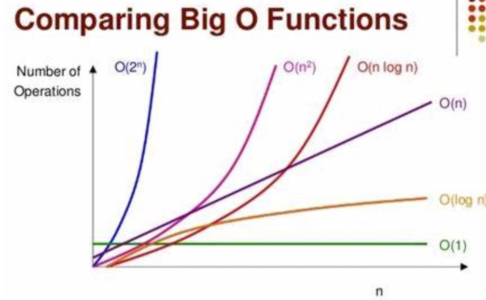

### 1. 算法时间复杂度和空间复杂度的计算

算法是用指用来操作数据、解决问题的一组方法。对于同一个问题，使用不同的算法，不同的解决方案，可能最终会达到相同的目标，其最终的结果是一样的，但是不同的算法、解决方案，在执行的过程中其所消耗的资源和时间，可能会有很大的区别。

衡量不同的算法之间的优劣，主要通过**时间**和**空间**两个指标去考量：

1. 时间：指执行当前算法所消耗的时间，通常使用时间复杂度来表示
2. 空间：指执行当前算法需要占用的内存空间，通常使用空间复杂度来表示

很多情况，时间和空间不能同时兼顾到，也不好同时兼顾到，需要在两者之间取得一个平衡点，这个平衡点的取得是我们应该考虑的。

<font color="#f20">通常情况下，一个算法有最好、平均、最差 3 种情况：研究算法，是去研究最差的情况；</font>

最坏情况，是指一个算法运行时间的上限，以及空间消耗的上限。如果一个算法最坏情况经常出现，就意味着平均情况和最坏情况一样差。

### 2. 时间复杂度

时间复杂度，指运行这个算法所需要的计算的工作量，其复杂程度反映了程序的执行时间，在很大程度上反映了算法的优劣。

执行算法耗费的时间，与算法中的语句“被执行的次数”成正比，执行的次数越多，花费的时间就越多。

算法的时间复杂度通常由大 O 符号表示，定义为 T(n) = O(f(n))，常见的时间复杂度有：

1. O(1)常数型
2. O(logn)对数型
3. O(n)线型
4. O(nlogn)线性对数型
5. O(n^2)平方型
6. O(n^3)立方型
7. O(n^k)k 次方型
8. O(2^n)指数型



借用网上的一张图片。

算法复杂度，仅仅是描述算法的增长趋势，并不能说一个算法一定比另外一个算法高效。如果常数项过大的时候，也会导致算法的执行时间变长。

**时间复杂度的计算**

```js
function p(n) {
    let a = 1;
    let b = 2;
    let sum = a + b;
    for (let i = 0; i < n; i++) {
        sum += i;
    }
    return sum;
}
```

该函数的的执行次数，使用函数表示为：T(n) =  2 + 1 + n，即n+3，但是因为时间复杂度只关注最高数量级，和系数没有关系，所以该函数的时间复杂度可以描述为O(n);

### 3. 空间复杂度

空间复杂度指执行算法所消耗的内存的大小，用于对程序运行过程中所需要的临时存储空间的度量。

除了需要存储空间、指令、常数、变量和输入数据外，还包括对数据进行操作的工作单元和存储计算所需信息的辅助空间。

看下面案例：

```js
let a = 1;
let b = 2;
let c = 3;
```

案例中的代码的临时存储空间，不会随着 n 的变化而变化，因此称空间复杂度为 O(1)。

再看下面的案例：

```js
let arrNew = [];
for (let i = 0; i < n; i++) {
  arrNew.push(i);
}
```

上面的案例，随着 n 的增加，数组的占用空间会增大。

通常来说，只要算法不涉及到动态分配空间，以及递归、栈所需的空间，空间复杂度通常为 O(1)，一个一维数组 a[n]的空间复杂度为 O(n)，二维数组的空间复杂度为 O(n^2).
