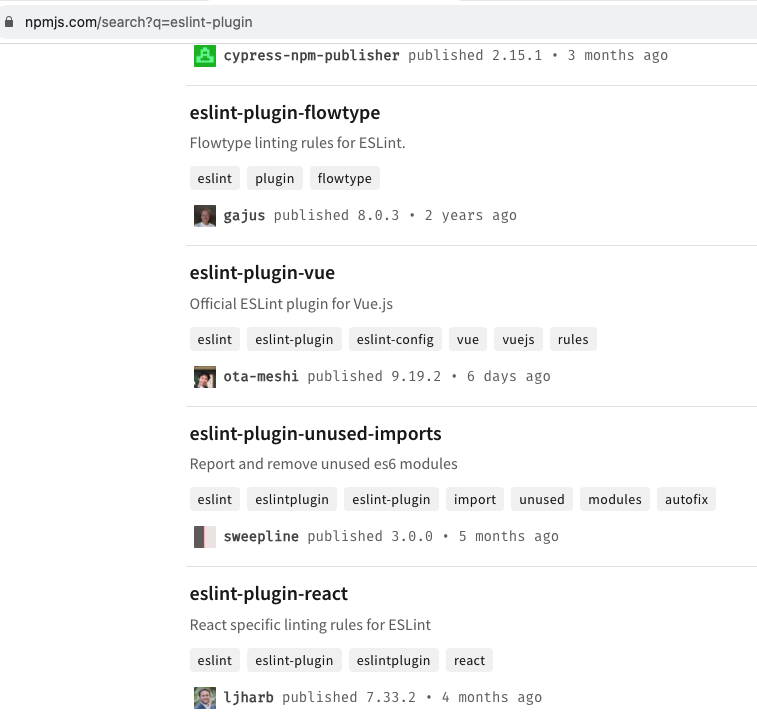
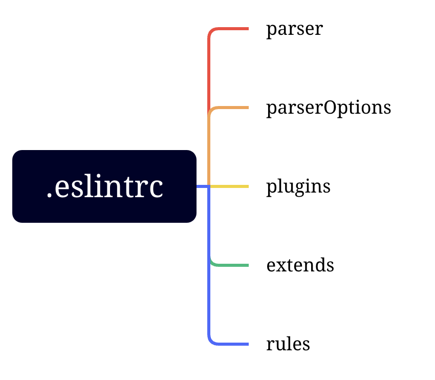

### 1. 简单认识ESLint

文档：https://eslint.nodejs.cn/

ESLint常用在静态代码扫描中，通过设置eslint语法规则，对代码进行静态检查，通过规则来约束代码的风格，以此来提高代码的健壮性、可读性，可以有表避免一些由于代码不规范而导致出现bug的可能。

规则是自由的，每个团队都可以有自己的规则，也可以直接使用开源社区中一些比较热门的规则集合，如airbn、eslint-plugin-vue、eslint-plugin-react等等，社区中有很多非常优秀的、开源的eslint规则。

### 2. ESLint配置

eslint的配置，通常是使用.eslintrc.js或者.eslintrc来配置的，也可以直接在package.json中定义eslintConfig的属性。

#### 2.1 parse

parse用来定义eslint所使用的解析器，eslint默认使用的是Espree(https://github.com/eslint/espree).解析器的作用就是将代码转化成一种AST抽象语法树，ESLint中叫做ESTree。我们也可以简单的理解为解析器就是一个翻译，将我们写的代码翻译成ESLint能看的懂、听得懂的语言。

eslint默认的解析器是espree，但是也还有其他几种常用的解析器：

1. Esprima：前面提到的espree就是基于Esprima改良的

2. Babel-eslint：一个对Babel解析器的包装，当我们的项目中使用了babel，babel解析器就会把我们的代码转换为AST，然后该解析器会将其转换ESLint能读的懂的ESTree。这个解析器目前使用的比较多，当前已经不再维护，升级为@babel/eslint-parser.

3. @typescript-eslint/parser: 将Typescript转换成estree的兼容形式，以便在ESLint中使用。