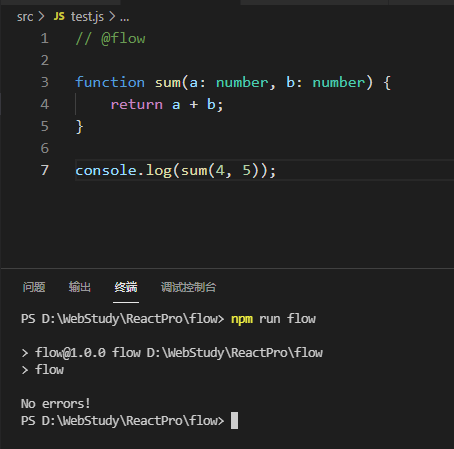
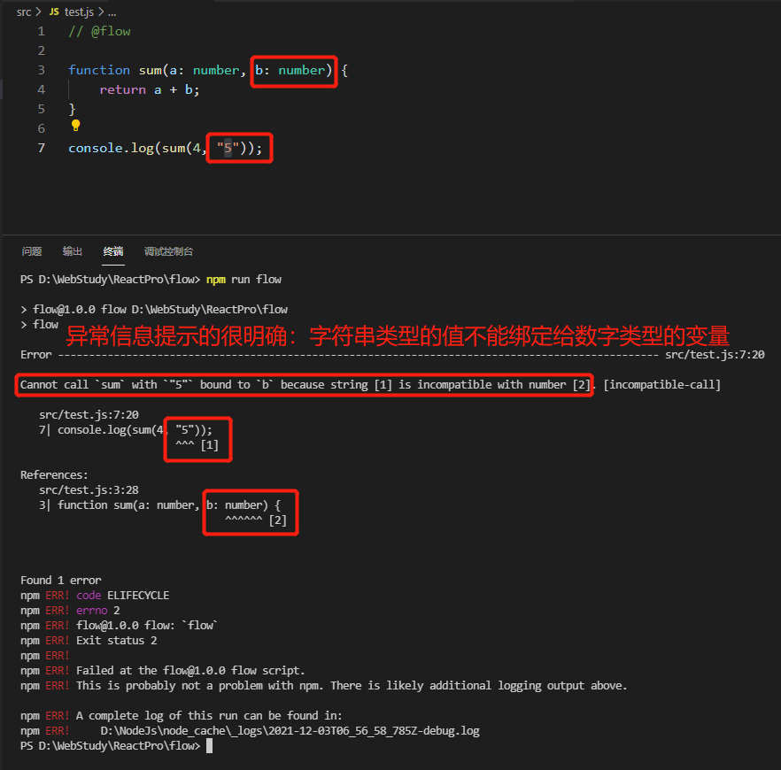

### 简单认识flow

flow是facebook推出的一款javascript静态类型检查器。

flow通过静态类型注释的方式去检查代码，这些静态的类型注释告诉flow，让flow保证我们的代码以我们期望的方式去运行。

### 环境搭建

使用flow静态类型检查，需要先安装编译器去编译我们的js代码，有两种编译器可以选择：Babel和flow-remove-types，我们以Babel为例。

1. 安装编译器：

```bash
npm install @babel/core @babel/cli @babel/preset-flow --save-dev # 开发时依赖，生产环境时不需要进行校验，因为开发环境已经校验完了
```

2. 配置babel

在项目的根目录下创建.babelrc文件，配置下presets

```json
{
    "presets": [
        "@babel/preset-flow"
    ]
}
```

3. 在package.json配置

如果项目中没有package.json这个文件，可以手动创建一个，也可以通过npm init的方式自动创建。

package.json中主要是配置babel编译器部分，能够让babel找到我们的js代码，这样才能对我们的js代码进行类型检查。

```bash
./node_modules/.bin/babel src/ -d lib/  #按照我们的源码都是在src目录下的假设做的配置
```

一般情况下，我们写项目的时候，都会进行源文件和编译后文件的目录区分，源文件我们大部分的优秀实践是放到根目录中的src目录下，编译后文件是在根目录中dist目录中。

配置package.json

```json
{
  "name": "flow",
  "version": "1.0.0",
  "description": "",
  "main": "index.js",
  "scripts": {
    "test": "echo \"Error: no test specified\" && exit 1",
    "build": "babel src/ -d lib/" // 项目中的babel编译器去编译src目录下的源文件
  },
  "author": "",
  "license": "ISC",
  "devDependencies": {
    "@babel/cli": "^7.16.0",
    "@babel/core": "^7.16.0",
    "@babel/preset-flow": "^7.16.0",
    "flow-bin": "^0.166.1"
  }
}
```

4. 安装flow

```bash
npm install flow-bin --save-dev # 还是开发时依赖
```

添加flow指令到package.json

```json
{
  "name": "flow",
  "version": "1.0.0",
  "description": "",
  "main": "index.js",
  "scripts": {
    "test": "echo \"Error: no test specified\" && exit 1",
    "build": "babel src/ -d lib/", // 项目中的babel编译器去编译src目录下的源文件
    "flow": "flow" // flow指令，进行类型检查和推断
  },
  "author": "",
  "license": "ISC",
  "devDependencies": {
    "@babel/cli": "^7.16.0",
    "@babel/core": "^7.16.0",
    "@babel/preset-flow": "^7.16.0",
    "flow-bin": "^0.166.1"
  }
}
```

5. 初始化flow

项目第一次引入flow、且flow是第一次执行的时候，执行：

```bash
npm run flow init
```

这个步骤可以简单的理解为初始化一个flow项目，就是在项目中引入了flow了。

6. 类型检查

flow初始化之后，就可以直接执行flow指令来进行类型的检查了

```bash
npm run flow
```

在类型正常的情况下，效果如图：



如果有类型异常的时候，效果如下：



### 使用

flow，可以全局安装，有可以项目内布局安装，我个人建议最好是项目内局部安装。局部安装，每个项目都可以根据自己的需要安装适合自己的版本，全局安装，就显得不那么灵活了。有的时候还会混淆全局和局部的命令调用，给新手造成一定的困扰。

如果使用了全局安装，那么就直接使用flow指令就可以了，如果是局部安装的，可以借助npm执行指令，如npm run flow status、npm run flow、npm run flow stop等。

如果想在一个项目使用flow做类型检查，大概步骤如下：

1. 初始化flow

2. 启动一个flow的后台进行，让flow可以实时监控我们的代码：文档说可以启动一个后台进行实时监控，但是我没有尝试成功，因为这不是我们现在项目的重点，也就没有重点研究，我新项目中基本是使用ts了，比flow要更加的简单、方便

3. 通过// @flow注释需要flow做类型监控的文件：也可以通过 /* @flow */的方式，就是js的注释方式，注释内容为@flow

4. 代码开发：指业务代码的开发

5. 类型检查

> 这些步骤的前提是已经安装了flow之后的步骤，安装flow包括flow-bin和babel编译器

启动后台检查进程和终止后台进程的方式：

```bash
npm run flow status  # 启动一个后台进程

npm run flow stop  # 终止一个后台进程
```

**标注需要flow进行类型检查的文件**

在文件的头部通过js注释的方式，注释内容为@flow,就表示该文件需要使用flow进行类型检查。

```javascript
// @flow

function sum(a: number, b: number) {
    return a + b;
}

console.log(sum(4, 8));
```

```javascript
/* @flow */

function square(num: number) {
    return num * num;
}

console.log(square(5));
```

flow主要可以做两方面的工作：烈性推断和类型检查。

```javascript
function split(str) {
    return str.split(" ");
}

console.log(split("Hello flow!")); // 这里调用的时候不会报错，因为flow会进行类型推断，自动推断str参数应该是一个string
split(12); // 这里会进行报错，因为这里flow进行了类型推断，应该传入一个string，但是实际调用时传入了一个number，所以报错了
```

### 类型注释只能在TypeScript文件中使用

flow可以进行类型推断，去判断变量、参数使用的类型是否争取。

```javascript
function fn(a, b) {
    return a + b;
}

fn(2,3);
fn("hello",8);
fn("hello","flow");
```

函数fn的参数，没有显示的给参数a、b指定类型，那么flow就会推断，只要是可以进行+操作的，flow都会认为是合法的，所以案例中的3种场景，都通过了flow的类型检查，因为number可以进行+操作，string可以进行+操作，表示字符串的拼接，number和string的+操作先进行类型转换后再进行后续操作，都是可以正常进行的，所以flow进行了类型推断，表示都是合法的数据类型。

```javascript
function fn(a, b) {
    return a + b;
}

let arr = [1, 2];
fn(arr, false); // flow进行类型检查时报错了，因为数组类型和布尔类型不能进行+操作，哪怕是进行了js内部的类型转换之后都不可以，所以flow做类型检查时报出了异常
```