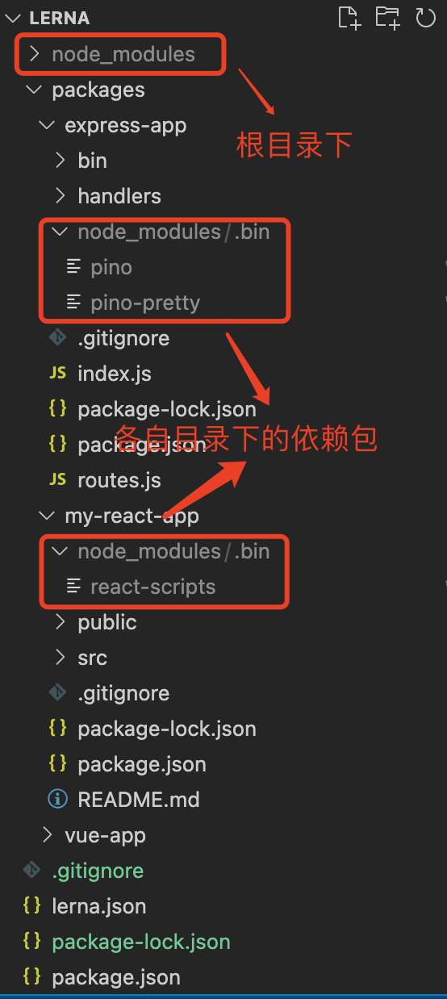

<!-- START doctoc generated TOC please keep comment here to allow auto update -->
<!-- DON'T EDIT THIS SECTION, INSTEAD RE-RUN doctoc TO UPDATE -->
**Table of Contents**  *generated with [DocToc](https://github.com/thlorenz/doctoc)*

- [1. 什么是memorepo？](#1-%E4%BB%80%E4%B9%88%E6%98%AFmemorepo)
- [2. memorepo的优势](#2-memorepo%E7%9A%84%E4%BC%98%E5%8A%BF)
- [3. memorepo的不足](#3-memorepo%E7%9A%84%E4%B8%8D%E8%B6%B3)
- [4. git中使用menorepo的困难](#4-git%E4%B8%AD%E4%BD%BF%E7%94%A8menorepo%E7%9A%84%E5%9B%B0%E9%9A%BE)
- [5. 前端范围领域内使用lerna进行menorepo项目管理](#5-%E5%89%8D%E7%AB%AF%E8%8C%83%E5%9B%B4%E9%A2%86%E5%9F%9F%E5%86%85%E4%BD%BF%E7%94%A8lerna%E8%BF%9B%E8%A1%8Cmenorepo%E9%A1%B9%E7%9B%AE%E7%AE%A1%E7%90%86)
  - [5.1 关键思想](#51-%E5%85%B3%E9%94%AE%E6%80%9D%E6%83%B3)
  - [5.2 尝试一个lerna项目](#52-%E5%B0%9D%E8%AF%95%E4%B8%80%E4%B8%AAlerna%E9%A1%B9%E7%9B%AE)

<!-- END doctoc generated TOC please keep comment here to allow auto update -->

### 1. 什么是memorepo？

Memorepo是项目管理的一种方式，指在一个项目仓库(repo)中管理多个模块/包(package)，和现在常见的每个模块、小项目、模块都创建一个项目仓库的代码管理方式不同。

目前有很多项目都采用了Memorepo的项目管理方式，如Vue(vue2、vue3)、react、react-react-app、babel等

> 还有其他一些项目，接下来需要再调研、详列。

一般情况下，使用memorepo代码管理方式的目录结构为：

```markdown
projectName
├─lerna.json
├─package.json
├─tree.md
├─packages
|    ├─pkg2
|    |  └package.json
|    ├─pkg1
|    |  └package.json
```

与memorepo代码管理方式相对的就是multirepo(多repo项目，以及现在的微前端)，会将一个大的项目根据职责、业务模块进行划分，然后创建不同的代码仓库进行管理。不同的团队可以专注于负责某个具体的代码仓库进行代码的提交、编译、发布等代码管理工作。

### 2. memorepo的优势

1. 可以看到所有代码，其他项目有了新的提交后就立刻可以被看到；

2. 便于协同工作:不会因为依赖项目的延误上线而导致进度延误，依赖代码一旦提交立刻可使用；

3. 代码的复用能力提升：项目内部可以非常简单的相互引用，一次提交，repo中依赖此代码的项目会立刻更新到最新状态；

4. 公共依赖只需要安装一次，menorepo中所有模块都共享，可以规避多项目依赖不一致的问题；

5. 测试简单：可以有效避免项目依赖导致的跨repo使测试变的复杂；

6. 可以统一使用CI、CD流程：一套配置解决所有模块的测试与发布流程；

### 3. memorepo的不足

1. 代码规模变大后会出现代码加载、性能、版本控制问题：可能会出现代码编辑器加载代码不成功、或加载缓慢问题；

2. 代码规模变大，大量的提交、分支、tag，版本的控制变的困难；

3. 由于项目间随意相互的引用造成的耦合性增加，可能会造成项目间职责不明确，代码的组合型降低；

4. 权限问题，代码对项目内所有成员可见；

### 4. git中使用menorepo的困难

1. git在每次提交的时候都会跟踪整个提交树的状态，由于项目增多、代码量加大，这会让git运行变得缓慢；

2. git的tag的作用将逐渐缩小，甚至失去它的作用：比如一个repo中的app项目的tag对于repo中的web项目是没有什么实际意义的；

3. 由于git底层使用的有向无环图实现历史记录，提交记录的激增，会使git log、git blame变的缓慢；

4. git分支也会随着项目的激增而激增，分支的激增也会导致git branch运行变缓；

5. 大文件存储会影响整个repo的性能(不过这个已经在git LFS(Large File Storage)中得到解决)；

6. git clone、git fetch、git push、git status都会随着文件数量的增多而变的缓慢；

### 5. 前端范围领域内使用lerna进行menorepo项目管理

git在menorepo项目中确实存在一些问题，尤其是项目规模大了、代码量起来了之后，确实会产生一些实际的问题，但是也有一些实际场景需要menorepo这种项目管理思想去管理、维护项目，基于menorepo的工程管理也出现了很多工具软件，如Rush、NX、Bit、lerna等。

lerna是一个git+npm进行前端项目管理的开源软件，lerna的诞生是为了解决babel的多包问题，以优化使用git和npm管理多包存储库的工作流程。

> Rush: https://rushjs.io/zh-cn/

> NX: https://nx.dev/

> Bit: https://bit.dev/

> lerna:https://www.lernajs.cn/

一个简单的lerna项目的结构：

```markdown
projectName
├─lerna.json
├─package.json
├─tree.md
├─packages
|    ├─pkg2
|    |  └package.json
|    ├─pkg1
|    |  └package.json
```

#### 5.1 关键思想

> 本文提到的前端项目，都是以js或者ts为开发语言的前端项目。

**一个git repo多个前端项目**

> 大家都喜欢叫成repo，我习惯叫是代码仓库或者代码库，本质上都是一个意思，大家就根据自己的情况去称呼吧，但是如果是一些刚接触的朋友，知道无论是什么叫法，都是一回事就行了。

可能曾经为了模块化等其他的一些原因，将项目拆分为多个代码库(repo)现在都放到一个代码库中了，正如上面的demo所示，都放到了packages目录下了。pakages目录下的多个子项目，可以通过lerna提供的能力直接相互引用，其代码的管理，都是在一个代码仓库下，即一个提交可能会影响到多个子项目的效果。

**共享node_modules**

通过lerna提供的能力(依赖提升)使得node_modules依赖只需要安装一次，所有子项目的依赖都会安装到项目根目录。

**统一版本发布管理**

通过配置根目录package.json中script指令，使用lerna运行命令会触发所有子项目中配置的同名命令。

如子项目A有启动服务的指令start、子项目B中也有启动项目的指令start，那么使用lerna运行start指令就会自动运行子项目A和子项目B的start指令，如果还配置了其他的同名命令如test、publish等，也是同样的效果。

**几个常用的lerna指令**

> 这里只介绍几个常用的指令，详细的指令可参考lerna官网：https://www.lernajs.cn。

1. lerna init

2. lerna clean

清理各子项目的依赖。

不光会清理子项目中的安装的依赖，还会直接清理掉各子项目的node_modules目录。

指令该指令的结果，就是各子项目的node_modules目录直接被清空了。

3. lerna bootstrap

公共依赖提升，就是各子项目共用的依赖包，都会被提升到根目录下，直观的结果就是各子项目的依赖，都安装到项目的根目录下，各子项目都只保留各自项目自己需要的依赖包，如各个项目自己的服务管理的包。

lerna官方文档上没有给解释清楚，或者解释的比较隐藏，不好找，其实这里需要加一个参数

4. lerna version

这个指令是不存在的。

如果要查看当前系统中的lerna版本号，可以通过指令lerna --version.

> 有资料上提示会更新各子项目版本号，就是package.json中version字段修改值，可以选择系统指定的新的版本号，也可以自定义版本号，但我尝试了是没有这个指令的，也可能是lerna版本的问题，或者需要安装其他的依赖，我没有去细究，对于我来说可能不那么重要。

> 

5. lerna publish

作用同npm publish，只是lerna publish会将所有未发布到npm到子项目发布到npm。

6. lerna run

类似npm run，lerna run将执行所有子项目中定义在package.json中的同名指令。比如所有的项目都定义了start指令，那么lerna run start将执行所有项目都start指令。

#### 5.2 尝试一个lerna项目

1. 创建lerna项目

项目创建相对简单，新建一个项目目录，进入项目目录后执行learn init指令，便可新建一个lerna项目

```bash
mkdir lerna
lerna init --yes
```

新创建的项目结构：

```markdown
lerna
├─lerna.json
├─package.json
├─tree.md
├─packages
```

简单看下初始化后的代码内容：

lerna.json

```json
{
  "lerna": "2.11.0",
  "packages": [
    "packages/*"
  ],
  "version": "0.0.0"
}
```

packages表示接受lerna管理的包，这了的值packages/*表示packages目录下的所有子项目都接受lerna的统一管理。

package.json，和通过npm创建的项目的package.json相同，没有什么特殊的地方。

2. 创建子项目

首先我们创建一个基于react的子项目，直接通过脚手架来创建。

```markdown
npm init react-app my-react-app 基于create-react-app脚手架创建一个react项目
npm init express-app my-express-app 基于express-generator项目生成器创建一个express项目
```

我在lerna项目中创建了3个子项目，一个react项目、一个vue项目和一个express项目，并且都可以正常启动。

```markdown
lerna
├─lerna.json
├─package.json
├─packages
|    ├─vue-app
|    |    ├─README.md
|    |    ├─babel.config.js
|    |    ├─package-lock.json
|    |    ├─package.json
|    |    ├─src
|    |    |  ├─App.vue
|    |    |  ├─main.js
|    |    |  ├─components
|    |    |  |     └HelloWorld.vue
|    |    |  ├─assets
|    |    |  |   └logo.png
|    |    ├─public
|    |    |   ├─favicon.ico
|    |    |   └index.html
|    ├─my-react-app
|    |      ├─README.md
|    |      ├─package-lock.json
|    |      ├─package.json
|    |      ├─src
|    |      |  ├─App.css
|    |      |  ├─App.js
|    |      |  ├─App.test.js
|    |      |  ├─index.css
|    |      |  ├─index.js
|    |      |  ├─logo.svg
|    |      |  ├─reportWebVitals.js
|    |      |  └setupTests.js
|    |      ├─public
|    |      |   ├─favicon.ico
|    |      |   ├─index.html
|    |      |   ├─logo192.png
|    |      |   ├─logo512.png
|    |      |   ├─manifest.json
|    |      |   └robots.txt
|    ├─express-app
|    |      ├─index.js
|    |      ├─package-lock.json
|    |      ├─package.json
|    |      ├─routes.js
|    |      ├─handlers
|    |      |    ├─configured.js
|    |      |    └simple.js
|    |      ├─bin
|    |      |  └app
```

一个大致的项目轮廓已经建立起来了。

3. 清理子项目中的node_modules依赖

```bash
lerna clean
```

通过lerna clean指令清理所有子项目中node_modules中安装的依赖。

> 通过lerna clean清理子项目的安装依赖，不光是将子项目中node_modules目录中的文件卸载或者移除掉，而是将node_modules目录也直接清理掉。

4. 提升node_modules到项目根目录，以便让所有子项目看可以共享node_modules

```bash
lerna bootstrap --hoist # 将子项目中的node_modules提升到根目录下
```

通过lerna bootstrap --hoist提升后，子项目共用的依赖包，都将安装到根目录下的node_modules目录，而每个子项目差异化的、不公用的依赖包，还是安装在各自的项目中。



由于空间的关系，我们的案例中有3个子项目，图中只显示了2个子项目。从图中可以看到，子项目共用的依赖包都已经提升到lerna项目的根目录了，但是每个子项目也依旧保留了node_modules目录。只不过子项目中保留的node_modules目录中基本上都是各子项目的可执行文件。

5. 配置执行脚本指令

因为lerna可以管理的是同名的指令，所以我们将lerna和子项目中同一个类型的指令都更改成同名的指令，如启动服务的指令都更改为start，测试指令都统一更改为test。

```js
// lerna中根目录下的package.json
"scripts": {
    "start": "lerna run start"
}

// express项目下的package.json
"scripts": {
    "start": "./bin/app",
    "test": "echo \"Error: no test specified\" && exit 1"
},

// vue项目中的package.json  
    "scripts": {
    "start": "vue-cli-service serve",
    "build": "vue-cli-service build",
    "lint": "vue-cli-service lint"
},

// react项目中的package.json
"scripts": {
    "start": "react-scripts start",
    "build": "react-scripts build",
    "test": "react-scripts test",
    "eject": "react-scripts eject"
},
```

这样在根目录下执行lerna项目的start指令，就可以启动所有的子项目了。

```bash
npm run start # 会启动所有子项目
```

6. 发布新的版本

通过lerna publish指令