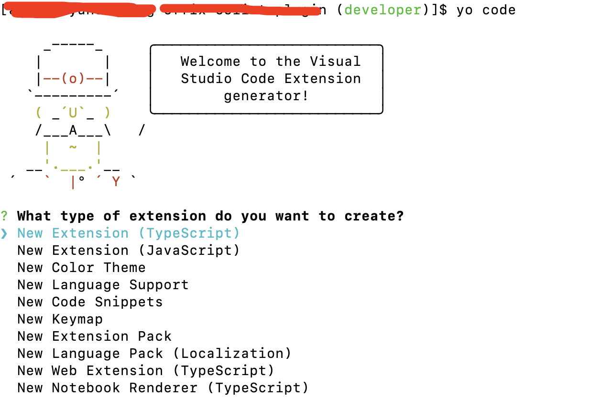

### vscode插件开发

#### 开发准备

1. 安装最新版本的vscode

2. 安装LTS版本的nodejs

3. 安装官方推荐的脚手架工具yeoman和Generator-code

4. 安装插件的打包和发布工具vsce

#### nodejs

可以安装一个版本相对较高的版本，如果全局安装了yo和generator-code之后，在通过yo脚手架创建项目的时候提示找不到mem-fs模块，大概如下的信息，则说明nodejs的版本低了，切换到一个高版本的nodejs即可。

```bash
Error [ERR_MODULE_NOT_FOUND]: Cannot find package 'mem-fs' imported from /Users/a58/.nvm/versions/node/v14.16.0/lib/node_modules/yo/node_modules/yeoman-environment/dist/environment-base.js
```

#### 通过yo、generator-code创建项目

