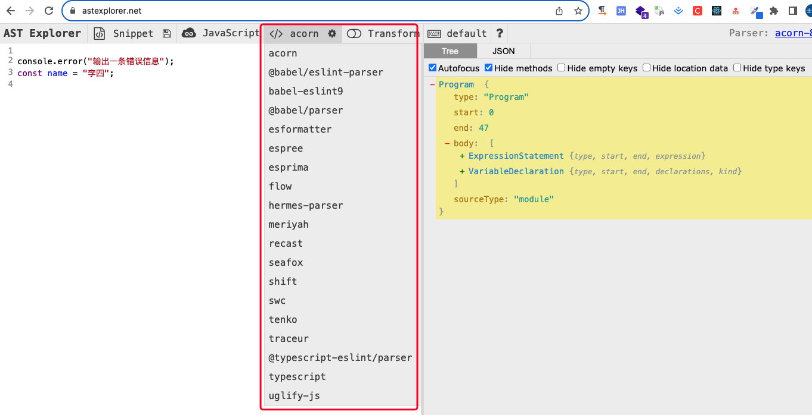
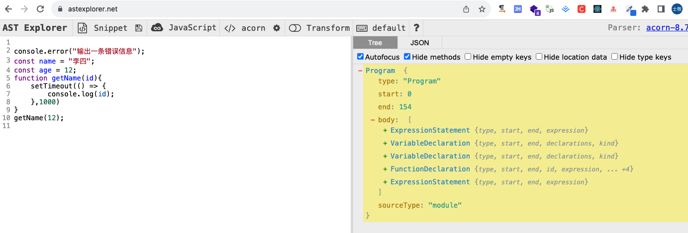
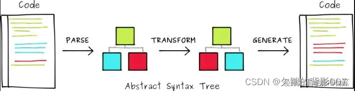

### 开发工具

yeoman、generator-eslint，全局安装即可。

环境要求：
```js
Node.js ^14.17.0 || ^16.0.0 || >= 18.0.0
```

环境安装：

```bash
npm install yo generator-eslint -g
```

创建eslint插件项目

```bash
# 创建目录
mkdir eslint-plugin-et
# 初始化项目
yo eslint:plugin
```

创建新的eslint规则

```bash
yo eslint:rule
```

### 基础知识

通过yo创建的eslint项目的结构如下：

```markdown
eslint-plugin-et
├─.eslintrc.js
├─README.md
├─package-lock.json
├─package.json
├─tests
|   ├─lib
|   |  ├─rules
|   |  |   └no-html-tags.js
├─lib
|  ├─index.js
|  ├─rules
|  |   └no-html-tags.js
├─docs
|  ├─rules
|  |   └no-html-tags.md
```

主要的是lib目录中rules下的no-html-tags.js文件，该文件是规则的源文件,需要重点关注。

下面来主要分析下该规则文件:

```js
"use strict";
/** @type {import('eslint').Rule.RuleModule} */
module.exports = {
  meta: {
    // messages字段元信息是脚手架没有生成的，需要手动添加下，否则项目会提示：`meta.messages` must contain at least one violation,就是说至少要有一个异常提示信息
    messages: {
      someMessageId: "使用了html标签了",
    },
    type: "problem", // `problem`, `suggestion`, or `layout`
    docs: {
      description: "检测html标签的使用情况",
      recommended: false,
      url: null,
    },
    fixable: null,
    schema: [],
  },

  create(context) {
    return {
      // 下面代码是脚手架没有生成的，需要手动添加一下
      CallExpression(node) {
        context.report({
          node,
          messageId: "someMessageId",
        });
      },
    };
  },
};
```

可以从文件中看到规则主要就是包含了一个meta对象和一个create函数，mate主要包含了规则的元数据，create函数返回一个访问器对象,该对象的属性为选择器，ESLint在遍历Javascript代码的抽象语法树时会执行所有监听了该选择器的回调函数。

#### meta对象

meta对象中有一些信息，具体如下：

**type: 字符串，表示规则的类型，值：null、problem、suggestion、layout之一**

problem：意味着该规则正在识别将导致错误或者行为混乱的代码，开发人员应该把这部分代码作为一个高度优先的事情来解决。

suggestion：意味着该规则制定了一些可以用更好的方式去完成的事情，但是如果不修改代码，也不会发生错误。

layout：意味着该规则主要关心决定外观的代码部分，如空格、逗号、分号等，而不是代码的执行方式，这些规则没有在AST中指定的部分起作用。

**docs(对象):是eslint的核心规则所需要的**

description(string):在规则索引中提供规则的简短描述

recommended(boolean):表示在配置文件中是否使用"extends":"eslint:recommended"来启用该规则

url(string):指定可以访问完整文档的链接，使代码编辑器可以在突出显示的规则违反上提供一个有用的链接。

fixable:

schema:指定了配置选项，以便eslint可以防止无效的属性。

### ESLint运行原理

#### 1. 将代码解析为AST

AST：Abstract Syntax Tree的建成，称为抽象语法树。

首先将源码解析为AST，解析AST的过程需要借助解析器，解析器有很多，现在为了学习方便，我们可以参考[AST在线解析网站](https://astexplorer.net/),如图：



上图中红框内是常用的js语法解析器，可以将JS/TS解析为AS。eslint默认使用espree这个解析器。

> ESLint是一个根据方案识别并报告es代码问题的工具，其目的是使代码风格更加一致并避免错误。在很多地方与JSLint和JSHint类似，除了下面3个方面:

1. ESLint使用Espree对代码进行解析；

2. ESLint在代码中使用AST评估方案；

3. ESLint完全是插件式的，每个规则都是一个插件，你可以在运行时添加更多插件

以[AST在线解析网站](https://astexplorer.net/)为例，我们在左侧输入代码，右侧就可以根据所选择的解析器将代码解析为AST了：



出了借助AST在线解析站点工具外，也可以借助[https://www.jointjs.com/demos/abstract-syntax-tree](https://www.jointjs.com/demos/abstract-syntax-tree)这个可视化工具将es代码解析为树，可以清晰的看到代码在解析过程中生成了多少个节点和tokens.

#### 2. 遍历AST各个节点

在生成AST之后，ESLint会先“从上到下”再“从下到上”的顺序遍历每个选择器两次。

#### 3. 触发监听AST选择器的rule规则回调

每一条ESLint规则都会用AST节点选择器对AST树中的节点进行监听，在遍历AST过程中，如果命中ESLint规则的选择器就会触发该规则的回调

#### 4. 再将AST生成代码

命中之后，在触发回调的过程中，我们可以对AST做一些修改，然后再重新生成代码，比如eslint的自助修复能力就是依赖于此。整个过程可以参考如下图所示：



### AST选择器

AST时