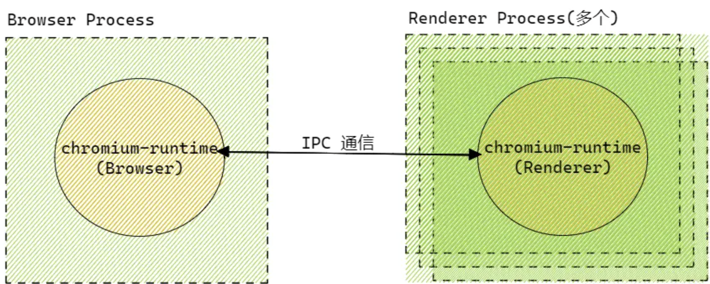
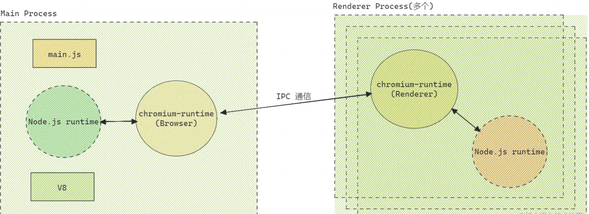
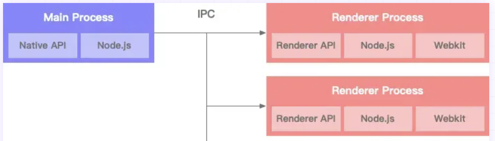

<!-- START doctoc generated TOC please keep comment here to allow auto update -->
<!-- DON'T EDIT THIS SECTION, INSTEAD RE-RUN doctoc TO UPDATE -->
**Table of Contents**  *generated with [DocToc](https://github.com/thlorenz/doctoc)*

- [1. Chromium架构](#1-chromium%E6%9E%B6%E6%9E%84)
- [2. Electron架构解析](#2-electron%E6%9E%B6%E6%9E%84%E8%A7%A3%E6%9E%90)
- [3. Electron和Chromium的事件机制](#3-electron%E5%92%8Cchromium%E7%9A%84%E4%BA%8B%E4%BB%B6%E6%9C%BA%E5%88%B6)

<!-- END doctoc generated TOC please keep comment here to allow auto update -->

### 1. Chromium架构

我们知道js是一门单线程语言，但是浏览器是一个多线程的，同理，Chromium作为chrome的体验版，Chromium也是多线程的工作机制。参考链接：https://www.chromium.org/developers/design-documents/multi-process-architecture/。

Chromium多进程的管理机制，在这个机制中，我们将运行UI并管理其他渲染器的进程称之为主进程或者浏览器进程，也称为浏览器；处理web网页内容的进程，称为渲染进程，有时也被称为渲染器。渲染器使用Blink开源布局引擎来解释和布局HTML。

Chromium的多进程模式主要由三大部分组成：浏览器端、渲染器端和浏览器与渲染器之间的通信方式(IPC).

1. 主进程

主进程，也叫浏览器进程，一个应用中只有一个主进程。应用打开，主进程启动。主进程为每个渲染进程维护对应的RenderProcessHost，负责主进程与渲染进程的交互。

RenderViewHost则与RenderView对象进行交互，渲染网页内容，主进程与渲染进程通过IPC进行通信。

2. 渲染进程

每个渲染进程都有一个全局的RenderProcess对象，可以管理当前渲染进程和主进程之间的通信，并维护其全局状态。

3. view管理

每个渲染进程可以维护多个RenderView对象，当新开标签页或弹出窗口后，渲染进程就会创建一个RenderView对象，Renderview对象与它在主进程中对应的RenderViewHost和Webkit嵌入层通信，渲染网页内容。---- 这部分是日常开发最需要关注的地方，因为我们做的最多的就是页面的展示，和调用electron的能力。

### 2. Electron架构解析

electron架构参考了Chromium架构模式，将主进程和渲染进程隔离，但是又在chromium架构的基础上做了一定的扩展。

**Chrome浏览器的架构**

由图例可看出来，Chromium运行时由一个浏览器进程和一个或多个的渲染进程构成，渲染进程负责渲染页面，浏览器进程负责管理渲染进程以及一些系统功能，如菜单栏、收藏夹等。

**Electron的架构(和Chromium架构的变化)**

electron仍然使用了Chromium的渲染进程和主进程的理念，渲染进程还是负责渲染界面，渲染进程可以有多个，每个渲染进程之间相互独立、互不干扰。electron和chromium改进的是，electron集成了nodejs环境，可以在渲染进程中调用nodejs API，渲染进程还是负责HTML和CSS的渲染，通过js实现DOM交互。

electron和chromium另外的一点不同，就是名称的变化。在Chromium中的进程命名是Browser Process和Renderer Process，翻译成中文就是浏览器进程和渲染进程。在Electron中，虽然保留了Renderer Process的概念，但是Browser Process改名成了Main Process，翻译成中文为主进程。

由于我经常说是主进程和渲染进程习惯了，就没有更改这个习惯，如果有同学看到这里了，知道在Chromium中是Browser Process和Render Process，在electron中，是Main Proess和Render Process，记住这个概念就可以了，其实本质上是一回事。

electron应用，每个应用只能同时运行一个主线程，该主线程运行在nodejs下，所以这个主线程也就是这个electron应用，可以调用系统的底层功能，如：渲染进程的创建、系统底层功能及原生资源的调用、应用生命周期的控制如启动、退出以及一些事件的监听等。在很多场景下需要调用系统功能的地方，都是通过主进程和渲染进程之间通信，然后主进程去调用系统功能的。

**electron的架构图**

经过上面的学习，我们大概可以总结下electron的架构图：

从electron的系统架构图中，可以发现：主线程和渲染进程都集成了Nodejs，另外，主进程还集成了Native API，渲染进程还集成了Renderer API和Chromium以实现跨端开发。

### 3. Electron和Chromium的事件机制

Nodejs的事件循环机制与浏览器的事件循环机制不同，Chromium是Chrome浏览器的体验版(这么说不严谨，本质上是这么回事，这个说辞好理解)，那么Chromium和浏览器的事件循环机制是相同的。

Nodejs的事件循环基于libuv实现，Chromium的事件循环基于messageBump实现，electron应用的主线程只能同时运行一个事件循环，所以在electron应用中，需要将两种完全不同的事件循环机制整合起来。

整合事件循环机制，有两种方案：

1. 使用libuv实现mesageBump，将Chromium集成到Nodejs；

2. 将nodejs集成到Chromium；

第一种方案的实现，由于不同的OS系统GUI事件循环差异很大，如Mac的事件循环是NSRunLoop，linux的事件循环为glib，实现过程复杂，成本较高，资源消耗和延迟问题没有办法得到有效解决，electron放弃了第一种实现方案；

Electron也尝试使用小间隔的定时器来轮询GUI事件循环，但这种方案有一个弊端，就是CPU占用过高，且GUI响应速度慢。

后来libuv引入了backend_fd概念，backend_fd轮训事件循环的文件描述符，electron通过轮询backend_fd来得到libuv的新事件实现Nodejs与Chromium事件循环的融合。