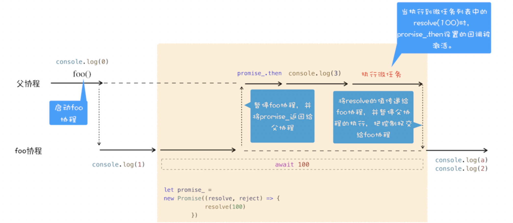

<!-- START doctoc generated TOC please keep comment here to allow auto update -->
<!-- DON'T EDIT THIS SECTION, INSTEAD RE-RUN doctoc TO UPDATE -->
**Table of Contents**  *generated with [DocToc](https://github.com/thlorenz/doctoc)*

- [1. async/await大概了解](#1-asyncawait%E5%A4%A7%E6%A6%82%E4%BA%86%E8%A7%A3)
- [2. 生成器 VS 协程](#2-%E7%94%9F%E6%88%90%E5%99%A8-vs-%E5%8D%8F%E7%A8%8B)
  - [2.1 生成器函数](#21-%E7%94%9F%E6%88%90%E5%99%A8%E5%87%BD%E6%95%B0)
  - [2.2 协程的执行流程](#22-%E5%8D%8F%E7%A8%8B%E7%9A%84%E6%89%A7%E8%A1%8C%E6%B5%81%E7%A8%8B)
- [3. async/await](#3-asyncawait)
  - [3.1 async](#31-async)
  - [3.2 await](#32-await)
- [4. 总结](#4-%E6%80%BB%E7%BB%93)

<!-- END doctoc generated TOC please keep comment here to allow auto update -->

### 1. async/await大概了解

Promise可以解决嵌套回调的问题，但是在使用时代码中充满了then()方法，如果遇到一些复杂的业务逻辑的话，就会造成代码的可读性较低，语义化不名下，不能很好的表示代码的执行流程。为了解决promise中可能会出现的较多的then()的情况，ES7引入了async/await，这是js异步编程的一个重大的改进。提供了在不阻塞主线程的情况下使用同步代码实现的异步访问资源的能力，且能使代码逻辑更加清晰。

假设有这么一个场景，我需要请求接口的内容，然后根据接口请求的结果再次发起对远程资源的请求。我们看一下使用Promise的实现方式：

```js
const api = "https://www.xxx.com";
const api2 = "https://www.xxxx.com";
fetch(api).then((res) => {
    console.log(res);
    return fetch(api2)
}).then(res => {
    console.log(res);
}).catch(err => {
    console.log(err);
})
```

其实这还不是很复杂的业务场景，但是我们发现了这几行代码中，出现了2个then，使得代码的阅读性降低。所以才引出了上文提到的async/await语法。

> fetch是ES6标准中新增的一个方法，基于promise实现的一个可以发送异步请求的方法，返回一个promise对象。

现在我们先不管async/await是什么，先看看通过async/await来实现一下上面的场景功能：

```js
async function getData() {
    try {
        let res = await fetch(api);
        console.log(res);
        let res2 = await fetch(api2);
        console.log(res2);
    } catch (err) {
        console.log(err);
    }
}
```

这样的实现，我们就会感觉这个功能实现的很线性，理解起来很容易，可读性较高。

在学习async/await之前，需要先了解生成器(Generator)的工作原理以及其实现机制(协程：Coroutine)。因为async/await是使用了Generator和Promise两种技术来实现的。

### 2. 生成器 VS 协程

#### 2.1 生成器函数

生成器函数，就是一个带星号(*)的函数，而且这个函数可以暂停和恢复执行。

> 生成器函数有yield关键字。

**生成器函数的具体使用方式**

1. 在生成器函数内部执行一段代码，如果遇到yield关键字，那么js引擎将会返回yield关键字后面的内容给外部，并暂停该函数的执行；

2. 外部 函数可以通过next方法恢复函数的执行；

**js引擎V8是怎么实现函数的恢复和暂停的呢？**

在理解函数的恢复和暂停，先了解一下协程的概念，协程是一种比线程更加轻量级的存在。我们看可以简单的把协程理解为线程上的任务，一个线程上可以存在多个协程，但是同一时间只能执行一个协程。比如当前执行的是A协程，想要启动B协程，那么就需要协程A将线程的控制权交给协程B。这个时候，协程A暂停执行，B协程开始执行；同样的道理，B协程也可以将线程的控制权交给协程A，启动协程A。

通常情况下，如果从A协程启动B协程，我们就把A协程称为B协程的父协程。

正如进程可以有多个线程一样，一个线程也可以有多个协程。不同的是，协程不是有系统内核去管理，而是完全由程序自己控制，也就是用户动态执行。这样的好处就是性能得到了很大的提升，不会像切换线程那样耗费资源。

#### 2.2 协程的执行流程

### 3. async/await

ES7中引入了async/await，这种技术方案看可以彻底的告别执行器和生成器，实现更加简洁、直观的代码。

#### 3.1 async

async是一个通过异步执行并隐式返回Promise作为结果的函数。

在学习async函数的时候，需要注意两个关键词：异步执行、隐式返回Promise。

我们看下案例：

```js
async function foo() {
    return 2;
}
console.log(foo());
```

案例中，声明了一个async函数，然后在调用async声明的函数的时候，返回了一个Promise对象，状态是resolved，结果是Promise{<resolved>: 2}

#### 3.2 await

前面的案例，我们知道async可以隐式返回一个Promise对象，那么我们再通过一个案例来看下await是什么。

```js
async function foo() {
    console.log(1);
    let a = await 100;
    console.log(a);
    console.log(2);
}
console.log(0);
foo();
console.log(3);
```

案例代码输出：0 1 3 100 2

这段代码的执行过程是什么样子的呢？看到了一位大佬的分析，非常到位，借用一下：



代码的执行顺序，先执行console.log(0);没有任何疑问；

接下来就是执行foo函数。由于foo是被async标记了，所以当进入到该函数时，js引擎会保存当前的调用栈等信息，接着执行console.log(1);并打印。

再往后的await 100语句，这行代码是重点。因为在await后，js引擎默默的做了太多的事情，我们来看下具体的步骤：

当执行到await时，js引擎会默认创建一个Promise对象：

```js
let promise_ = new Promise((resolve,reject) => {
    resolve(100);
});
```

在创建promise_对象的过程中，执行了resolve函数，js引擎会将该任务提交给微任务队列，返回当前宏任务队列继续执行。也就到了下面的console.log(3);当前宏任务队列执行完成，就又返回去执行当前任务队列中产生的微任务队列中的微任务。就是console.log(a);也就打印了100，然后继续console.log(2);

这部分说的专业一点，就是js引擎遇到了resolve之后，会暂停当前协程的执行，将主线程的控制权交给父协程去控制，同时将promise_对象返回给父协程。

父协程已经控制了主线程，这个时候父协程要走的一件事就是去调用promise_.then来监控promise状态的改变。

### 4. 总结

Promise虽然解决了深度嵌套的问题，但是代码中可能会有大量的then方法，语义不够明确，代码的可读性不高，催生了async/await的出现。

async/await实现了使用同步代码的风格编写异步代码，主要是因为async/await技术使用了生成器和Promise，生成器是协程的实现，利用生成器能实现生成器函数的暂停和恢复。

