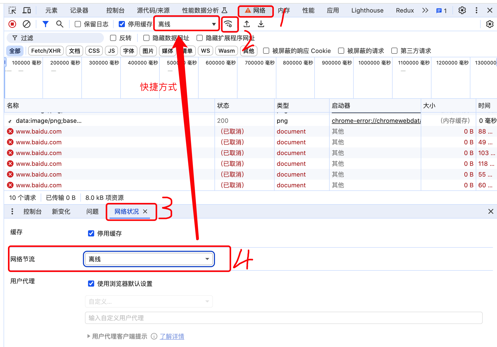
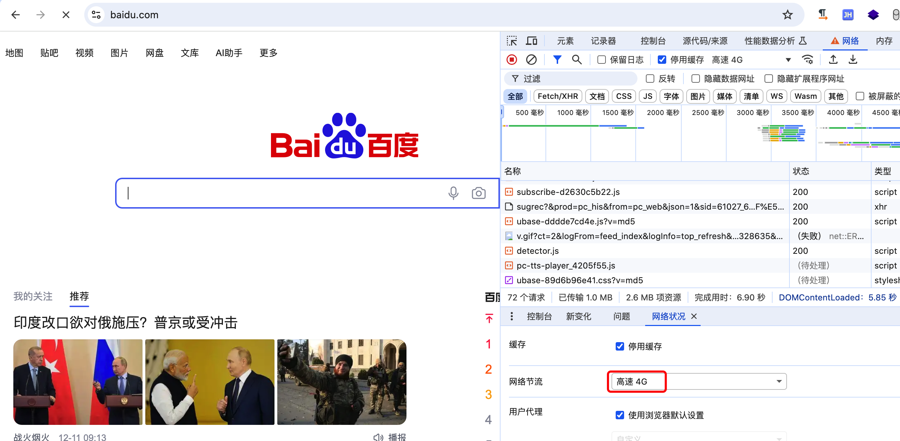
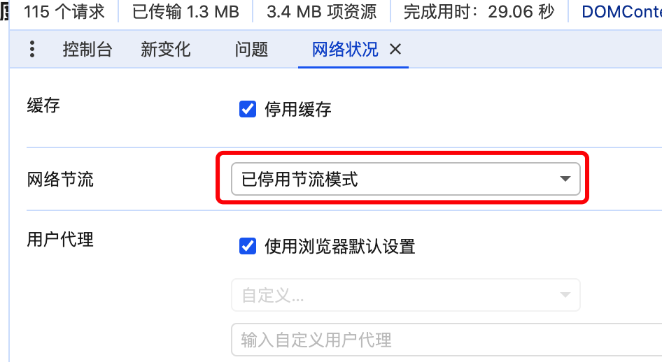

### chrome浏览器打开了开发者工具后就断开了网络连接

今天遇到一个现象，chrome浏览器在打开了开发者工具之后，就断开了网络连接。如下

> 没有网络连接，只是当前的页签没有网络，其他的页签是正常的，能够正常访问网络。

### 原因

在没有打开开发者工具的时候，网络正常，打开开发者工具后，当前页签网络断开，其他没有打开开发者工具的网络连接正常，所以问题应该是出在了开发者工具上，应该是开发者工具做了什么配置，影响到了当前页签的网络链接。

### 问题修复

根据上面的描述的思路去解决问题。

记得以前做页面性能测试的时候，可以在开发者工具中配置网络环境，分别为3G、低速4G、高速4G等一些配置项，那么找到这个地方去试试。

操作路径为：

打开开发者工具——网络页签——找到网络连接标识(也可以直接选择网络截流配置项)，打开网络状况面板，然后在网络节流中尝试不同配置项的效果。

网络节流配置项中，我们看到当前的配置项是“离线”，我们更改为一个其他的配置项，如我选择了“高速4G”，再来看下效果：

更改完成后刷新页面，发现网络连接正常。到此问题解决。

所以打开开发者工具时网络断开的原因，应该是之前在做开发调试的时候，为了模拟网络环境而更改了网络的节流类型，导致现在在打开开发者工具后时的网络连接异常。因为是开发者工具，所以当前的开发者工具中的配置，都只针对当前页签生效，其他页签不受影响。

最后，我们把网络截流配置为停用，仅在开发需要的时候，根据需要去配置就可以了。

