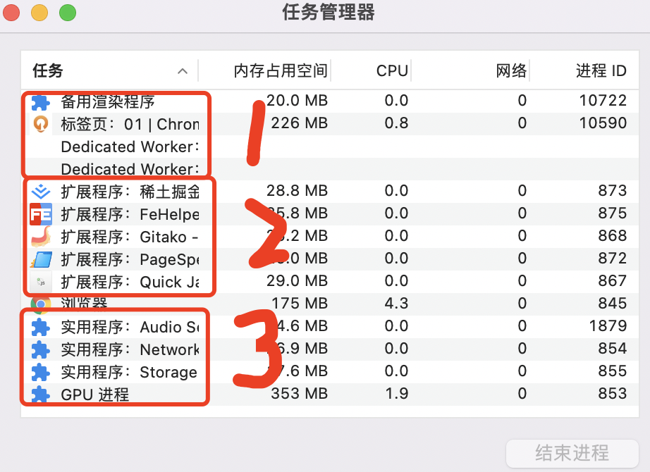

作为一名前端开发者，在面试的时候，经常被问及到“在浏览器里，从输入URL到页面展示，这中间经历了什么？”这样的经典面试题。

简单的从表面来说，就是浏览器把从url中请求的资源在浏览器中渲染了出来，生成了一个可以和用户交互的HTML页面。但是这个把从URL中请求的资源渲染成可以和用户交互的HTML页面的具体过程，到底都做了一些什么事情，是一个比较庞杂的过程。如果详细的解释起来，其中涉及到了网络、操作系统、web等一系列的计算机知识。

学习了一篇关于浏览器原理的知识，摘抄一下。

现在对于浏览器的学习，大多数都是基于chrome浏览器的，因为chrome浏览器或者基于chrome内核的浏览器的使用量最大，学习chrome浏览器最具有代表性。

作者抛出了一个问题，为什么打开一个页面，却有4个进程？

> 现在我测试了一下，打开一个页面，已经不再是4个进程了，而是更多个了。当然了我的浏览器可能是多运行了一些扩展程序插件，但是除了插件之外，也还有多个实用程序.



> 我浏览器安装了较多的扩展程序插件，为了截的图小一点，我结束了几个扩展程序。

那么为什么在只启动了一个页面的情况下，却启动了那么多的进程呢？这不是很消耗系统资源吗？

在回答这些问题之前，先学习一些计算机相关的基础知识。

### 1. 进程和线程

并行处理的概念，对于学习进程和线程以及进程和线程之间的关系有很大的帮助，我们先来了解并行处理。

#### 1.1 并行处理

什么是并行处理？计算机中的并行处理，就是指同一时间处理多个任务，如下面的demo：

```js
let a = 1 + 2;
let b = 3 * 5;
let c = 12 / 3;
```

简单来编码，我们可以把这个demo拆分为4个任务：

任务1: 计算 a = 1 + 2;

任务2: 计算 b = 3 * 5；

任务3: 计算 c = 12 / 3；

任务4: 显示计算结果。

案例的执行过程，可以使用单线程来处理：就是分上述的4个步骤去执行任务。

但是，上面案例，也可以使用多线程来执行。具体过程是怎么样的呢？过程只需要分2步：第一步使用3个线程同时执行前面3个任务，第二步显示计算结果。我们先不管具体的、真实的结果如何，但是仅从感官上，我们应该感觉到，使用单线程需要处理4步，使用多线程，仅仅使用了2个步骤就处理完成了，那么使用多线程的性能上应该比单线程也会更优一些。我们现在先不去纠结这个结论的科学性，可以先留个悬念.(当然了，仅从这个案例的资源消耗上来说，多线程是更优的)

**这里可以得出1个简单结论：使用多线程比单线程，处理同样的事务，多线程性能更优。**

#### 1.2 线程对比进程

多线程可以并行处理多任务，在性能上比单线程更优，但是**线程不是独立存在的。线程是由进程启动和管理的**。

##### 1.2.1 进程

什么是进程呢？

进程就是一个程序运行的实例。当启动一个程序的时候，系统会为这个程序创建一块内存，用来存放代码、运行中的数据和一个执行任务的主线程，我们把这样的一个运行环境叫做**进程**。

我的理解就很简单了，进程就是一块内存区域。只是这块内存区域存放了一些针对某些代码块，并形成了一个封闭的环境而已。

**进程和线程之间的关系**

1. 进程中的任意一个线程执行出错，都会导致整个进程的崩溃；

2. 线程之间共享进程中的数据；

3. 当一个进程关闭之后，操作系统会回收进程所占用的内存；

4. 进程之间相互隔离；

进程隔离是保护操作系统中进程互不干扰的技术，每一个进程只能访问自己占有的数据，这样就避免了一个进程将数据写入到另外一个进程的情况。正式因为进程之间是相互隔离的，所以如果一个进程崩溃了，或者挂起了，是不会影响到其他进程的。如果进程之间需要相互通信，则可以使用进程间的通信(IPC)机制。

> Electron桌面应用内部使用的也是chromium内核，有两个进程，分别是main主进程和renderer渲染进程，两者之间的通信需要用到IPC(Inter-process communincation).

##### 1.2.2 单进程浏览器时代

