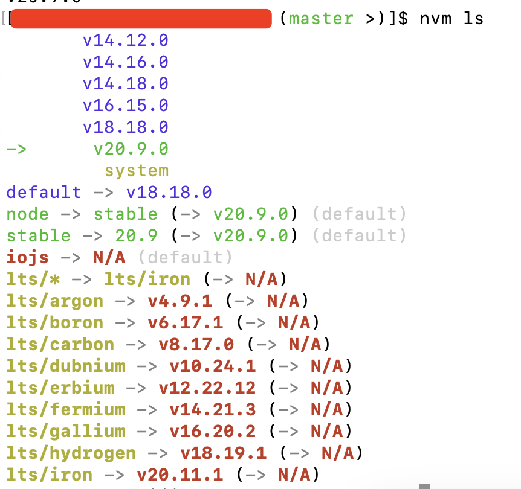

### ESLint+Husky实现代码提交审查

ESLint作为前端工程中识别和报告在Js/Ts代码中发现的模式的工具,其目标是使代码更加一致并避免错误.ESLint是完全插件化的,每条规则都是一个插件,我们可以在代码运行时添加更多的、必要的插件,来保证我们的项目更加智能、代码更加健壮.

[ESLint官网](https://eslint.org/)

**Husky**

在了解Husky之前,可以先简单了解下git-hooks,具体可参考:[https://git-scm.com/docs/githooks/2.9.5](https://git-scm.com/docs/githooks/2.9.5).日常使用git最多的是进行代码的版本控制,常用的指令有pull、push、commit等几个指令,但git是一个功能非常强大的版本控制工具,除了前面罗列出的几个推、拉、提交代码的操作,还可以进行代码的指令控制、进行自动化测试、自动化部署、代码审查等很多实用功能.这些强大的功能,大多是通过git的钩子函数去实现的.git的这些钩子函数,就是git的hooks.

git在执行一些指令如pull、commit、push等的时候都会自动触发一些钩子函数,然后就通过这些钩子函数可以实现强大的如自动化部署、自动化测试等功能.Husky等原理就是让我们在项目的根目录中写一个配置文件,然后在安装Husky的时候把配置文件和Git hooks关联起来,这样就可以实现通过简单配置来实现git强大的功能.Husky就是这么一个通过配置让git变得强大、变得简单、变得好用的工具.

[Husky参考文档](https://www.npmjs.com/package/husky)

**lint-staged**

在使用Husky和ESLint的时候,还需要一个好帮手:lint-staged.

ESLint在进行代码扫描的时候,都会进行一个全局的扫描,那么如果项目的工程变得庞大的时候,就会很影响性能了,这不是我们想要的,我们希望ESLint等所有的开发工具都是既快又安全还稳定,性能也要高.lint-staged就可以帮助我们在使用ESLint的时候实现我们的诉求:lint-staged能让这些插件只对暂存的文件进行扫描分析,它与ESLint等工具的配合使用,可以显著提高扫描的效率.

### 环境要求

**ESLint环境要求**

依赖Node环境,Node版本要求:^18.18.0, ^20.9.0, or >=21.1.0

> 以ESLint9.5为例

> 可以通过nvm来管理node版本,以满足不同项目对不同node版本的要求.

```bash
// 查看node版本
node -v
v20.9.0
```



**安装ESLint、Husky、lint-staged**


### 配置

#### 扩展(extends)

#### 插件(plugins)


#### 规则(rules)

eslint已有的规则,可以直接通过开启或关闭来启用.

- "off"或0: 关闭规则

- "warn"或1: 警告,不满足规则要求会发出警告,但是不会阻塞程序的执行

- "erros"或2: 错误,不满足规则后直接阻塞代码的执行