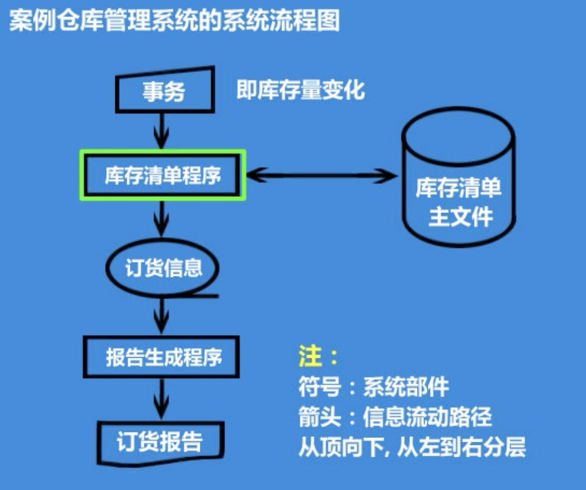

### 结构化分析的主要工具

系统流程图、程序流程图、数据流程图

#### 系统流程图

系统流程图在现在的软件工程中的地位不如以前那么高了,但是它是软件工程中做结构化分析的一个非常重要的工具.系统流程图可以帮助我们构建系统的物理模型.

**什么是系统流程图?**

系统流程图是描述一个系统物理模型的图形工具.

**什么是物理模型?**

以模型材料或标准图形元素直观的表达对象的特征.

- 构建物理模型

- 构建系统的软硬件清单

系统流程图示例

#### 程序流程图
### 数据流程图

