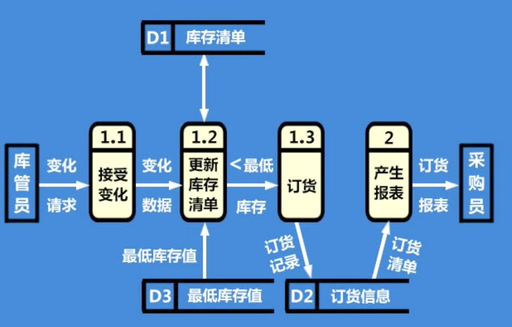

### 结构化分析的主要工具

系统流程图、程序流程图、数据流程图

#### 系统流程图

系统流程图在现在的软件工程中的地位不如以前那么高了,但是它是软件工程中做结构化分析的一个非常重要的工具.系统流程图可以帮助我们构建系统的物理模型.

**什么是系统流程图?**

系统流程图是描述一个系统物理模型的图形工具.

**什么是物理模型?**

以模型材料或标准图形元素直观的表达对象的特征.

- 构建物理模型

- 构建系统的软硬件清单

系统流程图示例

> 系统流程图中,要用标准符号.如果使用到了不是标准的标准符号,也可以,可以在流程图边上做个图例,能够让别人看懂符号要表达的意思即可.

#### 程序流程图

程序流程图,控制的是程序的控制信息.

程序流程图示例

> 要注意区分系统流程图和程序流程图.系统流程图表达的是系统的物理模型,程序流程图表达的是程序的控制信息.

### 数据流程图

数据流程图有4个基本符号

描述逻辑模型

数据流程图是描述系统逻辑流程的工具,它将数据独立、抽象出来,通过图形方式描述信息流动和处理情况.

数据流程图示例

1. 符号1: 数据源/终点

用矩形符号或者立体图形表示

矩形和立体图形,两个都可以表示数据源和数据终点,用任意一个都可以,但是在一个数据流程图中,要保持一致.

数据源/终点名称,直接写在符号图形里面

数据流的起点/终点,可以是人、设备、其他系统,如仓库员、读者、教学系统

2. 符号2:处理/加工

数据加工/处理符号

- 每个处理应该给予一个编号和名称

- 每个处理至少有一个输入流、一个输出流

3. 符号3:数据流

