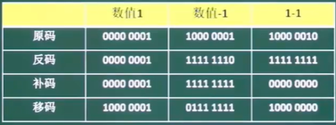
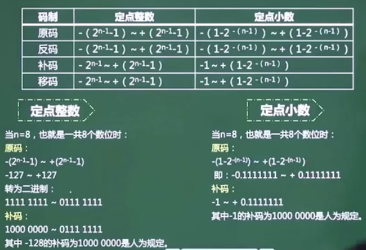
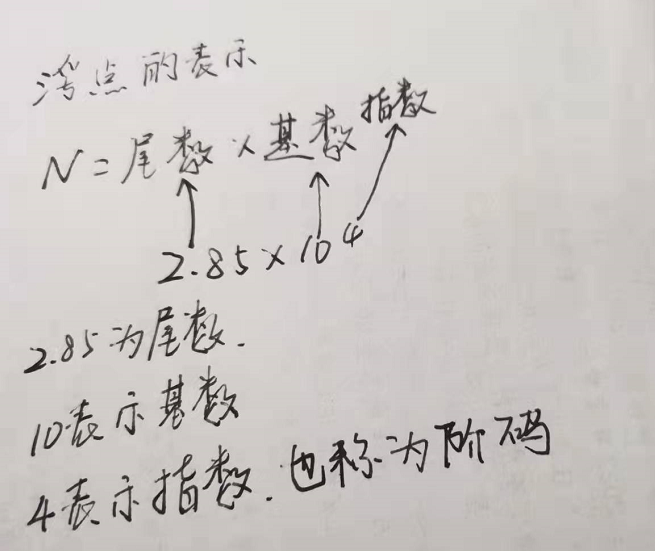
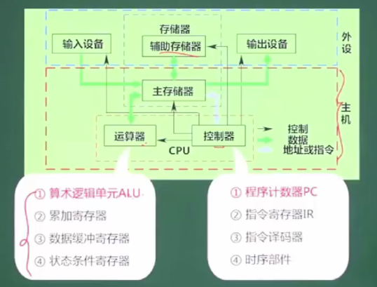
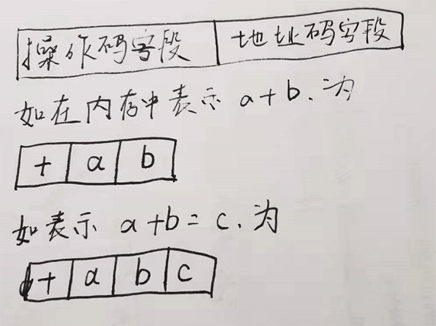
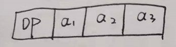
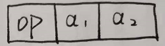
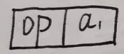
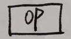

<!-- START doctoc generated TOC please keep comment here to allow auto update -->
<!-- DON'T EDIT THIS SECTION, INSTEAD RE-RUN doctoc TO UPDATE -->
**Table of Contents**  *generated with [DocToc](https://github.com/thlorenz/doctoc)*

- [软考概要](#%E8%BD%AF%E8%80%83%E6%A6%82%E8%A6%81)
- [1. 计算机组成与体系结构](#1-%E8%AE%A1%E7%AE%97%E6%9C%BA%E7%BB%84%E6%88%90%E4%B8%8E%E4%BD%93%E7%B3%BB%E7%BB%93%E6%9E%84)
  - [1.1 数据的表示（★★★★）](#11-%E6%95%B0%E6%8D%AE%E7%9A%84%E8%A1%A8%E7%A4%BA%E2%98%85%E2%98%85%E2%98%85%E2%98%85)
  - [1.2 运算器与控制器（★★★★）](#12-%E8%BF%90%E7%AE%97%E5%99%A8%E4%B8%8E%E6%8E%A7%E5%88%B6%E5%99%A8%E2%98%85%E2%98%85%E2%98%85%E2%98%85)
  - [1.3 Flynn分类法（★★）](#13-flynn%E5%88%86%E7%B1%BB%E6%B3%95%E2%98%85%E2%98%85)
  - [1.4 CISC与RISC（★★）](#14-cisc%E4%B8%8Erisc%E2%98%85%E2%98%85)
  - [1.5 流水线技术（★★★★）](#15-%E6%B5%81%E6%B0%B4%E7%BA%BF%E6%8A%80%E6%9C%AF%E2%98%85%E2%98%85%E2%98%85%E2%98%85)
  - [1.6 存储系统（★★★★）](#16-%E5%AD%98%E5%82%A8%E7%B3%BB%E7%BB%9F%E2%98%85%E2%98%85%E2%98%85%E2%98%85)
  - [1.7 总线系统（★）](#17-%E6%80%BB%E7%BA%BF%E7%B3%BB%E7%BB%9F%E2%98%85)
  - [1.8 可靠性（★）](#18-%E5%8F%AF%E9%9D%A0%E6%80%A7%E2%98%85)
  - [1.9 校验码（★★★）](#19-%E6%A0%A1%E9%AA%8C%E7%A0%81%E2%98%85%E2%98%85%E2%98%85)
- [2. 数据的表示](#2-%E6%95%B0%E6%8D%AE%E7%9A%84%E8%A1%A8%E7%A4%BA)
  - [2.1 不同进制的数据转换](#21-%E4%B8%8D%E5%90%8C%E8%BF%9B%E5%88%B6%E7%9A%84%E6%95%B0%E6%8D%AE%E8%BD%AC%E6%8D%A2)
    - [2.1.1 R进制转十进制：按权展开法](#211-r%E8%BF%9B%E5%88%B6%E8%BD%AC%E5%8D%81%E8%BF%9B%E5%88%B6%E6%8C%89%E6%9D%83%E5%B1%95%E5%BC%80%E6%B3%95)
    - [2.1.2 十进制转R进制：短除法](#212-%E5%8D%81%E8%BF%9B%E5%88%B6%E8%BD%ACr%E8%BF%9B%E5%88%B6%E7%9F%AD%E9%99%A4%E6%B3%95)
  - [2.2 数值表示范围](#22-%E6%95%B0%E5%80%BC%E8%A1%A8%E7%A4%BA%E8%8C%83%E5%9B%B4)
  - [2.3 浮点的运算](#23-%E6%B5%AE%E7%82%B9%E7%9A%84%E8%BF%90%E7%AE%97)
  - [2.4 浮点数的存储结构](#24-%E6%B5%AE%E7%82%B9%E6%95%B0%E7%9A%84%E5%AD%98%E5%82%A8%E7%BB%93%E6%9E%84)
- [3 计算机结构](#3-%E8%AE%A1%E7%AE%97%E6%9C%BA%E7%BB%93%E6%9E%84)

<!-- END doctoc generated TOC please keep comment here to allow auto update -->

### 软考概要

### 1. 计算机组成与体系结构

分值  6分  

#### 1.1 数据的表示（★★★★）

#### 1.2 运算器与控制器（★★★★）

#### 1.3 Flynn分类法（★★）

#### 1.4 CISC与RISC（★★）

#### 1.5 流水线技术（★★★★）

#### 1.6 存储系统（★★★★）

#### 1.7 总线系统（★）

#### 1.8 可靠性（★）

#### 1.9 校验码（★★★）

### 2. 数据的表示

数据，讲的是机器数、操作数，计算机中处理、计算数据都是采用二进制。

#### 2.1 不同进制的数据转换

##### 2.1.1 R进制转十进制：按权展开法

R进制转十进制使用按权展开²法，具体方法：

将R进制数的每一位数值用Rk形式表示，幂的底数是R，指数是k，k与该数字与小数点的距离有关：

1. 当该位在小数点左边，k值是正数：k表示当前数字所在的位数，小数点左侧从0开始
2. 当该位在小数点的右边，k值是负数：k表示当前数字所在的位数，小数点右侧从-1开始

二进制数：10100.01转换十进制：1x24+0x23+1x22+0x21+0x20+0x2-1+1x2-2=16+4+0.25=20.25

##### 2.1.2 十进制转R进制：短除法

短除法只是将十进制转换为其他进制的一种方法，还有其他的很多种方法，如果有其他更简单、更好理解的方式，不是必须要掌握短除法。

短除法，将所有的余数倒着写，其结果就是最终将十进制转换为其他进制的结果。

采用短除法，除数就是要转换的进制数，如要转换为二进制，除数是2，如果要转换为八进制，除数则为8.

如十进制135转换为二进制，结果为：10000111

演算过程如下图：

2.1.3 二进制转八进制和十六进制

每位八进制数用3个位的二进制数表示。

**二进制怎么转换为八进制呢？**

1. 掌握、领会每个八进制数位由3个二进制数位组成；

**数据的表示：码制**

常用的机器数表示方法有：原码、反码、补码、移码。

机器数，一般用8位表示一个数字，最高位表示符号位，其他位为数字。

符号位：0表示正数、1表示负数

字长：二进制数的准确性受到设备的限制，一次最大能处理的最大的二进制数的位数叫做字长；

字节：8位字长叫做一个字节；

1. 原码
   1. 把数字转换成的机器数，也就是二进制数
2. 反码：
   1. 正数的反码就是它的原码
   2. 负数的反码：除符号位之外的所有数字位取反
3. 补码
   1. 正数的补码和原码相同；
   2. 负数的补码在反码的基础上加1
   3. 计算机科学中，使用补码做加减法的计算，不使用原码和反码做数学计算
4. 移码：把符号为取反，在补码的基础上符号
   1. 移码用来做计算机科学中的浮点数的计算

**各种码制之间的转换**

1. 原码转反码
2. 原码转补码
3. 原码转移码
4. 反码转原码
5. 补码转原码
6. 移码转原码
7. 补码转反码
8. 补码

#### 2.2 数值表示范围

可以简单用4位的二进制代入理解一下：

1111:二进制为-7，最高位1为符号位，0表示正，1表示负。

0111：二进制的7，最高位为符号位，0表示正，1表示负。

7=23 - 1;

-7 = -(23 - 1)

从这个简单案例可得出一个结论：4位的二进制数:

最大可表示24-1-1 = 23 - 1

最小可表示-(24-1-1) = -(23-1)

根据这个现象得出结论：

在字长为n:

可最大表示的二进制数为：2n-1-1

可表示的最小的二进制数为：-(2n-1-1)

> 一般情况下字长为8

#### 2.3 浮点的运算

**浮点数的表示**

N = 尾数 x 基数指数

看下图案例：

**运算过程**

对阶 > 尾数计算 > 结果格式化

**特点**

1. 一般尾数用补码，阶码用移码；

2. 阶码的位数决定数的表示范围，位数越多范围越大；

3. 尾数的位数决定数的有效精度，尾数越多精度越高；

4. 对阶时，小数向大数看齐；

5. 对阶是通过小数的尾数右移实现的：算术右移

#### 2.4 浮点数的存储结构

### 3 计算机结构

计算机硬件5大设备：

1. 运算器
   1. 算术逻辑单元：ALU,数据的算术运算和逻辑运算
   2. 累加寄存器：AC， 通用寄存器，为ALU提供一个工作区，用来暂存数据
   3. 数据缓冲寄存器：DR  写内存时，用来暂存指令或者数据
   4. 状态条件寄存器：PSW 存状态标志与控制标志
      1. 有争议，有时也将其归为控制器部分

2. 控制器
   1. 程序计数器：PC  存储下一条要执行的指令的地址
   2. 指令寄存器：IR 存储即将执行的指令
   3. 地址寄存器：DR  
   4. 指令译码器：ID 对指令中的操作码字段进行分析解释
   5. 时序部件：提供时序控制信号

3. 存储器

   1. 主存储器
      1. 又叫内存储器，即内存

   2. 辅助存储器
      1. 外接的存储设备，如U盘、硬盘

4. 输入设备

5. 输出设备

硬盘不属于机箱里面的，属于辅助存储器。

CPU：主要由运算器、控制器、数据总线组成。

6. 指令的基本概念

   一条指令就是机器语言的一个语句，它是一组有意义的二进制代码；

   指令的基本格式如下：

   

   操作码部分指出了计算机要执行的操作，如加、减、乘、除、取数等等，地址码字段需要包含各操作数的地址及操作结果的存放地址等，从其地址结构的角度可以分为三地址指令、二地址指令、一地址指令和零地址指令。
   
   三地址操作指令，存储格式如下：
   
   

   三地址操作指令可表示如a + b = c类似的一元操作指令；

   二地址操作指令，存储格式如下：

   

   二地址操作指令可表示如a+=b类似的操作指令,将a和b想加的值再赋值给a

   一地址操作指令，存储格式如下：

   

   一地址操作指令可表示如++a类似的自增、自减等操作指令,将a自己操作的值再赋值给自己

   零地址操作指令，没有主动的输入操作数，一些系统级别的操作，如宕机、死机、自动重启类似的操作

   一地址操作指令，存储格式如下：

   