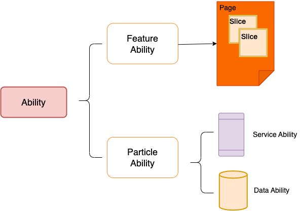

## 鸿蒙应用开发基本信息

开发者文档:[https://developer.harmonyos.com](https://developer.harmonyos.com)(旧)

开发者文档:[https://developer.huawei.com/consumer/cn/](https://developer.huawei.com/consumer/cn/)(新)

鸿蒙应用开发者平台,原本有自己的站点,可能由于其中的一些原因,也为了使开发者快速加入HarmonyOS生态,HarmonyOS开发相关内容均已迁入华为开发者官网.

## 入门

### 开发准备

### 基础知识

### 资源分类与访问

### ArkTS语言

## 开发

## 工具

## 术语

- Ability

应用的重要组成部分,是应用所具备能力的抽象.一个应用可以具备多种能力(即可以包含多个Ability),HarmonyOS支持应用以Ability为单位进行部署.

> HarmonyOS支持应用以Ability为单位进行部署,是否就是说HarmonyOS应用有多种部署方式,而以Ability为单位进行部署只是其中一种,且其他OS如Android、iOS不支持以Ability为单位进行部署呢?

Ability分为两种类型,Featrue Ability(简称FA)和Particle Ability(简称PA).

FA支持Page模板,用于提供与用户交互的能力

PA支持Service模板和Data模板,Service用于提供后台运行任务的能力,Data用于对外提供统一的数据访问抽象.

