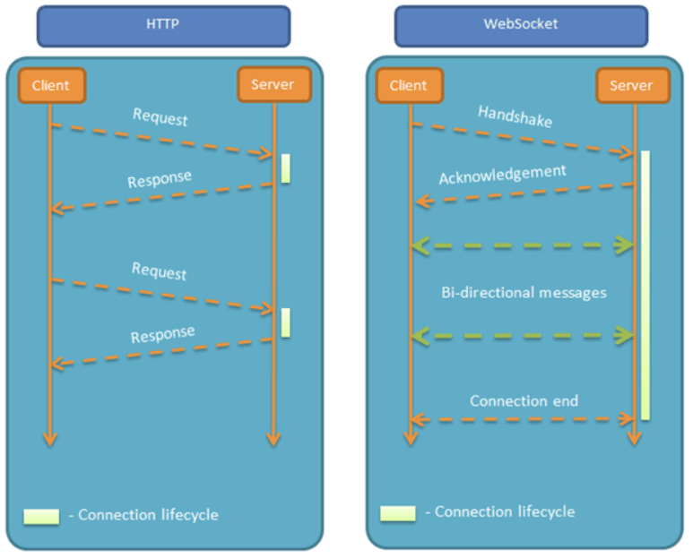

<!-- START doctoc generated TOC please keep comment here to allow auto update -->
<!-- DON'T EDIT THIS SECTION, INSTEAD RE-RUN doctoc TO UPDATE -->
**Table of Contents**  *generated with [DocToc](https://github.com/thlorenz/doctoc)*

- [题目](#%E5%A5%A5%E5%BE%B7%E8%B5%9B)
    - [1. Vue3和Vue2有哪些变化？](#1-vue3%E5%92%8Cvue2%E6%9C%89%E5%93%AA%E4%BA%9B%E5%8F%98%E5%8C%96)
    - [2. 前端有哪些常用设计模式？](#2-%E5%89%8D%E7%AB%AF%E6%9C%89%E5%93%AA%E4%BA%9B%E5%B8%B8%E7%94%A8%E8%AE%BE%E8%AE%A1%E6%A8%A1%E5%BC%8F)
    - [3. Vue中常用的路由模式：history、hash，有什么区别？](#3-vue%E4%B8%AD%E5%B8%B8%E7%94%A8%E7%9A%84%E8%B7%AF%E7%94%B1%E6%A8%A1%E5%BC%8Fhistoryhash%E6%9C%89%E4%BB%80%E4%B9%88%E5%8C%BA%E5%88%AB)
    - [4. Vue中的$router和$route有什么区别？](#4-vue%E4%B8%AD%E7%9A%84router%E5%92%8Croute%E6%9C%89%E4%BB%80%E4%B9%88%E5%8C%BA%E5%88%AB)
    - [5. 说说事件循环？](#5-%E8%AF%B4%E8%AF%B4%E4%BA%8B%E4%BB%B6%E5%BE%AA%E7%8E%AF)
    - [6. 说说js中的继承](#6-%E8%AF%B4%E8%AF%B4js%E4%B8%AD%E7%9A%84%E7%BB%A7%E6%89%BF)
    - [7.computed和watch，有什么区别？](#7computed%E5%92%8Cwatch%E6%9C%89%E4%BB%80%E4%B9%88%E5%8C%BA%E5%88%AB)
    - [8. 说下Vuex](#8-%E8%AF%B4%E4%B8%8Bvuex)
    - [9. v-for和v-if嵌套](#9-v-for%E5%92%8Cv-if%E5%B5%8C%E5%A5%97)
    - [10. MVC和MVVM的区别？](#10-mvc%E5%92%8Cmvvm%E7%9A%84%E5%8C%BA%E5%88%AB)
    - [11. HTTPS和HTTP的区别？](#11-https%E5%92%8Chttp%E7%9A%84%E5%8C%BA%E5%88%AB)
    - [12. 你是怎么理解websocket的？](#12-%E4%BD%A0%E6%98%AF%E6%80%8E%E4%B9%88%E7%90%86%E8%A7%A3websocket%E7%9A%84)
    - [13. 作用域的理解](#13-%E4%BD%9C%E7%94%A8%E5%9F%9F%E7%9A%84%E7%90%86%E8%A7%A3)
    - [14. 深拷贝、浅拷贝](#14-%E6%B7%B1%E6%8B%B7%E8%B4%9D%E6%B5%85%E6%8B%B7%E8%B4%9D)
    - [15. 怎么理解webpack中loader和plugin的，写过plugin吗，怎么实现一个plugin？](#15-%E6%80%8E%E4%B9%88%E7%90%86%E8%A7%A3webpack%E4%B8%ADloader%E5%92%8Cplugin%E7%9A%84%E5%86%99%E8%BF%87plugin%E5%90%97%E6%80%8E%E4%B9%88%E5%AE%9E%E7%8E%B0%E4%B8%80%E4%B8%AAplugin)

<!-- END doctoc generated TOC please keep comment here to allow auto update -->


##### 1. Vue3和Vue2有哪些变化？

##### 2. 前端有哪些常用设计模式？


##### 3. Vue中常用的路由模式：history、hash，有什么区别？

1. 使用这两种模式的时候，有没有遇到过什么问题？
2. 使用history有没有发现过跳转到404的情况？

##### 4. Vue中的$router和$route有什么区别？

1. 各有什么方法
2. $route有什么参数

##### 5. 说说事件循环？

常用的宏任务：

1. setTimout()  定时器
2. setInterval()  定时调用
3. postMessage()
4. script标签
5. I/O
6. UI交互事件

常用的微任务

1. new Promise().then(回调函数)或者catch()

2. MutationObserver()

3. async函数中await之后的部分

4. nextTick

   https://juejin.cn/post/6926832254962532359

##### 6. 说说js中的继承

1. ES6中的继承是怎么实现的

ES5中的继承，有多种继承的实现方式，比如原型链继承、盗用构造函数继承、组合式继承（组合原型链和原型链）、寄生式继承、寄生式组合继承

ES6中的继承，主要是通过extends关键字实现了继承，其本质上还是组合原型链和盗用构造函数的方式实现的，只是在此基础上做了一些封装，语法更优雅、美观了一些。

ES6通过extends关键字，可以实现拥有[[Construct]]和原型的对象，所以ES6不仅可以实现继承一个类，也可以继承一个普通的构造函数。

##### 7.computed和watch，有什么区别？

1. 哪个是默认执行的？
2. 哪个性能开销大？

**computed：计算属性**

计算属性，主要是根据已经存在的、知道的现有的值，去计算、处理得出一个新的值。

该新值，会根据已知的、参与该新值计算的值的变化而变化，其他值的变化，不会影响到该新值

计算属性，本质上是一个属性，但是形式上是一个函数，通过函数返回值的形式得到一个值，计算属性关联值存在于data中

关联值的变化影响到计算属性，别人变化影响到自己

有缓存，使用同一个计算属性时，性能更高

调用的时候才会被执行

依赖改变时才会进行重新计算

**watch**

watch，可以理解为主动监听数据的变化

被监听的这些数据的变化后影响到了别人

另外，watch也可以简单的理解为被监听数据变化后的一个回调函数

**总结**

1. watch，自己的变化影响到了其他数据，watch中做了一些处理，相当于一个回调处理函数
2. computed：自己受其他数据的影响
3. watch和computed，本质上都是Watcher

这个文章，有部分的介绍：https://juejin.cn/post/6924911113012248590，也可以看看源码

##### 8. 说下Vuex

1. 说下mutations和actions
2. mutations是通过什么方法提交的？
3. actions：通过什么提交的

##### 9. v-for和v-if嵌套

1. 为什么不能嵌套，或者不推荐嵌套？

   因为v-for比v-if优先级高，如果每次执行了v-for后执行v-if,会造成一些不必要的计算，影响性能。

   ```vue
   <ul>
       <li v-for="item in userinfo" :key="item.id" v-if="item.isActive">{{ item.username }}</li>
   </ul>
   ```

   如这样的案例，加入有200条数据中，只有一条数据需要进行v-if判断，这在性能上以及资源上是极大的浪费。

   那么怎么解决这样的问题呢？

   使用computed。

   ```vue
   <ul>
       <li v-for="item in activeUsers" :key="item.id">{{ item.username }}</li>
   </ul>
   <script>
   import data from "../assets/user.json";
   export default {
     data() {
       return {
         userinfo: data
       };
     },
     computed: {
       activeUsers() {
         // 过滤只有isActive为true的人员 
         return this.userinfo.filter((item) => {
           return item.isActive;
         });
       }
     }
   };
   </script>
   ```

##### 10. MVC和MVVM的区别？

**MVVM**

Model：数据，其实就是从通过api从服务端请求过来的数据，特殊的场景下也可以是静态的数据，比如本地的一些json文件，一个对象或者一个数组

View：展示层，DOM，也可以简单的理解为HTML部分

VM：ViewModel：视图模型层，是View和Model之间连接的桥梁，其实就是Vue。VM主要做两件事情，一是做数据监听，一是做数据绑定。

**MVC**

MVC是一种使用比较广泛的软件架构，其目的是为了基于分层的目的，将职责分开，View一般通过controller和model进行联系。Controller是view和model的协调者，view和model之间不做直接联系。

**MVVM的优势**

1. 低耦合：View可独立于Model变化和修改，viewmodel可以绑定到不同的view上，当view需要变化的时候，model可以不变，model变化的时候，view也可以不变
2. 独立开发：因为model、view和viewmodel分别负责不同的功能，可以分开独立开发。当然了一般的情况下，多是一个人开发的。
3. 可重用性：view的一些显示逻辑，可以放在viewmodel中，实现多个view重用同一个viewmodel的效果

##### 11. HTTPS和HTTP的区别？

可以参考[HTTP协议](../../net/http.md)

##### 12. 你是怎么理解websocket的？

websocket是一种网络通信协议，很多的网络功能都需要它。

**简单了解下HTTP的特点**

HTTP，超文本传输协议，可以实现浏览器和服务器端的超文本传输。

HTTP协议，有一个特点，也可以说是缺陷：通信只能由客户端发起。

那么假如我想了解股票的行情、动态或者天气预报的变化，那么身处客户端的我怎么能够知道实时的变化呢？

我之前可能会这样去做：我做客户端的，了解客户端向服务器端请求数据的技术，那我就不间断的向服务器端发送请求吧，比如我设置5分钟客户端就请求一次服务器端，也行了，虽然没有达到实时了解最新的情况，但是也缩小了数据获取的时间间隔，能够满足我大部分的诉求，心里很开心。

但也有一些场景我用上述请求轮询的方式不太合适，比如现在老板让我做一个聊天室，我不能5分钟请求拉一次数据呀，那我的用户敲了几个字等待回复消息都等待的睡着了，才有回复的信息过来。

另外，这种请求轮询的方式，也很消耗资源，因为它要保持连接常在。

在这样的场景下，websocket诞生了。

**为什么需要websocket呢？**

其实websocket和http一样，仅仅是众多网络协议中的一种。

websocket协议2008年诞生，2011年称为国际标准，现在所有浏览器都已经支持了。

亮点：也是最主要的特点，就是服务端可以主动的向客户端推送消息，客户端也可以主动的向服务端推送消息，真正的实现了对话平等，属于服务器推送技术的一种。

HTTP和Websocket的图例：



websocket还有其他一些特点：

1. 建立在TCP协议之上，服务器端实现相对简单；
2. 与HTTP有着良好的兼容性。默认端口为80和443，且握手阶段采用HTTP协议，因此握手时不容易被屏蔽，可以通过各种HTTP代理服务器；
3. 协议标识符是ws，如果数据加密了，则是wss，服务器网址就是URL
4. 可以发送文本，也可以发送二进制数据；
5. 没有同源限制，客户端可以与任意的服务器端通信；

现在只是做作为一个简单的认识、了解，先不讲具体的应用了。

##### 13. 作用域的理解

**重点：作用域链、执行上下文。**

说到js的作用域，就不得不说js中的执行上下文。执行上下文，也简称为上下文。

变量、函数的上下文，决定了变量、函数可以访问哪些数据，以及它们具体的行为。

每个上下文，都有一个与之关联的变量对象，这个上下文中定义的所有的变量和函数都存在于这个对象上。

这个变量对象，没有办法通过代码访问到，但是后台、底层的数据处理，会用到它。

全局上下文就是最外层的上下文。根据ECMAScript宿主环境的不同，表示全局上下文的对象也不相同。在浏览器中，全局上下文对象就是window，nodejs中是global。所以所有通过var定义的全局变量和函数都会成为window对象的属性和方法。

每个函数调用都有自己的上下文，当代码执行流进入到这个函数时，函数的上下文被推送到一个上下文栈上。函数执行完毕之后，上下文栈会弹出这个函数的上下文，将控制权返还给之前的执行上下文。ECMAScript程序的执行流程就是通过这个上下文栈进行控制的。

上下文中的代码在执行的时候，会创建变量对象的一个作用域链。这个作用域链决定了各级上下文中的代码访问变量和函数的顺序。代码正在执行的上下问的变量对象始终处于作用域链的最前端。

代码执行时的标识符解析是通过沿作用域链逐级搜索标识符名称完成的。搜索过程从作用域链的最前端开始，然后逐级往后，直到找到标识符。如果没有找到，通常就会报错。

具体的Js作用域的知识点，可以参考:[js作用域](../../frame/Javascript/js作用域.md)

##### 14. 深拷贝、浅拷贝

##### 15. 怎么理解webpack中loader和plugin的，写过plugin吗，怎么实现一个plugin？

##### 16. 你怎么理解vue中的单向数据流

vue是双向的数据绑定单向的数据流

React没有双向的数据绑定，也是单向的数据流

vue中实现的双向数据绑定：VM是View和Model之间的一个桥梁，实现双向绑定，主要是VM做了两件事：

1. 数据监听Data Listening
2. 数据绑定Data Binding

这里需要明确一下，VM就是指的Vue，Vue一方面监测View的数据变化，将变化后的值传递给model，另一方面就是将Model的值绑定到View上，实现数据的双向绑定。


**单向数据流**

Vue中的数据流动，总是由父组件流向子组件，通过props传值，子组件内可以维护自己的数据，保持自己的生命周期，但是子组件不能修改父组件中的数据。

单向的数据流，可以更好的实现组件之间的数据解耦。

加入子组件可以修改父组件数据，那么子组件中的数据变化了，就会引发所有引用了这个子组件的组件发送变化。所以Vue中不推荐子组件修改父组件中的数据。