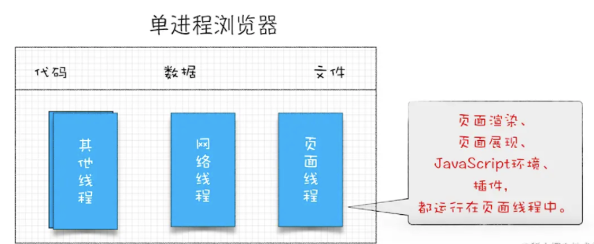
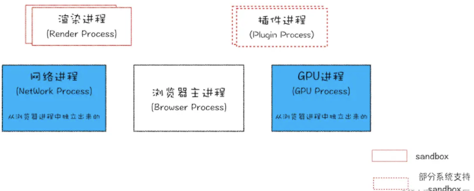

参考链接：https://blog.csdn.net/u012384510/article/details/111148687

一面

### 1.CSS部分 

#### 1.1 描述下CSS的盒模型

注意：不要漏掉IE的怪异盒模型

#### 1.2 怎么实现一个水平居中

### 2. Javascript

#### 2.1 javascript的数据类型有哪些？

原始数据类型：String、Number、Boolean、Null、Undefined、Symbol

引用类型：Array、Object

#### 2.2 Javascript是单线程还是多线程？

Javascript是单线程、非阻塞的开发语言。

### 3. 浏览器部分

#### 3.1 项目中有遇到过跨域问题吗，怎么解决的？

跨域问题，主要是浏览器为了安全角度考虑，设置了同源策略：协议、域名、端口

**怎么解决的？**

1. jsonp

   早期的时候，使用jsops解决方案，就是利用了script标签的src属性，发送带有callback的get请求，服务端将接口返回数据拼接到callback函数中，返回给浏览器，浏览器解析执行，从而前端拿到callback函数返回的数据。

   缺点：只能发送get请求

2. 代理：服务器如nginx做一些转发的代理，把请求转发到api的域名上，也可规避跨域问题

3. cors：跨域资源共享（cross-origin resource sharing）

   cors有两种请求：简单请求和非简单请求。

   **简单请求**

   同时满足下面两个条件的，就是简单请求：

   1. 请求方法是下面三个方法之一：
      1. HEAD
      2. GET
      3. POST

   2. HTTP的头部信息部超出以下几个字段：
      1. Accept
      2. Accept-Language
      3. Content-Language
      4. Last-Event-ID
      5. Content-Type：只限3个值：application/x-www-form-urlencode、text/plain、multipart/form-data

   **其实跨域请求，一般部需要前端做什么具体的事情，只需要和服务端做好配合就可以了。**

#### 3.2 现在使用的浏览器是单进程还是多进程？

现在使用的浏览器，基本都是多进程的，在大概2007年之前的早期的浏览器，大多是单进程的。

单进程浏览器架构：

单进程的浏览器有几个线程：网络线程、页面线程和其他线程。

**单进程浏览器的一些缺点、不足**

1. 浏览器是单进程的，某个线程出问题后，都可能会导致浏览器的崩溃；
2. 界面相关的多个任务集中到一起，如果有一项任务阻塞，就也会造成其他排队的任务阻塞，造成浏览器的卡顿；
3. 单进程的浏览器没有沙箱这个概念，浏览器中运行的任务，都可能会对操作系统造成威胁；

**多进程浏览器**

最新的浏览器，以chrome为代表，都是多进程的：1个浏览器进程、1个GPU进程、1个网络进程、多个渲染进程和多个插件进程；

**多进程浏览器解决了单线程浏览器的一些问题**

1. 当某个渲染进程和插件出现问题时，影响的只是当前页面或者插件，不会影响到其他的页面或插件的执行，其他页面不会受到影响；
2. 当某个渲染进程的任务阻塞时，或者内存泄漏等，影响的也只是当前这个进程所对应的页面，其他页面和浏览器不会受到影响；
3. 至于安全问题，部分浏览器采用了将渲染进程和部分操作系统插件进程放入了沙箱，让浏览器不能访问浏览器外部的资源，减少了对操作系统的伤害；

**多进程浏览器**

浏览器进程：主要负责页面展示、用户交互、子进程管理，同时提供存储功能；

渲染进程：核心任务是将HTML、CSS、Javascript渲染成用户可以交互的网页，排版引擎Blink和Javascript的v8引擎都在该进程下。默认情况下，chrome会为每个tab创建一个渲染进程，然后又处于安全方面的因素，会把渲染进程运行在沙箱模式下；

GPU进程：

网络进程：网络进程主要负责网络资源加载，在单进程浏览器中，网络进程表现为网络线程，后来独立出了一个网络进程；

插件进程：主要负责插件的运行，因为插件容易崩溃，所以需要通过插件进程来隔离插件，保证插件进程的崩溃不会影响到浏览器、或者其他页面；

**多进程架构浏览器也是有缺点的**

1. 资源消耗高；
2. 架构设计复杂，耦合性高，扩展性差；

##### 3.2.1 进程和线程有什么区别？

#### 3.3 描述一下浏览器的渲染过程

### 4. 网络部分

#### 4.1 常见的状态码有哪些？

#### 4.2 追问：是在命中强缓存还是协商缓存的时候才返回304呢？

#### 4.3 追问：聊聊浏览器缓存

#### 4.4 三次握手过程

#### 4.5 OSI七层模型

#### 4.6 HTTPS位于哪一层呢？

### 5. Git部分

5.1 用过哪些git命令？

5.2 怎么切换到新分支？

5.3 手上的代码还不足够commit，需要暂存当前工作并返回上一个commit，应该用哪个git命令？

### 6. 框架

6.1 React和Vue的区别

1. Vue描述自己为框架，React描述自己是类库。

2. Vue的生态，基本都是自己实现了，如单文件系统、状态管理机制、router等，React仅仅关注View部分，其router、状态管理等都是第三方实现的，react本身只关注MVVM或者MVC的View部分；
3. 

### 7. 分析输出

主要是this的指向问题

7.1 this的指向

7.2 事件循环机制

### 8. 算法

剑指offer上的题目

在一个n*m的二维数组中，每一行都是按照从左到右递增的顺序排序，每一列都按照从上到下递增的顺序排序。请完成一个函数：

输入这样的一个二维数组和一个整数，判断数组中是否有该整数。

二面：重点关注项目

### 1. 聊项目

这一块都是对着简历里写的东西问的，不只有项目，还有自己以前做的各种奇奇怪怪的折腾和开发经历

不展开来说，只把问题记录一下吧~

1.1 你用lua脚本的写的一个小应用，介绍一下

1.2 追问: 怎么实现这里面的广告拦截

1.3 展示一下字体设计

1.4 组件库项目的设计思路

### 2. 简历上技术点追问

2.1 async有用过吗？它是怎么实现异步的？

2.2 ES6怎么兼容低版本的浏览器

2.3 后端开发了解过吗？

2.4 有用过TS吗？

2.5 简历上写了对V8有过了解，那么说说Js和C的区别

追问：js和c在编译上的区别

追问：你说C编译生成了一个exe文件，那么这个exe文件里存储的是什么呢？

### 2.6 说一说你对JIT的认识

三面

滴滴的前端只有凉面，有三面，可能是因为推荐到了其他部门

### 1.react有一些新的特性，比如fiber，谈谈你对raect fiber的认识；

### 2.说说你对打包器的了解

2.1追问：怎么引入依赖？

### 3.你简历中写到用styled-components实践了css-in-js，谈谈你的认识

### 4.性能优化

### 5.手写：组合继承

#### 5.1 分析你写的组合继承中的原型链

#### 6.手写async

#### 7.算法：三数之和

给你一个包含n个整数的数组nums，判断nums中是否存在三个元素a，b，c=target。

