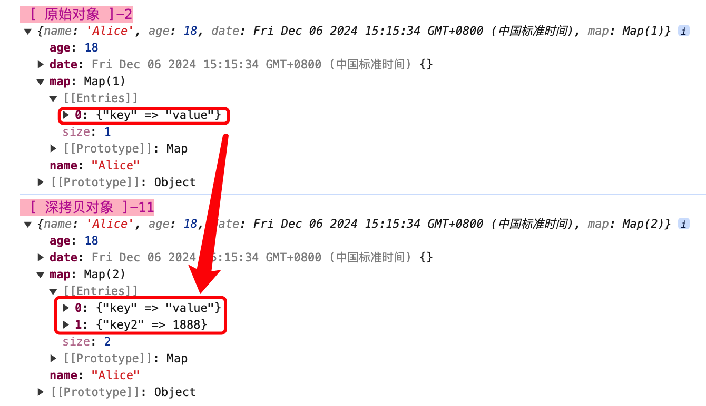
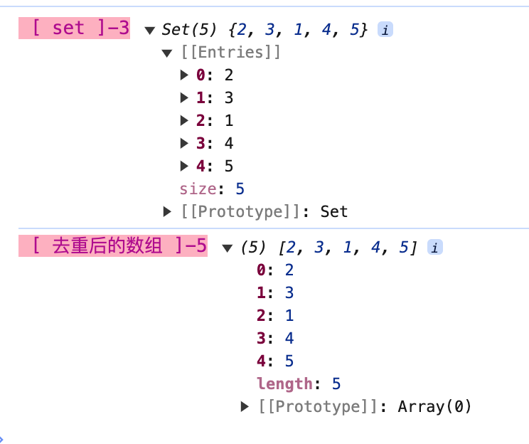
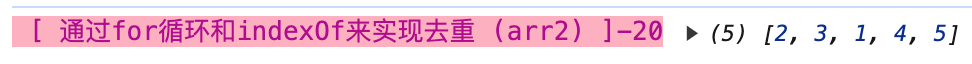

<!-- START doctoc generated TOC please keep comment here to allow auto update -->
<!-- DON'T EDIT THIS SECTION, INSTEAD RE-RUN doctoc TO UPDATE -->
**Table of Contents**  *generated with [DocToc](https://github.com/thlorenz/doctoc)*

- [js十大功能函数](#js%E5%8D%81%E5%A4%A7%E5%8A%9F%E8%83%BD%E5%87%BD%E6%95%B0)
  - [1. 防抖函数](#1-%E9%98%B2%E6%8A%96%E5%87%BD%E6%95%B0)
  - [2. 节流函数](#2-%E8%8A%82%E6%B5%81%E5%87%BD%E6%95%B0)
  - [3. 深拷贝](#3-%E6%B7%B1%E6%8B%B7%E8%B4%9D)
  - [4. 手写promise](#4-%E6%89%8B%E5%86%99promise)
  - [5. 异步控制并发数](#5-%E5%BC%82%E6%AD%A5%E6%8E%A7%E5%88%B6%E5%B9%B6%E5%8F%91%E6%95%B0)
  - [6. 继承](#6-%E7%BB%A7%E6%89%BF)
  - [7. 数组排序](#7-%E6%95%B0%E7%BB%84%E6%8E%92%E5%BA%8F)
  - [8. 数组去重](#8-%E6%95%B0%E7%BB%84%E5%8E%BB%E9%87%8D)
  - [9. 获取url参数](#9-%E8%8E%B7%E5%8F%96url%E5%8F%82%E6%95%B0)
  - [10. 发布订阅模式](#10-%E5%8F%91%E5%B8%83%E8%AE%A2%E9%98%85%E6%A8%A1%E5%BC%8F)

<!-- END doctoc generated TOC please keep comment here to allow auto update -->

### js十大功能函数

#### 1. 防抖函数

防抖是一种延迟执行的技术。

```js
// 防抖函数
function debounce(fn, delay = 1000){
    let timer = null;
    return function(e){
        if(timer){
            clearTimeout(timer);
        }
        timer = setTimeout(() => {
            fn.call(this,e);
        }, delay);
    }
}

// 调用demo
let btn = document.querySelector("#btn");

function handle(){
    console.log('%c [  ]-19', 'font-size:13px; background:pink; color:#bf2c9f;', "防抖函数")
}
btn.addEventListener("click", debounce(handle));
```

#### 2. 节流函数

js中，节流(throttle)是一种控制函数执行频率的技术,确保函数在特定的时间只执行一次。

**节流的作用**


**节流的实现**

**函数节流和防抖的异同点**

相同点：

- 都可以通过setTimeout来实现

- 目标相同：降低回调函数的执行频率，节省计算资源，提升性能

区别：

- 函数防抖,在连续操作结束后，处理回调函数，通过clearTimeout和setTimeout来实现。函数节流，在一段连续的操作中，没一个固定时间间隔内，只执行一次回调函数.

- 关注点不同。函数防抖，关注在一连续的操作中触发的事件只在最后一次操作后执行一次，本质是一种延迟执行技术。函数节流，其本质是在一定时间间隔内，只执行一次回调函数。

#### 3. 深拷贝

在js中，深拷贝是指创建一个对象的完全独立的副本，包括对象的所有嵌套属性和子对象。

**为什么需要深拷贝？**

1. 避免数据共享：当我们进行项目开发时拥有一个复杂的对象，并且在对对象进行修改而不影响原对象时，深拷贝就可以被拿来应用。

因为如果这个时候只是使用浅拷贝(如使用赋值操作或者Object.assign()操作)，那么在修改副本的时候也会影响到原对象，因为它们是共享的原始对象。

2. 为了数据的独立性：在某些情况下，可能会需要将同一个对象传递给不同的地方去调用，但是需要确保这些不同的地方对该对象的调用、修改时不影响原对象，那么这个时候进行深拷贝将会保证原数据的独立性。

**深拷贝的实现方法**

深拷贝，一般情况下可以使用JSON序列化和反序列化、递归调用的方式去实现。

1. 通过JSON序列化和反序列化去实现

  通过JSON的序列化将对象转换为JSON字符串，然后再将字符串解析为JSON对象。这种方法简单、在大多数的普通对象中都有效，但是对一些特殊性的对象类型如函数、正则表达式和日期对象等，可能会出现问题。

  JSON序列化的方式，简单，就是有一定的局限性，它适用于纯对象和数组，但是不支持函数、undefined、Infinity、-0、NaN等、正则表达式、日期对象等复杂的数据类型。

  ```js
  // json深拷贝
  const obj = {
      a: 1,
      b: {
          c: 2
      }
  };
  const newObj = JSON.stringify(obj);
  const targetObj = JSON.parse(newObj);
  targetObj.name = "Nicholas Zakas";
  console.log('%c [ targetObj ]-11', 'font-size:13px; background:pink; color:#bf2c9f;', targetObj)

  // 最终的targetObj如下，不会影响到原始对象obj
  targetObj = {
      a: 1,
      b: {
          c: 2
      },
      name: "Nicholas Zakas"
  };
  ```

2. 通过递归函数实现

```js
function deepCopy(source, hash = new WeakMap()){
    if(obj === null || typeof obj !== "object"){
        return source;
    }

    if(hash.has(source)){
        return hash.get(source);
    }

    let target = Array.isArray(source) ? [] : {};
    Reflect.ownKeys(source).forEach(key => {
        const val = source[key];
        if(typeof val === "object" && val !== null){
            target[key] = deepCopy(val, hash);
        }else {
            target[key] = val;
        }
    })

    return target;
}
```

3. structuredClone ES2023引入的

structuredClone是ES2023新引入的一个接口，原始提供了比JSON更强大的深拷贝能力，可以处理更多的数据类型，包括BigInt、Map、Set、Date、RegExp等，但是仍然不能处理函数。

```js
const originalObj = {
    name: "Alice",
    age: 18,
    date: new Date(),
    map: new Map([["key", "value"]])
};

console.log('%c [ 原始对象 ]-2', 'font-size:13px; background:pink; color:#bf2c9f;', originalObj);

const targetObj = structuredClone(originalObj); // 深拷贝
targetObj.map.set("key2", 1888);

console.log('%c [ 深拷贝对象 ]-11', 'font-size:13px; background:pink; color:#bf2c9f;', targetObj)
```



对深拷贝之后的目标对象做了数据修改后，对元数据没有影响。

**深拷贝的使用场景**

1. 对象克隆：当需要创建一个与现有对象完全相同但是完全独立的副本时，可以考虑使用深拷贝。例如在某些数据处理的场景中时，可能需要对一个对象进行多次操作，但又不想影响原始对象。

2. 参数传递：在函数调用中，如果你需要传递一个对象副本而不是原始对象，以避免函数内部的修改而影响到外部对象的原始数据，可以使用深拷贝来传递参数。

3. 数据持久化:当需要将对象保存到本地或者数据库，通常需要进行深拷贝以确保保存的对象是对象的副本而不是对原始对象的引用。

深拷贝在js中是一项很重要的技术，用于创建对象的独立副本，避免引起数据的意外修改。在实际应用中，根据具体实际情况选择合适的深拷贝方法可以提高代码的可靠性和可维护性。

#### 4. 手写promise

#### 5. 异步控制并发数

#### 6. 继承

#### 7. 数组排序

数组排序，有升序、降序。数组提供了原生的sort接口，可以实现一定程度上的排序能力。


#### 8. 数组去重

数组去重，在js中有着很广泛的应用。有以下几种常用的去重方法：

1. 使用es6的set和扩展运算符

- 基本原理：Set是ES6中新增的一种数据结构，它是一种类数组都数据结构，但是成员都是唯一的。

- 实现方式：可以将数组转换为Set，然后在将Set转换为数组，利用Set的成员的唯一性来实现数组的去重。


```js
const arr = [2, 3, 1, 2, 2, 3, 4, 4, 5];
const set = new Set(arr);
console.log('%c [ set ]-3', 'font-size:13px; background:pink; color:#bf2c9f;', set)
const uniqueArr = [...new Set(arr)];
console.log('%c [ uniqueArr ]-5', 'font-size:13px; background:pink; color:#bf2c9f;', uniqueArr)
```



2. 使用for循环和indexOf来实现数组去重

基本原理：新建一个空的新数组，然后遍历旧数组元素，如果新数组中不存在当前数组中的元素，则将它添加到新的数组中，否则不添加。最后新数组就是已经去重了的数组。

```js
const arr2 = [2, 3, 1, 2, 2, 3, 4, 4, 5];
function removalDuplicate(arr){
    const targetArr = [];
    for(let i = 0; i < arr.length; i++){
        if(targetArr.indexOf(arr[i]) === -1){
            targetArr.push(arr[i]);
        }
    }
    return targetArr;
}
removalDuplicate(arr2)
console.log('%c [ 通过for循环和indexOf来实现去重 (arr2) ]-20', 'font-size:13px; background:pink; color:#bf2c9f;', removalDuplicate(arr2))
```

效果如下：


#### 9. 获取url参数

获取url查询参数,并以对象形式返回。

```js
const url = "https://example.com/page?param1=value1&param2=value2";
function getUrlParams(url){
  const params = {};
  const queryString = url.split("?")[1];
  if(!queryString){
    return params;
  }
  const paramsArr = queryString.split("&");
  for(let i = 0; i < paramsArr.length; i++){
    const item = paramsArr[i].split("=");
    const key = decodeURIComponent(item[0]);
    const value = decodeURIComponent(item[1]);
    params[key] = value;
  }
  return params;
}

// 调用方式
getUrlParams(url);
```

#### 10. 发布订阅模式