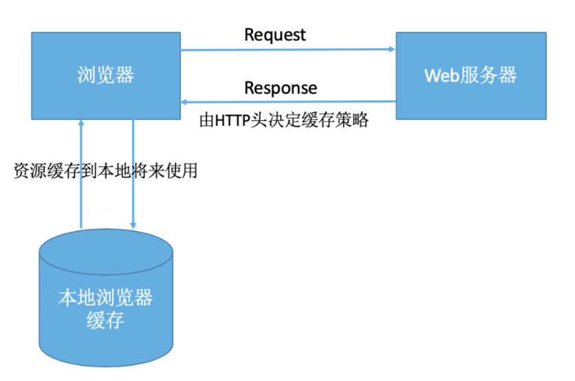

#### 1. Http 缓存

HTTP 缓存，也被称为 web 缓存。

1. http 缓存，指 web 资源（图片、js、css、html 页面、http 请求的数据等）存在于客户端的副本；
2. 缓存会根据进来的请求保存输出内容的副本；当以后有同一个请求进来的时候，缓存会根据缓存机制决定使用本地的缓存还是再次向服务器发送请求，请求新的内容

#### 2. 缓存的好处

- 减少网络延迟，加快页面的打开速度
- 减少网络带宽的消耗
- 降低服务器的压力
- ……

#### 3.HTTP 缓存的流程

HTTP 缓存的流程可以参考一张网络图片，描述的非常清晰、到位

##### 3.1 缓存规则

**过期机制**

过期时间，也称为缓存的有效期。一个缓存必须满足2个条件，浏览器才会认为它是有效的：

1. 含有完整的过期时间控制头信息（HTTP协议报头），且在有效期内；
2. 浏览器已经使用过这个缓存，并且在一个会话中已经校验其有效期；

**校验机制**

服务器返回资源的时候，又是会在控制头信息带上这个资源的实体标签（Entity Tag），它可以用来作为浏览器再次请求过程的校验标识。如果发现校验标识不匹配，说明资源已经被修改或者过期，需要重新拉取服务器上的资源。

##### 3.2 缓存阶段

浏览器缓存一般情况下分为两类：强制缓存（也成本地缓存）和协商缓存（也称弱缓存）。

**本地缓存**

浏览器发送请求以前，会先去本地缓存查看是否命中了强缓存，如果命中，则直接从缓存中读取数据，不会再向服务器发送HTTP请求到；如果没有命中本地缓存，才会向服务器发送请求，去申请新的资源。

**协商缓存**

当强缓存没有命中时，浏览器一定会向服务器发送请求。服务器会根据Request Header中的一些字段来判断是否命中协商缓存。如果命中，则服务器返回304响应，但是不会携带任何的响应实体，只是告诉浏览器可以直接从浏览器缓存中获取这个资源。如果本地缓存和协商缓存都没有命中，则直接从服务器加载资源。

**启用、关闭缓存**

#### 4. 其他缓存策略

##### 4.1 IndexDB

##### 4.2 Serveice Worker

##### 4.3 LocalStorage

##### 4.4 SessionStorage

#### 5. 定义最优缓存策略
