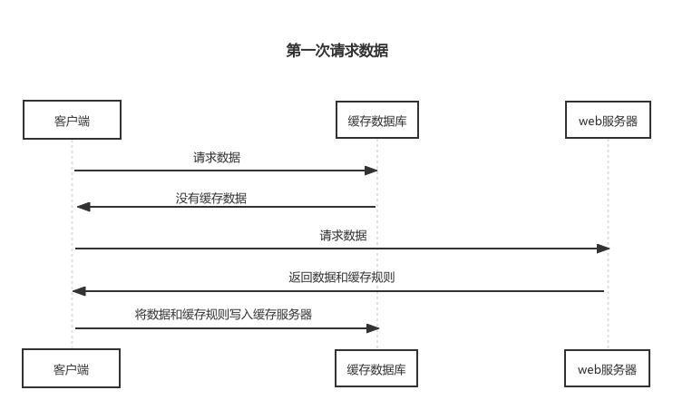
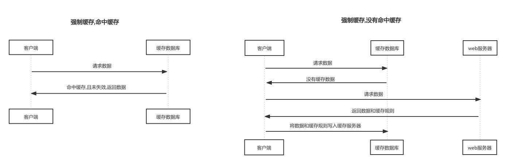

#### 1. Http 缓存

HTTP 缓存，也被称为 web 缓存。

1. http 缓存，指 web 资源（图片、js、css、html 页面、http 请求的数据等）存在于客户端的副本；
2. 缓存会根据进来的请求保存输出内容的副本；当以后有同一个请求进来的时候，缓存会根据缓存机制决定使用本地的缓存还是再次向服务器发送请求，请求新的内容

#### 2. 缓存的好处

- 减少网络延迟，加快页面的打开速度
- 减少网络带宽的消耗
- 降低服务器的压力
- ……

#### 3.HTTP 缓存的流程

HTTP 缓存的流程可以参考一张网络图片，描述的非常清晰、到位

在具体的了解缓存策略之前,我们先了解下用户刷新、访问行为的几种方式:

* 在浏览器地址栏中输入完整的URL敲击回车/通过书签访问
* F5/浏览器工具栏的刷新按钮/右键点击刷新(重新载入)操作,刷新页面
* ctrl+f5:强制刷新,完全不使用HTTP缓存

不同的刷新、加载方式,浏览器会使用不同的缓存策略.

HTTP缓存主要通过请求和响应报文头中对应的header信息来控制缓存的策略.

响应头中的相关字段为Expires、Cache-Control、Last-Modified、Etag

根据是否需要向服务器发送请求,HTTP缓存主要可以分为:强制缓存和协商缓存(也有人将协商缓存称为对比缓存,就是将缓存进行对比,看是否存在).

##### 3.1 缓存规则

**过期机制**

过期时间，也称为缓存的有效期。一个缓存必须满足2个条件，浏览器才会认为它是有效的：

1. 含有完整的过期时间控制头信息（HTTP协议报头），且在有效期内；
2. 浏览器已经使用过这个缓存，并且在一个会话中已经校验其有效期；

**校验机制**

服务器返回资源的时候，又是会在控制头信息带上这个资源的实体标签（Entity Tag），它可以用来作为浏览器再次请求过程的校验标识。如果发现校验标识不匹配，说明资源已经被修改或者过期，需要重新拉取服务器上的资源。

##### 3.2 缓存分类

HTTP缓存的种类有很多,根据是否需要向服务器发送请求,浏览器缓存一般情况下分为两类：强制缓存（也成本地缓存）和协商缓存（也称弱缓存）。

**强制缓存(本地缓存)**

浏览器发送请求以前，会先去本地缓存查看是否命中了强缓存，如果命中，则直接从缓存中读取数据，不会再向服务器发送HTTP请求到；如果没有命中本地缓存，才会向服务器发送请求，去申请新的资源。

**强制缓存流程图**

从流程图可以看出来,强制缓存,在缓存没有失效的情况下,客户端可以直接使用缓存数据,而不用向服务器发送请求,去请求数据.那么客户端是怎么判断缓存数据是否失效的呢?

对于强制缓存来说,响应header中的两个字段来标明缓存是否失效:Expires、Cache-Control.

* Expires

  Expires是HTTP1.0标准中的实现方案,现在浏览器默认已经都是用HTTP1.1了,所以Expires在浏览器中的作用基本被忽略,但是实际上大部分的网站对这个字段还是做了兼容.它的值为服务端返回的缓存的失效时间(也可以理解为缓存的有效期).在下一次的HTTP请求时,如果时间小于服务器返回的失效时间,则直接使用缓存数据.

  上文提到了,Expires是由服务器返回的缓存的失效时间,但是有的时候客户端和服务器时间不同步,会有误差,这个时间误差也导致了缓存命中的误差问题.在HTTP1.1中,Expires被Cache-Control取代了.

* Cache-Control

  Cache-Control是缓存中最重要的规则.常见的值有:private、public、no-cache、max-age、no-store,默认为private

  1. max-age:用来设置资源可以被缓存的时长,单位为秒

  2. s-maxage:作用和max-age相同,只不过是它只针对代理服务器缓存有效

  3. public:指响应可以被任何缓存区缓存

  4. private:只能针对个人用户缓存,不能被代理服务器缓存

  5. no-cache:强制客户端直接向服务器发送请求,每次请求都必须向服务器发送.服务器接收到请求后,判断资源是否变更,是则返回新内容,否则就返回304,表示数据没有变化,但是这个时候返回的时候不会携带实体数据.

     no-cache很容易被人误解,以为这个字段是为了限制响应数据不被缓存的,实际上Cache-Control:no-cache是会被缓存的,只不过每次都要向服务器发送请求,服务器根据数据是否变化来判断是否向客户端返回实体数据,其实就是评估缓存的有效性

  6. no-store:禁止缓存,这个是真正的不被缓存.

**协商缓存(也称弱缓存、对比缓存)**

当强缓存没有命中时，浏览器一定会向服务器发送请求。服务器会根据Request Header中的一些字段来判断是否命中协商缓存。如果命中，则服务器返回304响应，但是不会携带任何的响应实体，只是告诉浏览器可以直接从浏览器缓存中获取这个资源。如果本地缓存和协商缓存都没有命中，则直接从服务器加载资源。

协商缓存,在客户端已经缓存数据的情况下,使用协商(对比)缓存的方式去请求数据的 流程图:

**启用、关闭缓存**

#### 4. 其他缓存策略

##### 4.1 IndexDB

##### 4.2 Serveice Worker

##### 4.3 LocalStorage

##### 4.4 SessionStorage

#### 5. 定义最优缓存策略

* 结合native的强大储存能力:善于利用客户端的能力,定制合适的缓存机制,打造极致的体验
* 善用HTML5的缓存机制:合理利用LocalStorage、SessionStorage、IndexDB、Service Worker等存储机制,给页面带来极大的性能提升
* 更新最小化:有些资源的更新比较频繁,如Js或者CSS等,可以考虑将这部分内容作为单独的文件提供,这样,不是频繁更新的内容从缓存中获取,只有经常更新的数据才从服务器请求,确保下载的数据量是最小的;
* 
