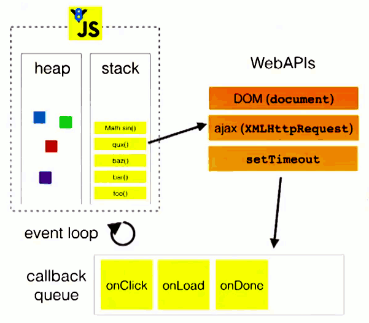

### 常见问题

1. 浏览器和node的事件循环区别是什么？

2. 什么是宏任务和微任务，为什么要有这两种任务？其执行顺序是什么？

### 常见的事件循环

**Js是单线程、非阻塞的**

**浏览器的事件循环**

1. 执行栈和事件队列

2. 宏任务和微任务

**node环境下的事件循环:和浏览器环境有所不同**

1. 事件循环模型

2. 宏任务和微任务

**经典面试题分析**

### Js单线程和非阻塞

**单线程**

Js的一个非常主要的任务是与用户互动、操作DOM。如果Js是多线程，那么会出现很多复杂的问题要处理，比如有多个线程同时操作了DOM，那么以哪个线程为准呢？为了避免这种问题的出现，Js设计成了单线程。H5提出的web worker标准，虽然实现了多线程，但是也有很多的限制，web worker也只是主线程的子线程，受主线程的控制。

**非阻塞**

通过event loop实现。

### 浏览器的事件循环

**执行栈和事件队列**

浏览器中的事件循环，我们可以看一张图：



执行栈：同步代码的执行，按照执行顺序依次添加到执行栈中

事件队列：异步代码执行，遇到异步事件不会等待它返回执行结果，而是先将这个事件挂起，继续执行执行栈中的其他任务。当异步事件有了返回结果时，将它放到事件队列中，被放入事件队列不会立刻执行回调，而是会等待当前执行栈中的所有任务都执行完成后，主线程为空闲状态时，主线程回去查找事件队列中是否有任务，如果有，则取出排在第一位的事件，并把这个事件对应的回调函数放到执行栈中，然后执行其中的同步代码。

```javascript
var btn = document.getElementById("btn");
btn.addEventListener("click", function timer() {
  setTimeout(function () {
    console.log("点击了按钮");
  }, 2000);
});

console.log("Hi");

setTimeout(function timeout() {
  console.log("来点击按钮");
}, 5000);
console.log("欢迎你!");
// 执行结果
// Hi 、 欢迎你、来点击按钮    如果点击了按钮，则会打印“点击了按钮”，没有点击按钮，则不打印
```

**宏任务和微任务**

宏任务和微任务，都可以简单的理解为异步任务。

宏任务：

1. script
2. setTimeout()  定时器
3. setInterval()  定时调用
4. postMessage()
5. I/O
6. UI交互事件

微任务

1. new Promise().then(回调)  注意只有then部分才是微任务，new Promise()是同步的
2. MutationObserver():
