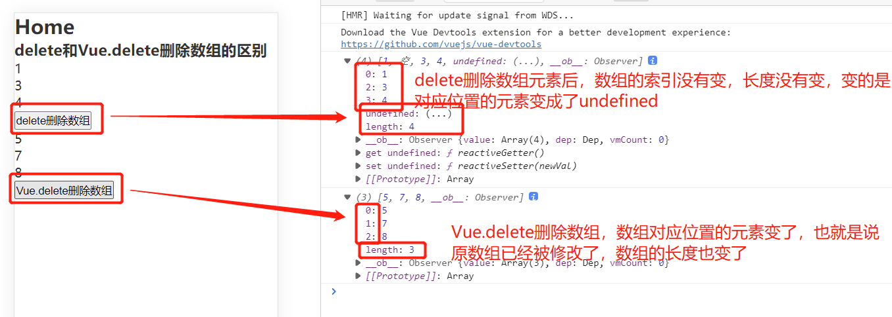

### delete和Vue.delete删除数组的区别

delete删除数组，只是被删除的元素变成了undefined、empty，是将数组对应位置的数组元素的值重置了，而位置还在，也就是键值还在、索引还在，数组的长度(length)不变。

而Vue.delete删除，是直接删除了数组对应位置的数组项，是将数组的这个位置的元素彻底的从数组中移出了，数组的长度值变了(减小了)，数组对应的键值也变了。

```html
<template>
  <div class="home">
    <h2>Home</h2>
    <h3>delete和Vue.delete删除数组的区别</h3>
    <div class="array-a">
      <ul>
        <li v-for="(item, index) in a" :key="index">{{ item }}</li>
      </ul>
      <button @click="deleteArrayA">delete删除数组</button>
    </div>
    <div class="array-b">
      <ul>
        <li v-for="(item, index) in b" :key="index">{{ item }}</li>
      </ul>
      <button @click="deleteArrayB">Vue.delete删除数组</button>
    </div>
  </div>
</template>
<script>
export default {
  name: "VueDelete",
  data() {
    return {
      a: [1, 2, 3, 4],
      b: [5, 6, 7, 8],
    };
  },
  methods: {
    deleteArrayA() {
      delete this.a[1];
      this.$set(this.a);
      console.log(this.a);
    },
    deleteArrayB() {
      this.$delete(this.b, 1);
      console.log(this.b);
    },
  },
};
</script>
```

效果如下图：


