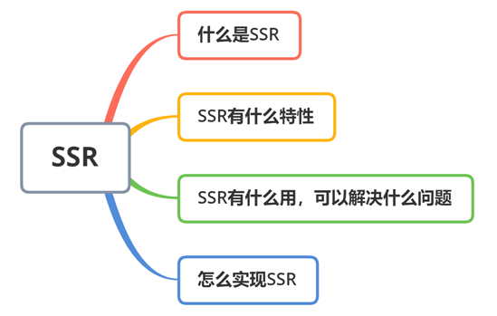

### SSR

1. 什么是SSR
2. SSR能解决什么问题，有什么作用？
3. 怎么实现或者使用SSR？

### 什么是SSR？

SSR：Server-side Render，意为服务端渲染，指在服务端完成HTML的结构拼接，然后返回给客户端浏览器，然后再在客户端完成客户端事件绑定，完成页面于用户交互过程的页面渲染方式。

现在常用的渲染方式有以下几种：

* 传统的SSR：传统开发语言实现的服务端渲染技术，如Asp、Jsp、PHP等

* 静态页面渲染：Static Rendering,传统的客户端渲染方式

* CSR: Client-side Render,客户端渲染

* 新型的服务端渲染SSR：即通过前端js框架实现的服务端渲染技术

传统的服务端渲染，就是服务端渲染出HTML页面，如上面提到的Asp、Jsp、PHP