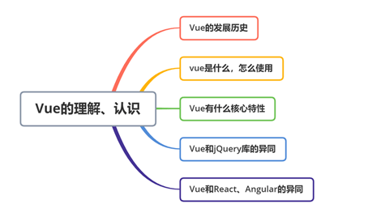

<!-- START doctoc generated TOC please keep comment here to allow auto update -->
<!-- DON'T EDIT THIS SECTION, INSTEAD RE-RUN doctoc TO UPDATE -->
**Table of Contents**  *generated with [DocToc](https://github.com/thlorenz/doctoc)*

  - [对vue是怎么理解的？](#%E5%AF%B9vue%E6%98%AF%E6%80%8E%E4%B9%88%E7%90%86%E8%A7%A3%E7%9A%84)
  - [Vue的历史](#vue%E7%9A%84%E5%8E%86%E5%8F%B2)
  - [那么Vue到底是什么呢？](#%E9%82%A3%E4%B9%88vue%E5%88%B0%E5%BA%95%E6%98%AF%E4%BB%80%E4%B9%88%E5%91%A2)
  - [Vue的核心特性](#vue%E7%9A%84%E6%A0%B8%E5%BF%83%E7%89%B9%E6%80%A7)
  - [Vue和jQuery的区别?](#vue%E5%92%8Cjquery%E7%9A%84%E5%8C%BA%E5%88%AB)
  - [Vue和React、Angular的异同](#vue%E5%92%8Creactangular%E7%9A%84%E5%BC%82%E5%90%8C)
- [重点来了，对Vue是怎么理解的](#重点来了对vue是怎么理解的)
  - [组件机制](#组件机制)
    - [数据传递](#数据传递)
    - [事件传递](#事件传递)
    - [内容分发](#内容分发)
      - [默认插槽](#默认插槽)
      - [具名插槽](#具名插槽)
      - [作用域插槽](#作用域插槽)
    - [模板渲染](#模板渲染)
      - [模板编译](#模板编译)
      - [预编译](#预编译)
    - [小结](#小结)
  - [响应式系统](#响应式系统)
  - [虚拟DOM： Virtual DOM](#虚拟dom-virtual-dom)

<!-- END doctoc generated TOC please keep comment here to allow auto update -->

[toc]
### 对vue是怎么理解的？

我认为对一件事情，或者物件的理解，首先会想到的几个方面，就是这个物件、事务是什么，它的发展历史是什么，它是为了解决什么问题的，它怎么解决问题，有针对性的去解决什么问题，以及有没有其他的类似功能的物件、事务也能起到类似相同的作用，如果有，那它的优势是什么，如果没有，我们是怎么继续让这件事做的更优？

大概的思路可参考下图：



### Vue的历史

Vue是一套用于构建用户界面的渐进式框架，Vue的核心只关注视图层，即用户UI界面，容易上手，方便与第三方库、项目整合。

在上世纪90年代，网络上的站点，几乎就是静态的HTML网页，网站中的数据，都是静态的固定的元素，是没有数据库存储的，如果我们想更新站点数据，就需要新开发一个新的网页，然后再部署到服务器上，即为的不方便。然后到了20世纪，以asp、jsp为代表的服务端网页开发技术，取代了之前已经可以取代之前已经通过CGI+Perl运行的可以和数据库有交互的技术解决方案了。这个时候，网站的使用者，可以在网站上输入信息，并和数据库的数据产生交互，极大的增加了网站使用的便利性。行业称这个时代为Web2.0。

随着人们的使用频率和时间的不断增长，人们对网站的使用需求也逐步提高。asp、jsp技术有一些缺点，就是网页是在服务端渲染完成的，在服务端渲染完成的数据返回到客户端的时候，返回的内容太多、质量太大，导致体验很不友好，因为用户们并没有那么多的时间一直在等待呀，还有很多的事情要做，因为很可能就是工作时开个小差，没有那么多的时间去等待。以及随着智能移动设备的出现和使用普及率的提高，所以人们对网站的性能需求也是逐渐提高了。

为此，开发者进行了众多的技术迭代和提升，在性能的要求上精益求精，开发效率上也进行了各种各样的探索。由之前的静态站点，到asp、jsp等类似技术的发展可以直接和数据库交互，到网页由最初的table布局，到后来的可以使用div+css的方式进行页面布局等等技术的发展，人们的生产效率和网站的性能都出现了极大的提升。

但是生产力和生产关系总是有产生矛盾的时候，站点的性能提升了，用户们在使用体验上的要求也在提升，那么做各种各种的针对用户友好的交互，就真的难为了java工程师了，你让他们给我们倒个数、写个SQL，保证给你完成的漂漂亮亮，但是你让他们给你写出漂亮的各种页面交互效果，而且是通过和服务端开发语言风格完全不同的js，简直是太难为人了。于是就出现了各种关注UI层(View层)的框架，以便让更加专业的前端关注页面UI层，专注和终端用户打交道，专业的人做专业的事，分工明确，体验提升。这样的框架中使用范围比较大的有Vue、React和Angular。

### 那么Vue到底是什么呢？

上面已经简单介绍了下，Vue是一套用于构建用户界面的渐进式框架，它只关注视图层，是尤雨溪在2014年2月份发布的。

### Vue的核心特性

1. 组件化

现在前端框架如Vue、React等真正的实现了组件化，是真正的实现了UI组件的按需引用。

在模块化的这个概念下，UI层的模块化实现，是最难的。按照其他开发语言的模块化定义，是很好实现的，实现不同逻辑、不同意义的拆分，是很容易，我实现按需调用很容易的，但是UI怎么来按需引用呢？现在的UI框架给解决了UI模块的按需引用。

现在我们可以通过框架，将UI、样式和交互（数据交互和使用交互）都可以将文件组织到一起，然后通过工程化的方式组织到一起，对外提供统一的接口，非常大的提升了开发效率和产品项目的统一性，这样：

* 降低了整个项目的耦合度：

* 提高了代码的可维护性：由于组件是功能、UI模块最小单元的集合，所以每个组件的功能都是单一的，逻辑较为清晰，维护较为方便

* 调试方便，提升开发效率：

上面几个优势，最终体现出来的都是组件功能单一，逻辑清晰。

2. 指令系统

先解释一下指令：指令（Directives）是带有v-前缀的特殊属性，指令属性的值预期是单个js表达式。指令的职责是，当表达式的值改变时，将其产生的连带影响，响应式的作用于DOM。vue给我们提供了丰富的指令，如：

v-text

v-html

v-show

v-if

v-else

等等众多指令，具体可以参考：[https://vue3js.cn/docs/zh/api/directives.html#v-text](https://vue3js.cn/docs/zh/api/directives.html#v-text),我们可以通过这些指令，直接作用于DOM，而不再需要像原来那样，先获取到希望发生作用的DOM，然后再给获取到的DOM添加事件。

3. 数据驱动

其实我想把这个特性和指令系统放到一起的，但是由于数据驱动这个新的概念、思维方式太重要了，还是单独拿出来说一下。

数据驱动MVVM

MVVM指的是Model-View-ViveModel

model：模型层，表示处理业务逻辑并和服务端进行交互的部分

view：视图层，表示将数据绑定到UI并展示出来的这一层，可以简单的理解为HTML绑定数据并展示

ViewModel：视图模型层，从概念上也可以看出来，表示链接View和model的部分，是model和view之间通信的桥梁


### Vue和jQuery的区别?

通过前面的介绍我们已经知道Vue的一个典型特性，就是数据驱动的双向数据绑定特性以及丰富的指令系统，通过丰富的指令会以及数据驱动的模式直接将事件作用到DOM上，其核心的思想是通过修改DOM的属性值来引起DOM的变化，属性的值，也就是数据，也就是说，Vue的所有操作，都是基于数据的。而jQuery就不同了，jQuery是一个高效、精简且功能丰富的javascript工具库，它提供的丰富的API易于使用且兼容多版本的浏览器，这让诸如HTML文档遍历、操作、事件处理、动画等操作更加简单和高效。

由此我们可以清楚，jQuery的优势在于操作DOM，以及浏览器之间的兼容性，它擅长的不是数据处理。当然了，它也可以处理数据，只是处理的方式是先获取到数据需要绑定的DOM，然后将数据处理完成后，再通过一定的办法将数据和该DOM节点进行绑定。这里对数据的处理，其实也经和jQuery没有多大的关系了。

所以概括一下就是：

* Vue操作数据，通过数据处理的方式来更改DOM上展示的数据，通过数据来操控一切；

* jQuery是操作DOM，对DOM的操作更高效、更便捷；


### Vue和React、Angular的异同

> 先不比较Angular了，Vue和React的共性更多一些

相同点：

* 组件化思想

* 服务端渲染

* 都是SPA应用

* 支持服务端渲染，react是next.js，Vue是nuxt.js

* 数据驱动型思想

* 都有native的解决方案：react的ReactNative，Vue的weex

* 虚拟DOM思想

* 都有自己的命令行构建工具，React的是create-react-app,Vue的是@vue/cli,都内置了一些比较实用的功能

除了上面的一些都有的特性之外，也有一些区别的：

* diff算法不同：react主要使用diff队列保存需要更新哪些DOM，得到patch树，再统一操作批量更新DOM；Vue使用双向指针，边对比边更新DOM

* 组件化通信方式的不同：React使用的是回调函数来实现数据通信的，Vue中不同组件之间的数据通信是通过事件和回调函数

* 数据变化的实现原理不同：react使用的不可变数据，vue使用的是可变数据

## 重点来了，对Vue是怎么理解的

Vue是一套用于构建用户界面的渐进式框架，其核心有2点：

1. 构建用户界面；

2. 渐进式；

**什么是渐进式呢？**

渐进式的核心就是减少强制，比如Vue，我们使用vue做项目，可以使用vue只重构项目中的某一个页面，而不是必须整个项目必须都要全部使用vue实现；你可以使用vue的vue-router而不是必须使用vuex等等。总之，就是vue框架本身以及生态很强大，你可以选择有必要的部分去使用，框架本身不要求我们必须要引入、使用框架的全部内容。

**构建用户界面**

由于vue的定位位构建用户界面，其在界面构建方面做了大量的工作，如组件化系统、声明式渲染、数据持久化等等，都对界面的构建提供了非常友好的支持。

### 组件机制

组件就是对一个逻辑单元独立的功能和样式的封装，从而使得代码得到更好的复用，提高开发的效率；

Vue组件，可以从外部传入数据过来，包括属性和事件，组件内部也有自己的状态，可以有自己的声明周期和计算属性等，综合外部的传递和内部的自己的属性，决定了组件最终的交互和逻辑体现；

#### 数据传递

每个组件之间是相互独立的、相互割裂的，就是说每个组件之间不存在任何的耦合，各个组件之间互不影响，除非发生了组件之间的相互引用。

Vue中如果发生了组件的引用，允许外部向组件内部通过props传递数据。

```html
<!--组件-->
<template>
    <div class="tt">{{ msg }}</div>
</template>

<script>
export default {
    props: {
        msg: {
            type: String,
            default: "Hello Vue"
        }
    }
}
</script>
```

下面为引用：

```html
<tt :msg="info"></tt>
<script>
import UserCenter from "./components/UserCenter.vue";
import Tt from "./components/tt.vue";
export default {
  name: "App",
  components: {
    UserCenter,
    Tt
  },
  data() {
    return {
      info: "Hello Vue"
    };
  }
};
</script>
```

数据的传递，可以发生在父子组件之间：父组件向子组件传递数据、子组件向父组件推送数据。

#### 事件传递

Vue内部实现了一个事件总线系统，也就是EventBus。Vue可以使用EventBus来作为沟通桥梁的概念。每个Vue组件都继承了EventBus，都可以接受事件$on和发送事件$emit

除了父子组件之间可以使用$emit、$on来传递和监听事件，也可以通过一个Vue实例为多层级的父子组件之间建立通信的桥梁；

```javascript
// 父组件通过$on来监听事件
const eventBus = new Vue();
eventBus.$on("eventName",val => {
  // 做一些事情
});

// 子组件通过$emit触发事件
eventBus.$emit("eventName","触发的事件");
```

除了$on、$emit外，事件总线还提供了另外2个方法：$once、$off.

$on:监听、注册事件

$emit:触发事件

$once:注册事件，仅允许该事件注册一次，触发后立即移出该事件

$off:移除事件

#### 内容分发

Vue根据Web Components规范草案的内容分发系统，将<slot>元素作为承载分发内容的出口。

slot，就是一个占位符，至于这个占位的地方要显示的内容，以及显示内容的样式，完全由父组件来决定。

插槽（slot），又分为默认插槽、具名插槽。

##### 默认插槽

默认插槽，就是没有名字的插槽，一个组件内只能有1个默认插槽。

```html
  <!--父组件-->
    <tt :msg="info" @getName="getName">
      <div>
        <h3>这里是一个slot</h3>
      </div>
    </tt>
  <!--子组件-->
    <div class="child">
        <div class="tt">{{ msg }}</div>
        <button @click="btnClick">子组件中点击事件</button>
        <slot></slot>
        <slot name="btn"></slot>
    </div>
```

如该组件只有1个默认插槽，且也只能有1个默认插槽。

子组件中的默认插槽，会被父组件中的div>h3取代。

##### 具名插槽

具名插槽，就是有name属性的插槽。具名插槽，一个组件内可以有多个。

```html
<!--父组件-->
    <tt :msg="info" @getName="getName">
      <div>
        <h3>这里是一个slot</h3>
        <button slot="btn">这是一个slot占位的button</button>
        <p slot="text">这里是一个slot占位的text</p>
      </div>
    </tt>
<!--子组件-->
    <div class="child">
        <div class="tt">{{ msg }}</div>
        <button @click="btnClick">子组件中点击事件</button>
        <slot></slot>
        <slot name="btn"></slot>
        <slot name="text"></slot>
    </div>
```

子组件中的两个具名插槽btn和text会分别被父组件的div>button和div>p取代。

实际上，默认插槽也有name属性，只不过属性值是default，可以缺省。

##### 作用域插槽

有个小疑问没有搞清楚：是不是作用域插槽不能是具名插槽？

#### 模板渲染

Vue的核心是声明式渲染，不是命令式渲染。

声明式渲染，是只告诉程序，我想要的结果，至于结果的计算过程，不必关心，这些事情交给程序去处理。

命令式渲染，是要命令程序一步一步的根据命令去执行渲染，需要一步一步的告诉程序去做什么，下一步继续做什么，最后得出一个我们期望的结果。

可以看下案例：

```javascript
var arr = [1, 2, 3, 4, 5];
// 命令式渲染，关心每一步，关心过程，得出结果
var newARr = [];
for (var i = 0; i < arr.length; i++) {
  return newARr.push(arr[i] * 2);
}

// 声明式渲染，不关心中间过程，只关心最终结果
var newArr1 = arr.map((item) => {
  return item * 2;
});
```

##### 模板编译

为什么要进行模板编译呢？

因为Vue的组件化系统，组件中的template浏览器是没有办法直接解析的，因为template不是正常的HTMl标签，而模板编译，就是将模板template编译成可执行的javascript代码，也就是将template编译成真正的渲染函数。

模板编译分为3个阶段：parse、optimize、generate，最终生成render函数。


parse：使用正则表达式将template进行字符串解析，得到指令、class、style等数据，生成抽象语法树AST。

optimize：寻找抽象语法树AST中的静态节点进行标记，为后面的VNode的patch过程做对比优化；

generate：根据AST结构拼接成render函数的字符串。

##### 预编译

vue中，模板编译只有在组件实例化的时候被编译一次，生成渲染函数之后就不再对组件进行编译了。编译，对组件的runtime是一种性能上的损耗，模板编译的目的，仅仅是将template编译、转换成渲染函数。而组件、模板的这个转换过程，是可以在项目的构建过程中完成。

vue项目的构建，webpack配置的vue-loader依赖了vue-template-compiler模块，在webpack对vue项目的构建过程中，将template预编译成了渲染函数，然后在runtime就可以直接跳过了模板编译过程。

vue的runtime，仅仅需要的是render函数，而有了预编译之后，我们只需要保证在项目构建过程中生成render函数就可以了，那么就可以减少runtime时生成render函数的性能损耗了。

#### 小结

### 响应式系统

### 虚拟DOM： Virtual DOM

https://juejin.cn/post/6844904020864139278#heading-2

https://juejin.cn/post/7021394272519716872#heading-4