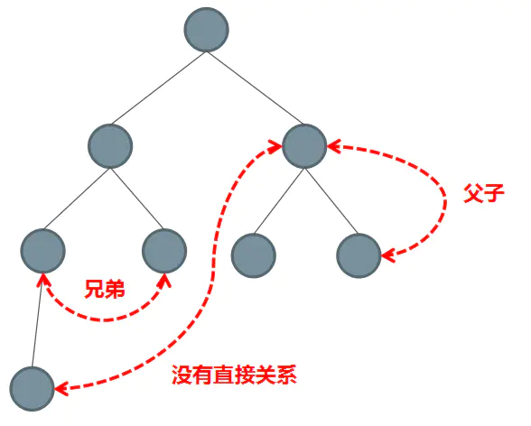

### 1. 组件间的通信

组件间的通信，有2个核心要素：

1. 组件

2. 通信

通信，简单理解，就是不同组件之间的数据传递、消息推送。

### 2.通信的场景

组件之间的通信，可以分为以下几种场景：

1. 父子组件之间的通信；

2. 兄弟组件之间的通信；

3. 祖孙组件之间的通信：指组件与后代组件之间的通信

4. 非关系组件之间的通信；

借用网上的一张图片，可以直观的表现出组件之间的关系：



### 3. 组件之间的通信方案

1. props

2. 通过$emit触发自定义事件

3. 使用ref

4. EventBus

5. $parent和$root

6. attrs和listeners

7. Provide和Inject

8. Vuex

#### 3.1 props

**使用场景**

主要用在父子组件之间父组件传递数据给子组件的通信场景。

**使用方式**

子组件设置props属性，定义接收父组件传递过来的参数

父组件通过子组件中定义的属性字面量进行传值

```javascript
// router/index.js
    {
        path: "/compo",
        component:Cmp,
        children:[
            {
                path: "cpcmp",
                component: Pcmp,
                meta: {
                    title: "父组件"
                }
            }
        ]
    }
```

```vue
// 父组件 Parent.vue
<template>
    <div>
        <b>{{ msg }}</b>
        <child :username="username" :age="age" :height="height" />
    </div>
</template>

// 子组件 Child.vue
<template>
    <div>
        <b>{{ msg }}</b>
        <p>{{ username }}</p>
        <p>{{ age }}</p>
        <p>{{ height }}</p>
    </div>
</template>

<script>
export default {
    data() {
        return {
            msg: "子组件"
        }
    },
    props: {
        username: {
            type: String,
            default: "Nicholas Zakas"
        },
        age: Number,
        height: {
            type: Number,
            default: 1.98
        }
    }
}
</script>
```

子组件Child.vue中定义了props，接收从父组件中传递的值

父组件通过子组件中定义的props字面量进行传值

props，是vue中最常用的父子组件传值(通信)方式

#### 3.2 通过$emit触发自定义事件

适用场景：父子组件中，子组件向父组件传递数据

适用方案：

1. 子组件通过$emit触发自定义事件，$emit方法接收2个参数：第一个参数为自定义事件名，第二个参数为参数；

2. 父组件通过监听、响应子组件传递过来的自定义事件，实现子组件到父组件的数据传递

   ```vue
   <!--子组件 Child.vue-->
   <template>
       <div>
           <b>{{ msg }}</b>
           <p>{{ username }}</p>
           <p>{{ age }}</p>
           <p>{{ height }}</p>
           <button @click="clickHandle">$emit传值</button>
       </div>
   </template>
   
   <script>
   export default {
       data() {
           return {
               msg: "子组件"
           }
       },
       props: {
           username: {
               type: String,
               default: "Nicholas Zakas"
           },
           age: Number,
           height: {
               type: Number,
               default: 1.98
           }
       },
       methods: {
           clickHandle() {
               let user = {
                   name: "LiLei",
                   age: 16
               };
               /**
                * $emit提交自定义事件
                * $emit方法通常会传递2个参数：第一个参数为自定义事件名，第二个参数为子组件向父组件传递的数据
                */
               this.$emit("getinfo", user);
           }
       }
   }
   </script>
   
   <!--父组件 Parent.vue-->
   <template>
       <div>
           <b>{{ msg }}</b>
           <!-- 监听子组件通过$emit定义的自定义事件: getinfo -->
           <child :username="username" :age="age" :height="height" @getinfo="getUserInfo" />
       </div>
   </template>
   
   <script>
   import Child from "./Children.vue";
   export default {
       data() {
           return {
               msg: "父组件",
               username: "HanMeimei",
               age: 18,
               height: 1.62
           }
       },
       components: {
           Child
       },
       methods: {
           /**
            * 响应函数：子组件通过$emit传递过来的自定义事件
            * 响应函数第一个参数，默认为从子组件传递过来的数据
            */
           getUserInfo(data) {
               let { name, age } = data;
               console.log(name, age);
           }
       }
   }
   </script>
   ```

   

#### 3.3 使用ref

使用方式：

父组件中在使用子组件的时候给子组件设置ref属性

父组件通过this.$refs.子组件中定义的ref属性值来获取子组件的数据、执行子组件中的方法

```vue
<!--父组件 Parent.vue-->
<template>
    <div>
        <b>{{ msg }}</b>
        <!-- 监听子组件通过$emit定义的自定义事件: getinfo -->
        <child
            :username="username"
            :age="age"
            :height="height"
            @getinfo="getUserInfo"
            ref="userinfo"
        />
        <product
            :product="product.name"
            :price="product.price"
            @priceCommit="getProductInfo"
            ref="product"
        />
        <div class="btn-area">
            <ul>
                <li>
                    <button @click="getUserName">用户信息</button>
                </li>
                <li>
                    <button @click="getProductName">产品信息</button>
                </li>
                <li>
                    <button @click="exeMed">ref执行组件方法</button>
                </li>
            </ul>
        </div>
    </div>
</template>

<script>
import Child from "./Children.vue";
import Product from "./Product.vue";
export default {
    data() {
        return {
            msg: "父组件",
            username: "HanMeimei",
            age: 18,
            height: 1.62,
            product: {
                name: "电脑",
                price: 2500
            }
        }
    },
    components: {
        Child, Product
    },
    methods: {
        /**
         * 响应函数：子组件通过$emit传递过来的自定义事件
         * 响应函数第一个参数，默认为从子组件传递过来的数据
         */
        getUserInfo(data) {
            let { name, age } = data;
            console.log(name, age);
        },
        getProductInfo(data) {
            let { name, price } = data;
            console.log(name, price);
        },
        getUserName() {
            console.log(this.$refs.userinfo.height);
        },
        getProductName() {
            console.log(this.$refs.product.product);
        },
        exeMed() {
            /**
             * 通过ref执行子组件中的方法
             * 注意这个方法要定义在子组件中
             */
            this.$refs.product.printLog();
        }
    }
}
</script>

<!--子组件 Children.vue-->
<template>
    <div>
        <b>{{ msg }}</b>
        <p>{{ username }}</p>
        <p>{{ age }}</p>
        <p>{{ height }}</p>
        <button @click="clickHandle">$emit传值</button>
    </div>
</template>

<script>
export default {
    data() {
        return {
            msg: "子组件"
        }
    },
    props: {
        username: {
            type: String,
            default: "Nicholas Zakas"
        },
        age: Number,
        height: {
            type: Number,
            default: 1.98
        }
    },
    methods: {
        clickHandle() {
            let user = {
                name: "LiLei",
                age: 16
            };
            /**
             * $emit提交自定义事件
             * $emit方法通常会传递2个参数：第一个参数为自定义事件名，第二个参数为子组件向父组件传递的数据
             */
            this.$emit("getinfo", user);
        }
    }
}
</script>
<!--子组件 Product.vue-->
<template>
    <div>
        <p>上平名称：{{ product }}}</p>
        <p>价格：{{ price }}</p>
        <button @click="priceHandle">价格处理</button>
    </div>
</template>

<script>
export default {
    data() {
        return {}
    },
    props: {
        product: {
            type: String,
            default: "手机"
        },
        price: {
            type: Number,
            default: 0
        }
    },
    methods: {
        priceHandle() {
            let product = {
                name: this.product,
                price: this.price
            };
            this.$emit("priceCommit", product);
        },
        printLog() {
            console.log("测试下$refs执行方法");
        }
    }
}
</script>
```

#### 3.4 EventBus

适用场景：兄弟组件之间、跨级组件之间

明确一个概念：EventBus，又称“事件总线”

Vue内部已经实现了EventBus，在Vue项目中，

使用方式：

1. 创建事件总线，有两种方式：

   1. 新建一个单独的js文件，如event-bus.js，该文件中也引入Vue

      ```javascript
      import Vue from "vue";
      
      const EventBus = new Vue();
      
      export default EventBus;
      ```

   2. 在项目main.js中直接挂载在Vue的原型上

      ```javascript
      Vue.prototype.$EventBus = new Vue();
      ```

      Vue内部实现了EventBus机制，vue中使用EventBus的时候，不用引入单独的EventBus实现包，也不需要自己实现。

      **使用EventBus的一般流程**

      创建EventBus -> 引入EventBus实例 -> 绑定/监听事件 -> 递交/发布事件 -> 销毁监听事件

      > 要注意是同一个页面中的兄弟组件之间、或者跨级的组件之间使用。

      ```vue
      <!--父组件  C.vue-->
      <template>
          <div class="wrapC">
              <h5>C组件</h5>
              <A />
              <B />
          </div>
      </template>
      
      <script>
      import A from "./A.vue";
      import B from "./B.vue";
      export default {
          data() {
              return {}
          },
          components: {
              A, B
          }
      }
      </script>
      
      <style>
      .wrapC {
          padding: 20px;
          background-color: azure;
      }
      </style>
      
      <!--子组件A A.vue-->
      <template>
          <div class="wrapA">
              <h3>组件A</h3>
              <p>组件A中的数据{{ num }}</p>
              <button @click="watherEvent">监听事件</button>
              <Aa />
          </div>
      </template>
      <script>
      import Aa from "./Aa.vue";
      export default {
          data() {
              return {
                  num: 0
              }
          },
          components: {
              Aa
          },
          methods: {
              watherEvent() {
                  //使用Vue原型链引入
                  this.$EventBus.$on('getNum', (num) => {
                      console.log('num', num)
                      this.num = num * num;
                  })
              }
          }
      }
      </script>
      
      <!--子组件B B.vue-->
      <template>
          <div class="wrapB">
              <h3>B页面</h3>
              <button @click="sendMsg">触发事件</button>
          </div>
      </template>
      <script>
      export default {
          methods: {
              sendMsg() {
                  const num = 2
                  //使用Vue原型链引入
                  this.$EventBus.$emit('getNum', num)
              }
          }
      }
      </script>
      
      <!--跨级组件 Aa.vue-->
      <template>
          <div class="wrapAa">
              <h5>组件A的子组件</h5>
              <p>{{ num }}</p>
              <button @click="getNum">组件A的子组件监听EventBus通信数据</button>
          </div>
      </template>
      
      <script>
      export default {
          data() {
              return {
                  num: 0
              }
          },
          methods: {
              getNum() {
                  this.$EventBus.$on("getNum", (info) => {
                      console.log("组件A的子组件");
                      this.num = info * 5;
                  });
              }
          }
      }
      </script>
      ```

#### 3.5 $parent和$root

适用场景：

$parent:兄弟组件之间，通过父组件构建通信的桥梁

$root:跨级组件之间，通过根组件搭建通信的桥梁


可以通过$parent执行父组件中的方法，获取父组件中的数据

可以通过$root执行根组件中的方法、获取根组件中的数据

> 通过$parent不能执行跨级中的组件的方法和获取跨级组件的数据

```vue
<button @click="getParentData">获取父组件中的数据</button>
<button @click="exeRootFun">执行根组件中的方法</button>
<script>
	export default {
        methods:{
                    getParentData() {
            // 获取父组件中的数据
            console.log(this.$parent.msg);
        },

        /**
         * 期望通过$root访问根组件中的属性
         * 执行根组件中的方法，但是都失败了
         * 暂时没有找到原因
         */
        exeRootFun() {
            this.$root.showMsg();
        }
        }
    }
</script>
```

> 虽然在技术上可以实现子组件访问子组件和根组件，但是优秀的实践不建议这么做。因为这么做提高了子组件和父组件之间的耦合性，会破坏组件之间的复用性。
>
> 拆分组件的目标就是为了代码的复用，但是如果子组件通过一些技术方式和父组件绑定到一起了，那么子组件的复用性就会受到破坏，除非做很多的逻辑判断。

> <font color="#f20">vue2，通过脚手架搭建的项目，通过$root访问根组件的属性，执行根组件的方法，都失败了，暂时没有想到原因，懵圈了……</font>

上面简单描述了下$parent和$root访问父组件属性和方法，下面再来阐述通过$parent和$root进行通信。

#### 3.6 attrs和listeners

适用场景：跨级组件，祖先组件传值给子孙组件


#### 3.7 Provide和Inject

适用场景：祖先组件传值给子孙组件

使用方案：

祖先组件中定义provide，返回需要传递给子孙组件的属性

子孙组件中通过定义inject接收从祖先组件中provide返回的数据

```vue
<!--祖先组件-->
<template>
    <div class="provide">
        <h5>祖先组件</h5>
        {{ grandpa }}
        <Child />
        <button @click="sendMsg">祖先组件中处理一个数据，发送给子孙组件</button>
    </div>
</template>

<script>
import Child from "./Child.vue";

export default {
    data() {
        return {
            grandpa: "传递过来的数据"
        }
    },
    components: {
        Child
    },
    methods: {
        sendMsg() {
            this.grandpa = "经过修改的祖先数据";
        }
    },
    provide() {
        return {
            foo: this.sendMsg()
        }
    }
}
</script>

<!--子组件 Child.vue-->
<template>
    <div class="child">
        <h5>儿子组件</h5>
        <Child2 />
    </div>
</template>

<script>
import Child2 from "./Child-2.vue";
export default {
    data() {
        return {}
    },
    components: {
        Child2
    }
}
</script>

<!--子孙组件 Child2.vue-->
<template>
    <div class="child-2">
        <h5>孙子组件</h5>
        <p>
            从祖先组件中获取的数据:
            <span class="fcr">{{ foo }}</span>
        </p>
    </div>
</template>

<script>
export default {
    inject: ["foo"]
}
</script>
```

> 一般情况下，子孙组件向父级组件、祖先组件通信时，<font color="#f20">只有在页面组件加载时会发生，不能通过其他事件触发</font>。不知道是不是因为我没有找到其他合适的方法。

#### 3.8 Vuex

适用场景：复杂的、全局的、不同的组件之间的数据传递。

Vuex的简单介绍：

Vuex相当于一个全局的状态存储仓库，将需要全局存储的状态都保存在这里，在有需要的地方按需索取。

state：用来存储状态，可以说是全局状态的仓库

getter：类似于state的计算属性，用来获取state中的状态值

mutations：集中管理修改state状态的方法，同步方式进行state状态的修改

actions：用来修改state状态，不过actions经常用来做异步处理。如果没有异步的处理，可以没有actions这个环节。

### 4.小结

父子组件之间的通信，props，父传子

兄弟关系的组件之间，用EventBus，也可以使用$parent

祖先与后代组件之间，使用attrs和listeners，或者provide与inject

复杂的全局的状态可以通过Vuex

