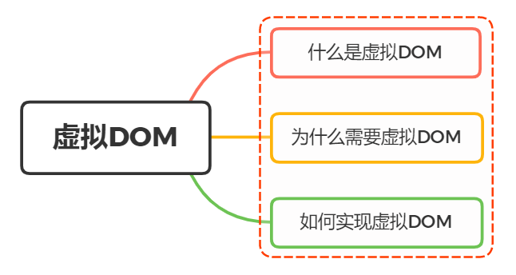

### 虚拟DOM



### 1.虚拟DOM

做前端的朋友，应该都不陌生虚拟DOM，虚拟DOM是当前前端方向react和vue的精华所在。

虚拟DOM，实际上就是Javascript对真是DOM的一层抽象。它以Javascript对象作为基础的树，用对象的属性来描述DOM节点，最终通过Vue或者React的一些处理，将Javascript对象渲染成真是的DOM。

在Js中,虚拟DOM表现为一个Object对象，最好包含标签名(tag)、属性(attribute)和子元素对象三个属性，同时子元素对象也具备这些特性：标签名、属性和子元素，以此循环。

```javascript
var obj = {
    tag: "div",
    attrs: { className: "app", id: "appRoot" },
    children: [
        {
            tag: "h1",
            attrs: { className: "title" },
            children: ["这是一个模块标题"]
        },
        {
            tag: "p",
            attrs: null,
            children: ["React是一个非常不错的UI库，用于构建用户界面"]
        }
    ]
}
```

这是一段虚拟DOM，对应的真是DOM为：

```html
<div class="app" id="appRoot">
    <h1 class="title">这是一个模块标题</h1>
    <p>React是一个非常不错的UI库，用于构建用户界面</p>
</div>
```

通过VNode，Vue可以对这棵抽象树进行创建节点、删除、更新等编辑操作，经过diff算法得出一些需要修改的最小单元，再更新视图，减少了DOM操作，提高了性能。

### 2. 为什么需要虚拟DOM

传统的web开发，数据的变化、页面效果，都是基于DOM操作的。大量的DOM操作，引起了页面的性能问题。

在Vue或者react之前，我们在使用原生api或者jquery操作DOM时，

### 3.  怎么实现虚拟DOM

### 4.小结

createElement创建VNode的过程，每个VNode都有children，每个children也是一个VNode，这样就形成了一个虚拟的DOM树，用于描述真实的DOM结构。