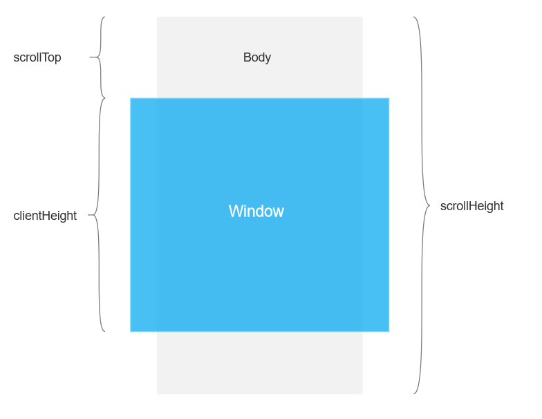

### 实现上拉加载、下拉刷新效果

上拉加载、下拉刷新，一般是发生在移动端产品上，其实本质的道理和PC端网页的分页类似，只是交互形式上的差别。

移动端设备上是下拉、上拉，PC端上是点击分页。

现在有一些比较好的开源方案，使用量也比较大，如betters-scroll、iscroll、pulltorefresh.js等，这些库使用起来很方便，帮我们解决了大量的下拉、上拉的页面交互、数据交互的大问题。

### 1. 上拉加载、下拉刷新的实现

上拉加载、下拉刷新，都依赖于用户交互

另外一点就是领悟在什么场景以及什么场景会用到上拉加载、下拉刷新的动作，触发这样的事件。

在效果实现以前，可以先深入理解一下几个常用的属性：

window、body、scrollTop、clientHeight、scrollHeight

先来大概了解下这几个属性的含义，可以先不纠结具体是什么意思：



window：window就是字面意思，窗口，就是浏览器窗口的可视高度，不包括滚动条

body：

scrollTop：

clientHeight：

scrollHeight：

详情可参考[js中scrollTop、cilentHeight、scrollHeight等各种高度](../../frame/Javascript/js中的各种高度.md)

有一个加单的结论，可以先简单的记住一下：

>  scrollTop + clientHeight >= scrollHeight

以及一些简单的实现：

```javascript
dataRefresh() {
    // 获取文档高度、页面滚动高度和浏览器窗口高度
    let windowHeight = document.documentElement.clientHeight;
    let scrollTop = document.documentElement.scrollTop;
    let scrollHeight = document.body.scrollHeight;

    // 设置页面居理底部居理
    let distance = 50;
    if (scrollTop + windowHeight >= scrollHeight - distance) {
        // 上拉加载逻辑代码
    }
}
```

**下拉刷新**

下拉刷洗，其实就是页面本来已经在页面的顶部了，这时想主动触发一下看是否服务端有更新的内容，或者就是想重新拉取一些内容，怎么去操作呢？

我们使用过微博，或者抖音啥的，如果已经置于页面顶部了还想刷新内容，一种操作时点击左下角的tab的那个当前item，另外一种操作是下拉页面，实现刷新。


### 2. 案例

