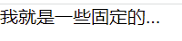
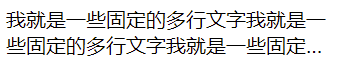
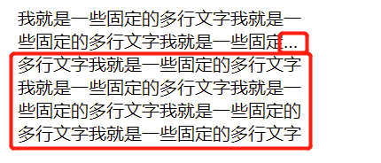
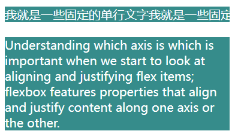
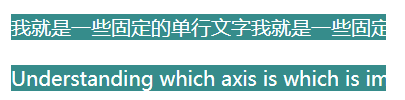

<!-- START doctoc generated TOC please keep comment here to allow auto update -->
<!-- DON'T EDIT THIS SECTION, INSTEAD RE-RUN doctoc TO UPDATE -->
**Table of Contents**  *generated with [DocToc](https://github.com/thlorenz/doctoc)*

- [1.单行超过指定宽度后显示……](#1%E5%8D%95%E8%A1%8C%E8%B6%85%E8%BF%87%E6%8C%87%E5%AE%9A%E5%AE%BD%E5%BA%A6%E5%90%8E%E6%98%BE%E7%A4%BA)
- [2.两行超过指定宽度后显示……](#2%E4%B8%A4%E8%A1%8C%E8%B6%85%E8%BF%87%E6%8C%87%E5%AE%9A%E5%AE%BD%E5%BA%A6%E5%90%8E%E6%98%BE%E7%A4%BA)
- [3.两行以上文字超过指定宽度后显示……](#3%E4%B8%A4%E8%A1%8C%E4%BB%A5%E4%B8%8A%E6%96%87%E5%AD%97%E8%B6%85%E8%BF%87%E6%8C%87%E5%AE%9A%E5%AE%BD%E5%BA%A6%E5%90%8E%E6%98%BE%E7%A4%BA)

<!-- END doctoc generated TOC please keep comment here to allow auto update -->

#### 1.单行超过指定宽度后显示……

主要4个CSS属性联合作用：width、text-overflow、white-space(或者word-break：keep-all，目的一样，就是不换行)、overflow

text-overflow:怎么向用户展示溢出指定范围的内容，显示省略号使用ellipsis属性值

white-space：处理元素中的空白

```html
<style>
    .text {
        width: 150px;
        text-overflow: ellipsis;
        white-space: nowrap;
        overflow: hidden;
    }
</style>
<div class="text">我就是一些固定的单行文字我就是一些固定的单行文字</div>
```



> demo中的实现，white-space也可以使用word-break，目的是使文字不换行，只要达到这个目的即可

#### 2.多行超过指定宽度后显示……

```html
<style>
    .multy-text {
        display: -webkit-box;
        -webkit-box-orient: vertical;
        -webkit-line-clamp: 2;
        width: 260px;
        overflow: hidden;
    }
</style>
<div class="multy-text">
    我就是一些固定的多行文字我就是一些固定的多行文字我就是一些固定的多行文字我就是一些固定的多行文字我就是一些固定的多行文字我就是一些固定的多行文字我就是一些固定的多行文字我就是一些固定的多行文字
</div>
```



多行显示省略号的效果，主要是在webkit内核浏览器，实现效果的一些必须属性也都不是标准属性，都是webkit内核浏览器的私有属性。

在网上也参考了一些解决方案，有说需要设置容器高度和行高的，可以设置，但是不是必须的；

以及overflow: hidden；属性对于多行显示省略号来说不是必须的，但是对于效果的完美是必须的。-webkit-line-clamp设置行数其实就相当于设置了高度，设置overflow就是在文字高度超出设置的行数时隐藏，如果不设置，那么文字在设置的行数结尾也会显示省略号，但是溢出部分也会展示出来，应该不是我们预期中的效果



#### 3. 强制文字不换行

中文，使用word-break和white-space都可以，但是如果是英文的话，就只能使用white-space了，使用word-break: keep-all是无效的。

white-space本来是用来处理元素中的空白的，但是当属性值设置为nowrap时，行内文本换行无效，就利用了这个，实现了文本不换行的效果。

> 因为word-break有兼容性问题，就统一记住white-space吧。

```html
<style>
    .keep-all {
        width: 300px;
        word-break: keep-all; // 中文生效，英文不生效
    }
</style>
<!--强制文字不换行-->
<div class="keep-all bg mb20">
    我就是一些固定的单行文字我就是一些固定的单行文字
</div>
<div class="keep-all bg mb20">Understanding which axis is which is important when we start to look at aligning and justifying flex items; flexbox features properties that align and justify content along one axis or the other.</div>
```



```html
<style>
    .keep-all {
        width: 300px;
        white-space: nowrap;
    }
</style>
<!--强制文字不换行-->
<div class="keep-all bg mb20">
    我就是一些固定的单行文字我就是一些固定的单行文字
</div>
<div class="keep-all bg mb20">Understanding which axis is which is important when we start to look at aligning and justifying flex items; flexbox features properties that align and justify content along one axis or the other.</div>
```

