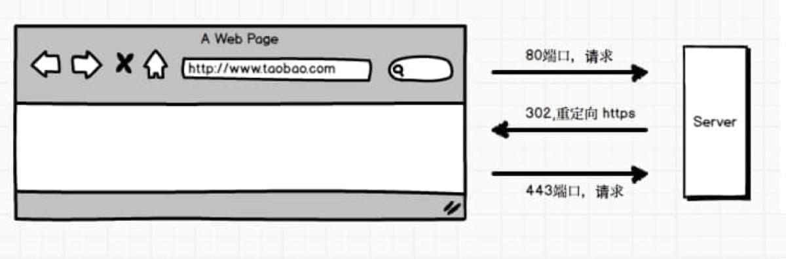
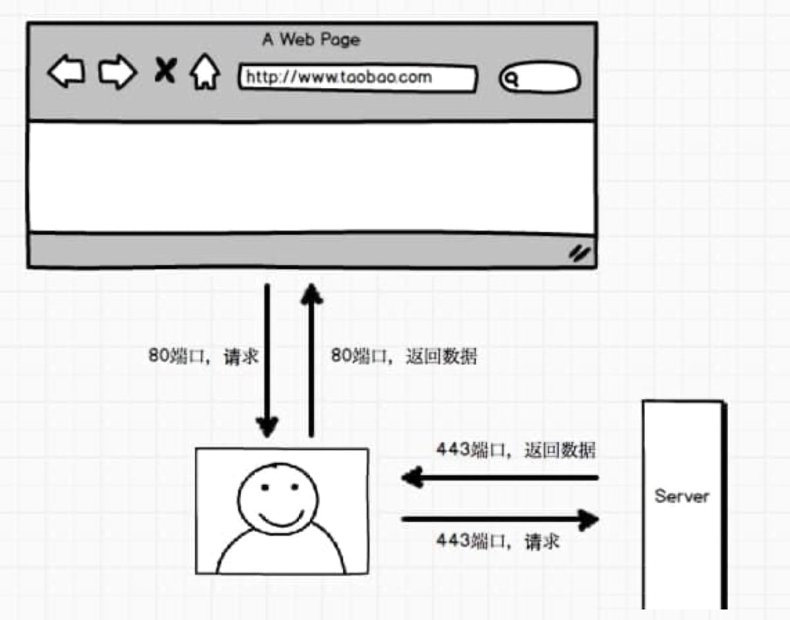

### HSTS

HSTS是什么？

要了解HSTS，建议先了解下HTTP状态码，可参考:[常用HTTP状态码](./%E5%B8%B8%E7%94%A8HTTP%E7%8A%B6%E6%80%81%E7%A0%81.md)

在web开发中，经常会用到如301、302之类的状态码(3xx大类的状态码，表示重定向)，但是很少用到307(用的少，不是不用哦)。

**中间人劫持**

HTTPS协议使用443端口进行数据传输，HTTP协议默认使用80端口进行数据传输。劫持者首先劫持HTTP协议默认的80端口，当用户向目标服务器发起请求时，劫持者模拟正常的https请求向服务器获取数据，然后通过80端口向客户端返回数据，可参考如下流程:



大部分用户在浏览器地址栏输入网址的时候只会输入域名，而不会将协议、//、www都全部输入，比如我想打开百度这个站点，我一般只在地址栏输入baidu.com，而不会输入https://www.baidu.com，除了专业的技术人员，估计很多人应该都不知道https是什么。

当我习惯性的输入了baidu.com之后，这个时候浏览器默认使用的是http协议，当请求到达了服务器之后，服务器告诉浏览器进行302跳转:

```bash
Location: //www.baidu.com
```

然后浏览器就会重新发起请求，通过https方式，443端口进行数据传输。正是因为用户没有直接输入//链接，而是通过302协议的方式自动添加的方式，劫持者正式利用了这一点：



正常情况下，只要能够劫持了用户的网络，比如劫持路由、DNS，那么就可以做为中间人在服务端返回的内容中注入代码，入添加劫持者自己的广告(有的地方的网络运营商就直接劫持网络，向网站中植入运营商的广告)。

**中间人劫持大多出现在2种情况**

1. 用户没有通过准确的方式访问页面。如果用户没有手动的输入https、//，那么浏览器默认是以http的方式访问页面的；

2. https的页面中可能内嵌了包含http的链接，这个http链接有可能会被劫持

那么有没有办法解决中间人劫持呢？

### 启用HSTS

