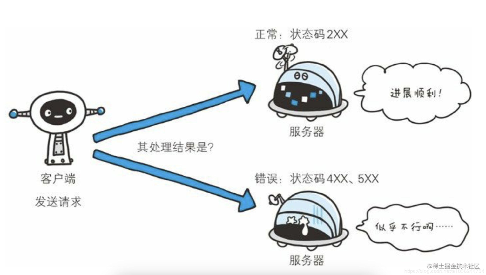

### 常用状态码

HTTP状态码用来标识客户端和服务端交互的结果，标记服务端信息处理的是否正常、通知显示的处理结果提示信息，如果正确的处理了客户端请求信息，可能返回一个success，如果处理信息异常，则返回异常信息，定位异常。

状态码由3位数字组成入200、301等，数字的第一位表示了响应的类别，后面2位没有类别。HTTP状态码，可以分为以下5种类型。

**5种HTTP状态码类别**

| 状态码 | 类别                           | 描述                   |
| ------ | ------------------------------ | ---------------------- |
| 1xx    | Informational：信息状态码      | 接受请求正在处理       |
| 2xx    | Success：成功状态码            | 请求正常处理完成       |
| 3xx    | Redirection：重定向状态码      | 需要附加操作已完成请求 |
| 4xx    | Client Error：客户端错误状态码 | 客户端无法处理请求     |
| 5xx    | Server Error：服务端错误状态码 | 服务端处理请求出错     |

HTTP状态码总数大概有60多种，但是常用的大概是16种：

#### 16种常用的状态码

| 状态码 | 状态码英文名称        | 中文描述                                                     |
| ------ | --------------------- | ------------------------------------------------------------ |
| 200    | OK                    | 请求成功。常用于HTTP请求入get、post                          |
| 204    | No Content            | 无内容。服务器成功处理，但是没有内容返回。在没有更新网页的情况下，可以保证当前文档的正常显示 |
| 206    | Partial Content       | 对资源某一部分的请求，服务器成功处理了部分get请求，响应报文中包含由Content-Range指定范围的实体内容 |
|        |                       |                                                              |
| 301    | Moved Permanently     | 永久重定向。请求的资源已经被永久的重定向到新的URI，返回的信息会包含新的URI，浏览器会自动重定向到新的URI。今后任何新的请求都会使用新的URI替代 |
| 302    | Found                 | 临时性重定向。与301类似，但是资源只是被临时性移动，客户端仍然可以继续使用原来的URI |
| 303    | See other             | 查看其他地址，与302类似，使用get请求查看                     |
| 304    | Not Modified          | 所请求的资源没有修改。服务器返回该状态码时，不会返回任何的资源。客户端会缓存访问过的资源，通过提供一个头信息指出客户端希望只返回在指定日期之后修改过的资源。 |
| 307    | Temporary Redirect    | 临时重定向。与302类似，使用get请求重定向，会按照浏览器标准，不会从post变成get |
|        |                       |                                                              |
| 400    | Bad Request           | 客户端请求报文中存在语法错误，服务端无法理解。浏览器会像200 OK一样对待该状态码 |
| 401    | Unauthorized          | 请求要求用户的身份认证。通过HTTP认证(BASIC认证、DIGEST认证)的认证信息，若之前已经进行过一次请求，则表示用户认证失败 |
| 402    | Payment Required      | 保留，将来可能会使用                                         |
| 403    | Forbidden             | 服务端理解客户端的请求，但是拒绝处理                         |
| 404    | Not Found             | 服务端没有办法根据客户端的请求找到资源(网页).通过此代码，网站设计人员可以设置个性化的页面，也可以在服务端拒绝请求时做一些处理措施 |
|        |                       |                                                              |
| 500    | Internal Server Error | 服务器内部错误，没有办法完成请求。可能是web应用存在bug或者其他的一些临时故障 |
| 501    | Not Implemented       | 服务器不支持请求的功能，无法完成请求                         |
| 503    | Service unavailable   | 由于超载火系统维护，服务器暂时无法处理客户端的请求。延时的长度可包含在服务器的Retry-After头信息中 |

#### 其他不太常用的状态码

| 状态码 | 状态英文名称                  | 中文描述                                                     |
| ------ | ----------------------------- | ------------------------------------------------------------ |
| 201    | Created                       | 已创建，成功请求并创建了资源                                 |
| 202    | Accepted                      | 已接受。已接受请求，但是还没有处理完成                       |
| 203    | Non-Authoritative Information | 非授权信息。请求成功，但返回的meta信息不在原始的服务器，而是一个副本 |
| 205    | Reset Content                 |                                                              |
|        |                               |                                                              |
|        |                               |                                                              |
|        |                               |                                                              |
|        |                               |                                                              |
|        |                               |                                                              |
|        |                               |                                                              |
|        |                               |                                                              |
|        |                               |                                                              |
|        |                               |                                                              |
|        |                               |                                                              |
|        |                               |                                                              |
|        |                               |                                                              |
|        |                               |                                                              |
|        |                               |                                                              |
|        |                               |                                                              |
|        |                               |                                                              |
|        |                               |                                                              |
|        |                               |                                                              |
|        |                               |                                                              |
|        |                               |                                                              |
|        |                               |                                                              |

