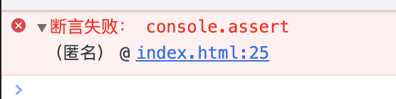
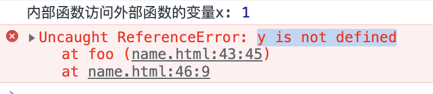

<!-- START doctoc generated TOC please keep comment here to allow auto update -->
<!-- DON'T EDIT THIS SECTION, INSTEAD RE-RUN doctoc TO UPDATE -->
**Table of Contents**  *generated with [DocToc](https://github.com/thlorenz/doctoc)*

- [1. Javascript基础](#1-javascript%E5%9F%BA%E7%A1%80)
  - [1.1 简介](#11-%E7%AE%80%E4%BB%8B)
  - [1.2 js程序调试](#12-js%E7%A8%8B%E5%BA%8F%E8%B0%83%E8%AF%95)
  - [1.3 语法基础](#13-%E8%AF%AD%E6%B3%95%E5%9F%BA%E7%A1%80)
    - [1.3.1 语法规则](#131-%E8%AF%AD%E6%B3%95%E8%A7%84%E5%88%99)
    - [1.3.2 数据类型](#132-%E6%95%B0%E6%8D%AE%E7%B1%BB%E5%9E%8B)
      - [1.3.2.1 整数的表示形式](#1321-%E6%95%B4%E6%95%B0%E7%9A%84%E8%A1%A8%E7%A4%BA%E5%BD%A2%E5%BC%8F)
      - [1.3.2.2 浮点数的表示形式](#1322-%E6%B5%AE%E7%82%B9%E6%95%B0%E7%9A%84%E8%A1%A8%E7%A4%BA%E5%BD%A2%E5%BC%8F)
      - [1.3.2.3 js中一些特殊的数值常量](#1323-js%E4%B8%AD%E4%B8%80%E4%BA%9B%E7%89%B9%E6%AE%8A%E7%9A%84%E6%95%B0%E5%80%BC%E5%B8%B8%E9%87%8F)
    - [1.3.3 变量及其作用域](#133-%E5%8F%98%E9%87%8F%E5%8F%8A%E5%85%B6%E4%BD%9C%E7%94%A8%E5%9F%9F)
    - [1.3.4 运算符和表达式](#134-%E8%BF%90%E7%AE%97%E7%AC%A6%E5%92%8C%E8%A1%A8%E8%BE%BE%E5%BC%8F)
  - [小结](#%E5%B0%8F%E7%BB%93)
- [2. 流程控制与异常处理](#2-%E6%B5%81%E7%A8%8B%E6%8E%A7%E5%88%B6%E4%B8%8E%E5%BC%82%E5%B8%B8%E5%A4%84%E7%90%86)
- [3. javascript对象](#3-javascript%E5%AF%B9%E8%B1%A1)
- [4. 文档对象模型](#4-%E6%96%87%E6%A1%A3%E5%AF%B9%E8%B1%A1%E6%A8%A1%E5%9E%8B)
- [5. 浏览器对象模型](#5-%E6%B5%8F%E8%A7%88%E5%99%A8%E5%AF%B9%E8%B1%A1%E6%A8%A1%E5%9E%8B)
- [6. Nodejs与ajax](#6-nodejs%E4%B8%8Eajax)
- [7. jquery应用](#7-jquery%E5%BA%94%E7%94%A8)
- [8. 综合应用案例](#8-%E7%BB%BC%E5%90%88%E5%BA%94%E7%94%A8%E6%A1%88%E4%BE%8B)

<!-- END doctoc generated TOC please keep comment here to allow auto update -->

### 1. Javascript基础

#### 1.1 简介

**Javascript的发展历史**

1992年，Nombas公司Cenvi项目中的ScriptEase

1995年Netscape Navigator 2.0开发了LiveScript

Netscape Navigator 3.0将LiveScript命名为Javascript

随后微软开发出了JScript

> Javascript不是由微软开发的

**简单认识Javascript**

Javascript是一门解释型脚本语言，不是编译型语言，开发的js代码不需要经过编译器的编译可以直接运行。

Javascript是一种基于对象的语言，同时也可以理解为面向对象的语言。js编程中，可以使用自己已经创建好的对象。

javascript是一门弱类型语言，具有足够的安全型，因为js不允许访问本地磁盘。

**Javascript的特点**

是一门脚本语言

基于对象

简单性

安全性

动态的

跨平台的

**script代码的引用**

javascript代码在网页中放在<script></script>标记中，<script>标记不是自闭合标签，不能通过下面方式使用。

```html
<script src="" /><!-- 不能通过这种方式使用，<script>不是自闭合标签 -->
```

**js代码的引用方式有如下几种方式**

1. 放在html中的<script>标记中

```html
<script>
    function hello(){
        alert("hello!");
    }

    hello();
</script>
```

2. html中通过script标记的src属性导入外部的js文件

```html
<script src="../js/util.js"></script>
```

3. 嵌入到html标记中

```html
<body onload="alert('hello world!');"></body>
<input type="text" onblur="alert(this.value)" /> <!--表示在input失去焦点的时候弹出当前输入框的值-->
```

4. 可以在a标记中的href属性中通过javascript:的方式使用嵌入js代码

```html
<a href="javascript:alert('hello world,a标记');">弹出</a>
```

#### 1.2 js程序调试

1. alert调试

```html
<script>
    x = 10;
    alert(1);
    document.write("", +x);
    alert(2);
</script>
```
可以通过两个提示框的方式判断x的操作是否成功

alert会中断程序的执行，在当前的alert执行完成后才会继续执行后续语句

2. console调试

console.log不会中断程序的执行，它只是在控制台打印信息，不影响程序的执行。

console.assert():会判断一个表达式的真假，如果为假，则输出异常信息，并抛出异常

```html
<script>
    var result = 1;
    console.assert(result);
    var year = 2022;
    console.assert(year === 2028);
</script>
```

效果如下:



3. 断点调试


4. 在代码中添加debugger语句实现断点

在代码中添加debugger调试，注意在调试完成之后需要把该语句debugger删除掉

#### 1.3 语法基础

##### 1.3.1 语法规则

**标识符**

js中，为各种变量、函数、类等起的名字，就是标识符

**标识符的规则**

字母、数字、下划线、$组合而成

标识符不能以数字开头

大小写敏感，长度无限制

不能使用系统预留字、关键字

**注释**

注释有两种

// ：单行注释

/* */：多行注释

##### 1.3.2 数据类型

javascript中的数据类型主要包括三大类：

**基本类型**

数值、字符串、布尔类型

**引用类型**

也称为对象类型，如数组、Object

**特殊类型**

undefined、null

**typeof检测变量的数据类型**

未定义：undefined --- name除外，name在部分浏览器中是window的全局属性

布尔值：boolean

字符串：string

NaN、数值：number

数组、对象或null：object

function定义的函数、函数表达式、箭头函数等各种方式定义的函数：function

```html
<script>
    function sum(a, b) {
        return a + b;
    }
    const arr = [];
    const add = (a, b) => {
        return a + b;
    }
    const increase = function (a, b) {
        return a + b;
    }
    console.log("typeof 未定义的变量username:", typeof username); // undefined
    console.log("typeof 函数:", typeof sum); // function
    console.log("typeof 箭头函数:", typeof add); // function
    console.log("typeof 变量函数:", typeof increase); // function
    console.log("typeof undefined:", typeof undefined); // undefined
    console.log("typeof null:", typeof null); // object
    console.log("typeof 数组:", typeof arr); // object
    console.log("typeof NaN:", typeof NaN); // number
</script>
```

> 这里可以关注下window的属性，window的属性都不能直接作为普通的标识符使用，window下的全局变量很多，可以通过打印window属性来查看下。

数值型就是表示实数，即整数和浮点数
###### 1.3.2.1 整数的表示形式

**十进制整数**

0-9的10个阿拉伯数字表示，如0，10，15，-12

**八进制整数**

以0开头、由0-7的8个阿拉伯数字表示，如022，031

**十六进制整数**

以0x或者0X开头，由a-f6个字母以及0-9的10个数字表示，如0x12，0x26

###### 1.3.2.2 浮点数的表示形式

**十进制浮点数**

由数字和小数点组成: 12.3,123.5

**科学计数法**

较大的数会使用到科学计数法，如1.235e3表示1.235x10<sup>3</sup>或者1.235E2等

科学计数法中，e的前面可以是小数，但是e的后面只能是整数，表示乘方

在使用科学计数法中，e的前面没有数字是错误的使用方式，e的后面没有整数，也是错误的使用形式，如:

1.2e、E3等都是错误的使用方式

###### 1.3.2.3 js中一些特殊的数值常量

Infinity:表示无穷大的常量

NaN：非数值

Number.MIN_VALUE:可表示的最小数值

1. 字符串

2. 布尔值

只有两个值：true、false

3. Undefined

只有一个值：undefined

4. Null

只有一个值：null

**undefined和null的联系**

undefined和null的相等性判断,在非全等型判断的时候，它们两个是相等的，但是在全等型判断时它们两个是不等的。

```js
console.log(undefined == null); // true
console.log(undefined === null); // false
```

区别

1. null是javascript语言的关键字，undefined是js预定义的全局变量，不是关键字

2. 执行typeof运算，null返回的是object，undefined返回的是undefined

3. 两者在根据需要转换为字符串的时候，undefined会转为“undefined”，null会转为"null"

变量没有被赋值而被使用的时候，这个变量就会是一个undefined

一般情况下不会给一个变量赋值为undefined，但是有可能会给一个变量赋值为null

undefined是系统级别的，null为程序级别的

##### 1.3.3 变量及其作用域

js中，通过"use strict"定义为严格模式，严格模式下，变量必须先声明后使用个，否则报错。

作用域指变量的可见性，js中的作用域可分为全局作用域和局部作用域

js在非严格模式下，变量可以不先声明而直接使用，这样的变量是全局的作用域

js函数可以嵌套，在这种情况下，内部函数可以访问外部函数变量，但是外部函数不能访问内部函数的变量

```ts
function foo() {
    var x = 1;
    function bar() {
        var y = 2;
        console.log("内部函数访问外部函数的变量x:", x); // 1
    }
    bar();
    console.log("外部函数访问内部函数中的变量y:", y); // 会报错，y is not defined
}

foo();
```



```js
function foo() {
    var x = 1;
    function bar() {
        var x = 2;
        console.log("内部函数bar中的x:", x); // 2
    }
    bar();
    console.log("外部函数中的x:", x); // 1
    
}
foo();
```

案例中，内部函数bar中重新定了变量x，所以在内部函数中的变量x和外部函数中的变量x是没有关系的，它们是两个独立的变量，所以最终的输出结果为内部的变量输出2，外部变量输出1.

但是如果内部函数bar中不是重新声明的变量x，而是直接给变量重新赋值，那么情况就不同了：

```js
function foo() {
    x = 1;
    function bar() {
        var x = 2;
        console.log("内部函数bar中的x:", x); // 2
    }
    bar();
    console.log("外部函数中的x:", x); // 2
    
}
foo();
```

该案例中，内部函数中是对变量x重新赋值了，这个变量在内部函数中没有定义，它会沿着原型链向外部寻找，在外部函数找到了定义，就改变了外部函数中变量x的值，所以内部函数和外部函数中的变量x的值都成了2.

这个时候，我又修改了下代码的执行顺序，我先执行外部函数的打印然后再执行内部函数：

```js
function foo() {
    x = 1;
    function bar() {
        x = 2;
        console.log("内部函数bar中的x:", x); // 2
    }
    console.log("外部函数中的x:", x); // 1
    bar();
}
foo();
```

最新的案例中，外部函数中的x仍旧是1，但是内部函数x是2.因为虽然内部函数可以访问外部函数的变量，且内部函数的变量也不是通过var声明的，但是我们需要注意执行顺序，先执行的外部函数，然后才去执行的内部函数，在执行了内部函数之后外部函数中的变量x才变成了2.所以最终的执行结果是外部函数的x为1，内部函数的x为2.

**js中没有块级作用域的概念**

块级作用域，即{}的作用域，js中没有块级作用域的概念。

如案例中for循环中定义了变量i和j，但是在for循环外部都访问到了这个变量。

```js
function baz() {
    for (var i = 0; i < 5; i++) { }
    console.log("i:", i); // 5
    var obj = {
        name: "Lily"
    };
    for (var attr in obj) {
        var j = 10;
    }
    console.log("j:", j); // 10
}
baz();
```

**变量提升**

会把变量的声明提升到函数顶部，但是赋值操作只有执行到了当前的语句行才会真正的赋值

##### 1.3.4 运算符和表达式

对各种数据进行加工的过程称为运算，表示各种不同运算的符号称为运算符，参与运算的数据称为操作数

**运算符的分类**

按照操作数的数量来分：一元运算符、二元运算符、三元运算符

按照功能划分：赋值运算符、算术运算符、关系运算符、逻辑运算符、位运算符、条件运算符等

**表达式**

由运算符和操作数按一定语法形式组成的符号序列

一个常量或者一个变量名字是最简单的表达式，其值就是该常量或者变量的值

表达式的值还可以用作其他表达式的操作数，形成复杂的表达式

###### 1.3.4.1 算术运算符和算术表达式

算术运算符完成数学中的加、减、乘、除四则运算

1. 单目运算符：有4个

+(加)、-(减)、++(自增)、--(自减)

2. 双目运算符：有5个

+(加)、-(减)、*(乘)、/(除)、%(取余、求余)

由算术运算符链接起来的表达式称为算术表达式

下面的案例都是表达式：

```js
var a = 10;
var b = a + 2;
var c = a + b;
```

> 表达式和语句有什么关系呢？

###### 1.3.4.2 位运算

###### 1.3.4.3 运算符优先级


##### 1.3.5 数据类型转换

###### 1.3.5.1 转换为数值类型

有3个函数可以将非数值类型转换为数值类型

Number()、parseInt()、parseFloat()

Number()可以将任何类型的数据转换为数值，parseInt()和parseFloat()只能将字符转换为数值

**Number()的转换规则**

1. true和false，分别返回1和0

2. 如果是数字值，则原样返回

3. 如果是null，则返回0

4. 如果是undefined，返回NaN

5. 如果是字符串
    - 如果是字符串中只包含数字，则将其转换为十进制数值
    - 如果字符串中包含有效的十六进制如0xac，则将其转换为等值的十进制整数值；
    - 如果是空字符串，则返回0
    - 除上述之外的其他字符，则返回NaN

**parseInt()转换规则**

1. parseInt()可以使用第二个参数，表示基数

2. parseInt()在将字符串转换为数值时，更多的是看该字符串是否符合数值模式。它会忽略字符串前面的空格，直到找到第一个非空格字符

3. 如果第一个字符不是数字字符或者负号，parseInt()则会返回NaN

4. 如果第一个字符是数字字符，parseInt()会继续解析第2个字符，直到解析完所有的后续字符或者遇到了一个非数字字符

```js
var n1 = '1234hello';
console.log(parseInt(n1)); // 1234
var n2 = '12.3';
console.log(parseInt(n2)); // 12
```
5. 如果字符串中的第一个字符是数字字符，parseInt()能够自动识别出各种整数形式，如八进制、十进制还是十六进制

**parseFloat()函数转换规则**

与parseInt()转换规则类似


**parseFloat()和parseInt()的区别**

1. parseFloat()函数参数的第一个小数点是有效的，parseInt()函数参数的第一个小数点是无效字符

2. parseFloat()始终会忽略参数最前面的0，parseInt()不会忽略参数前面的0

> 浮点数没有八进制、十进制、十六进制等进制的概念

###### 1.3.5.2 转换为字符串

把数值转换为字符串有两种方式：

1. 使用toString()方法

toString()方法也可以指定基数参数

```js
var num = 10;
console.log("默认转换为十进制字符串:",num.toString()); // 10
console.log("指定转换为二进制字符串:", num.toString(2)); // 1010
console.log("指定转换为八进制字符串:", num.toString(8)); // 12
console.log("指定转换为十六进制字符串:", num.toString(16)); // a
```

> undefined和null不能通过toString()将其转换为字符串，因为undefined和null没有toString()方法

2. 使用函数String()

如果不确定要转换的值是否是undefined或null的时候，可以使用String()来进行转换，String()可以将任何类型的值转换为字符串,包括undefined和null

```js
var num2 = undefined;
var nl = null;
console.log("String(null)",String(nl)); // null
console.log("String(undefined):", String(num2)); // undefined
console.log("null.toString()",nl.toString()); // 异常，因为null没有toString()方法
console.log("undefined.toString():", num2.toString()); // 异常，undefined没有toString()方法
```

###### 1.3.5.3 转换为布尔类型

js中布尔类型只有两个值：true、false

1. 可以使用Boolean()函数将值转换为布尔类型

   各种数据类型与布尔类型的转换规则

   | 数据类型  | 转换为true                  | 转换为false |
   | --------- | --------------------------- | ----------- |
   | Boolean   | true                        | false       |
   | String    | 任何非空字符串              | 空字符串    |
   | Number    | 任何非0的数字值，包括无穷大 | 0和NaN      |
   | Object    | 任何非空对象                | null        |
   | Undefined |                             | undefined   |

   > 注意空字符串和带有空格的字符串，只含有一个空格字符的字符串不是空字符串

2. 
#### 小结
**数据类型**

Javascript中的数据类型分为三大类:基本类型(数值型、字符串和布尔型)、引用类型(也称为对象类型)、特殊类型(undefined和null)

变量的作用域指变量的可见性。javascript中的变量作用域分为全局变量和局部变量。

一个完整的javascript程序由3部分组成:核心(ECMAScript)、浏览器对象模型(BOM)和文档对象模型(DOM)。

**以下变量具有全局的作用域**

所有定义在最外层的变量 --- 非函数体内部

未定义而直接赋值的变量

所有window对象的属性

**在函数体内通过var、let、const关键字定义的变量是局部作用域变量，只在函数内部生效**

### 2. 流程控制与异常处理

### 3. javascript对象

### 4. 文档对象模型

### 5. 浏览器对象模型

### 6. Nodejs与ajax

### 7. jquery应用

### 8. 综合应用案例