<!-- START doctoc generated TOC please keep comment here to allow auto update -->
<!-- DON'T EDIT THIS SECTION, INSTEAD RE-RUN doctoc TO UPDATE -->
**Table of Contents**  *generated with [DocToc](https://github.com/thlorenz/doctoc)*

- [1. 绪论](#1-%E7%BB%AA%E8%AE%BA)
  - [1.1 操作系统的概念](#11-%E6%93%8D%E4%BD%9C%E7%B3%BB%E7%BB%9F%E7%9A%84%E6%A6%82%E5%BF%B5)
    - [1.1.1 计算机系统的组成](#111-%E8%AE%A1%E7%AE%97%E6%9C%BA%E7%B3%BB%E7%BB%9F%E7%9A%84%E7%BB%84%E6%88%90)
    - [1.1.2 操作系统的形成](#112-%E6%93%8D%E4%BD%9C%E7%B3%BB%E7%BB%9F%E7%9A%84%E5%BD%A2%E6%88%90)
    - [1.1.3 操作系统的概念](#113-%E6%93%8D%E4%BD%9C%E7%B3%BB%E7%BB%9F%E7%9A%84%E6%A6%82%E5%BF%B5)
    - [1.1.4 操作系统的地位](#114-%E6%93%8D%E4%BD%9C%E7%B3%BB%E7%BB%9F%E7%9A%84%E5%9C%B0%E4%BD%8D)
    - [1.1.5 操作系统的特征](#115-%E6%93%8D%E4%BD%9C%E7%B3%BB%E7%BB%9F%E7%9A%84%E7%89%B9%E5%BE%81)
  - [1.2 操作系统的形成和发展](#12-%E6%93%8D%E4%BD%9C%E7%B3%BB%E7%BB%9F%E7%9A%84%E5%BD%A2%E6%88%90%E5%92%8C%E5%8F%91%E5%B1%95)
  - [1.3 操作系统的主要功能](#13-%E6%93%8D%E4%BD%9C%E7%B3%BB%E7%BB%9F%E7%9A%84%E4%B8%BB%E8%A6%81%E5%8A%9F%E8%83%BD)
  - [1.4 操作系统的特征](#14-%E6%93%8D%E4%BD%9C%E7%B3%BB%E7%BB%9F%E7%9A%84%E7%89%B9%E5%BE%81)
  - [1.5 UNIX和Linux系统简介](#15-unix%E5%92%8Clinux%E7%B3%BB%E7%BB%9F%E7%AE%80%E4%BB%8B)
- [2. 进程管理](#2-%E8%BF%9B%E7%A8%8B%E7%AE%A1%E7%90%86)
  - [2.1 进程概述](#21-%E8%BF%9B%E7%A8%8B%E6%A6%82%E8%BF%B0)
  - [2.2 线程的引入和实现](#22-%E7%BA%BF%E7%A8%8B%E7%9A%84%E5%BC%95%E5%85%A5%E5%92%8C%E5%AE%9E%E7%8E%B0)
  - [2.3 进程之间的关系和通信](#23-%E8%BF%9B%E7%A8%8B%E4%B9%8B%E9%97%B4%E7%9A%84%E5%85%B3%E7%B3%BB%E5%92%8C%E9%80%9A%E4%BF%A1)
  - [2.4 信号量和P、V操作的一般应用](#24-%E4%BF%A1%E5%8F%B7%E9%87%8F%E5%92%8Cpv%E6%93%8D%E4%BD%9C%E7%9A%84%E4%B8%80%E8%88%AC%E5%BA%94%E7%94%A8)
  - [2.5 死锁](#25-%E6%AD%BB%E9%94%81)
  - [案例 Linux进程管理](#%E6%A1%88%E4%BE%8B-linux%E8%BF%9B%E7%A8%8B%E7%AE%A1%E7%90%86)
- [3. 处理机调度](#3-%E5%A4%84%E7%90%86%E6%9C%BA%E8%B0%83%E5%BA%A6)
  - [3.1 调度级别](#31-%E8%B0%83%E5%BA%A6%E7%BA%A7%E5%88%AB)
  - [3.2 作业调度和进程调度](#32-%E4%BD%9C%E4%B8%9A%E8%B0%83%E5%BA%A6%E5%92%8C%E8%BF%9B%E7%A8%8B%E8%B0%83%E5%BA%A6)
  - [3.3 调度策略和调度性能评价](#33-%E8%B0%83%E5%BA%A6%E7%AD%96%E7%95%A5%E5%92%8C%E8%B0%83%E5%BA%A6%E6%80%A7%E8%83%BD%E8%AF%84%E4%BB%B7)
  - [3.4 常用调度算法](#34-%E5%B8%B8%E7%94%A8%E8%B0%83%E5%BA%A6%E7%AE%97%E6%B3%95)
  - [3.5 中断处理](#35-%E4%B8%AD%E6%96%AD%E5%A4%84%E7%90%86)
  - [案例 Linux系统的进程调度](#%E6%A1%88%E4%BE%8B-linux%E7%B3%BB%E7%BB%9F%E7%9A%84%E8%BF%9B%E7%A8%8B%E8%B0%83%E5%BA%A6)
- [4. 存储管理](#4-%E5%AD%98%E5%82%A8%E7%AE%A1%E7%90%86)
  - [4.1 地址空间与重定位](#41-%E5%9C%B0%E5%9D%80%E7%A9%BA%E9%97%B4%E4%B8%8E%E9%87%8D%E5%AE%9A%E4%BD%8D)
  - [4.2 分区管理技术](#42-%E5%88%86%E5%8C%BA%E7%AE%A1%E7%90%86%E6%8A%80%E6%9C%AF)
  - [4.3 分页管理技术](#43-%E5%88%86%E9%A1%B5%E7%AE%A1%E7%90%86%E6%8A%80%E6%9C%AF)
  - [4.4 虚拟存储管理](#44-%E8%99%9A%E6%8B%9F%E5%AD%98%E5%82%A8%E7%AE%A1%E7%90%86)
  - [4.5 请求分页技术](#45-%E8%AF%B7%E6%B1%82%E5%88%86%E9%A1%B5%E6%8A%80%E6%9C%AF)
  - [4.6 段页式系统](#46-%E6%AE%B5%E9%A1%B5%E5%BC%8F%E7%B3%BB%E7%BB%9F)
  - [4.7 常用的页面置换算法](#47-%E5%B8%B8%E7%94%A8%E7%9A%84%E9%A1%B5%E9%9D%A2%E7%BD%AE%E6%8D%A2%E7%AE%97%E6%B3%95)
  - [案例:Linux存储管理](#%E6%A1%88%E4%BE%8Blinux%E5%AD%98%E5%82%A8%E7%AE%A1%E7%90%86)
- [5. 文件系统](#5-%E6%96%87%E4%BB%B6%E7%B3%BB%E7%BB%9F)
  - [5.1 文件系统概述](#51-%E6%96%87%E4%BB%B6%E7%B3%BB%E7%BB%9F%E6%A6%82%E8%BF%B0)
  - [5.2 文件系统的逻辑和物理组织](#52-%E6%96%87%E4%BB%B6%E7%B3%BB%E7%BB%9F%E7%9A%84%E9%80%BB%E8%BE%91%E5%92%8C%E7%89%A9%E7%90%86%E7%BB%84%E7%BB%87)
  - [5.3 目录文件](#53-%E7%9B%AE%E5%BD%95%E6%96%87%E4%BB%B6)
  - [5.4 文件存储空间的管理](#54-%E6%96%87%E4%BB%B6%E5%AD%98%E5%82%A8%E7%A9%BA%E9%97%B4%E7%9A%84%E7%AE%A1%E7%90%86)
  - [5.5 文件的共享和文件系统的安全性](#55-%E6%96%87%E4%BB%B6%E7%9A%84%E5%85%B1%E4%BA%AB%E5%92%8C%E6%96%87%E4%BB%B6%E7%B3%BB%E7%BB%9F%E7%9A%84%E5%AE%89%E5%85%A8%E6%80%A7)
  - [案例:Linux文件系统](#%E6%A1%88%E4%BE%8Blinux%E6%96%87%E4%BB%B6%E7%B3%BB%E7%BB%9F)
- [6. 设备管理](#6-%E8%AE%BE%E5%A4%87%E7%AE%A1%E7%90%86)
  - [6.1 设备管理概述](#61-%E8%AE%BE%E5%A4%87%E7%AE%A1%E7%90%86%E6%A6%82%E8%BF%B0)
  - [6.2 设备分配技术](#62-%E8%AE%BE%E5%A4%87%E5%88%86%E9%85%8D%E6%8A%80%E6%9C%AF)
  - [6.3 I/O软件层次和管理](#63-io%E8%BD%AF%E4%BB%B6%E5%B1%82%E6%AC%A1%E5%92%8C%E7%AE%A1%E7%90%86)
  - [6.4 设备驱动程序](#64-%E8%AE%BE%E5%A4%87%E9%A9%B1%E5%8A%A8%E7%A8%8B%E5%BA%8F)
  - [6.5 与设备无关的操作系统I/O软件](#65-%E4%B8%8E%E8%AE%BE%E5%A4%87%E6%97%A0%E5%85%B3%E7%9A%84%E6%93%8D%E4%BD%9C%E7%B3%BB%E7%BB%9Fio%E8%BD%AF%E4%BB%B6)
  - [6.6 用户级I/O软件](#66-%E7%94%A8%E6%88%B7%E7%BA%A7io%E8%BD%AF%E4%BB%B6)
  - [6.7 磁盘调度和管理](#67-%E7%A3%81%E7%9B%98%E8%B0%83%E5%BA%A6%E5%92%8C%E7%AE%A1%E7%90%86)
  - [案例:Linux设备管理](#%E6%A1%88%E4%BE%8Blinux%E8%AE%BE%E5%A4%87%E7%AE%A1%E7%90%86)
- [7. 现代操作系统发展](#7-%E7%8E%B0%E4%BB%A3%E6%93%8D%E4%BD%9C%E7%B3%BB%E7%BB%9F%E5%8F%91%E5%B1%95)
  - [7.1 现代操作系统的发展](#71-%E7%8E%B0%E4%BB%A3%E6%93%8D%E4%BD%9C%E7%B3%BB%E7%BB%9F%E7%9A%84%E5%8F%91%E5%B1%95)
  - [7.2 嵌入式操作系统](#72-%E5%B5%8C%E5%85%A5%E5%BC%8F%E6%93%8D%E4%BD%9C%E7%B3%BB%E7%BB%9F)
  - [7.3 分布式操作系统](#73-%E5%88%86%E5%B8%83%E5%BC%8F%E6%93%8D%E4%BD%9C%E7%B3%BB%E7%BB%9F)
  - [7.4 云计算系统](#74-%E4%BA%91%E8%AE%A1%E7%AE%97%E7%B3%BB%E7%BB%9F)

<!-- END doctoc generated TOC please keep comment here to allow auto update -->

### 1. 绪论

#### 1.1 操作系统的概念

##### 1.1.1 计算机系统的组成

计算机系统由硬件系统和软件系统两部分组成
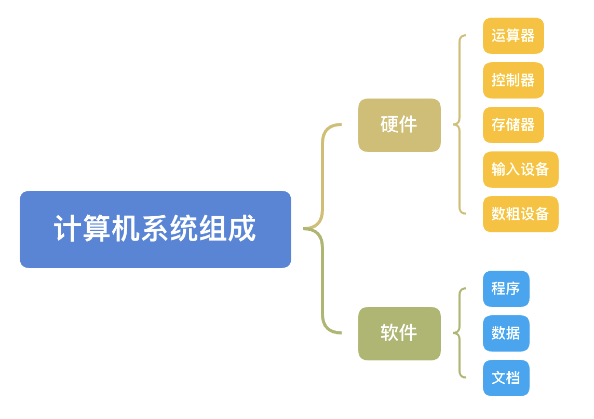

##### 1.1.2 操作系统的形成

##### 1.1.3 操作系统的概念

操作系统是控制和管理计算机系统内各种硬件和软件资源、有效的组织多道程序运行的系统软件(或程序集合)，是用户和计算机之间的接口。Operation System，简称OS

**对操作系统的理解**

1. OS是系统软件，由一整套程序组成

2. OS的基本职能是控制和管理系统内各种资源，有效组织多道程序运行

3. OS提供众多服务，方便用户使用，扩充硬件功能

**典型的操作系统**

1. DOS系统

DOS系统是windows系统的前身，是命令行模式接口

2. Microsoft Windows系列

图形用户界面，使用体验更加友好，更加简单

3. IBM OS/2

一个类windows的操作系统，也是一个图形用户界面

4. UNIX

系统庞大，价格昂贵，普通用户很少接触到

相比而言，微软的windows系列则在普通用户中使用的较多

UNIX系统主要是命令行接口，不过也有一些图形的用户界面

5. Linux

一个类UNIX的小型的操作系统，在PC机上也有很多应用

##### 1.1.4 操作系统的地位

操作系统是硬件之上的第一层软件，是整个计算机系统的管理控制中心，管理系统中的所有资源，可以为其他的软件提供运行环境。

##### 1.1.5 操作系统的特征

#### 1.2 操作系统的形成和发展

##### 1.2.1 操作系统的形成

1. 手工操作阶段

输入介质：穿孔纸带、穿孔卡片

输出设备：打印机

手工操作阶段工作过程：

- 将程序卡片装到输入机上

- 启动输入机将程序和数据送入计算机

- 利用控制台开关启动程序执行，并监视和控制其执行情况

- 计算结束后，用户取走打印出来的结果，并卸下卡片

- 整个过程都是在“人工干预”下进行

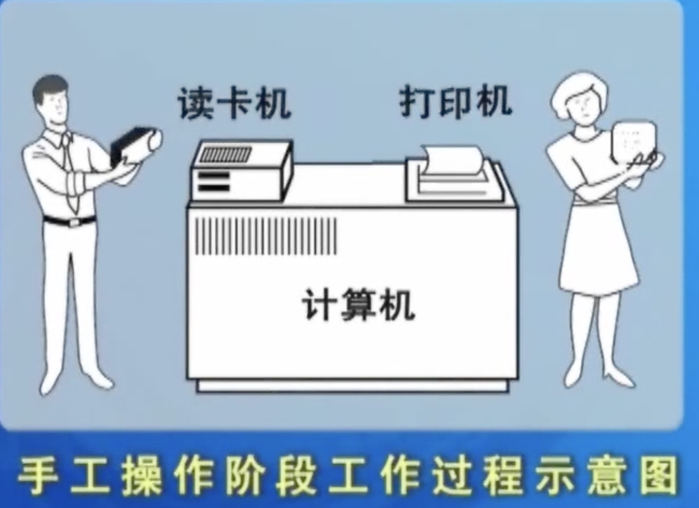

2. 早期批处理阶段

- 早期联机批处理

操作员有选择的将若干执行作业合为一批，输入到磁带上，然后在监督程序的控制下，使作业一个接一个的连续执行

系统中作业的处理是成批进行的，并且内存中总是只保留一道作业，故又称为单道批处理

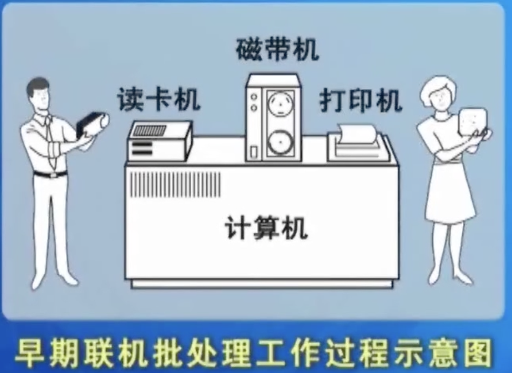

- 早期脱机批处理

联机:online

脱机: offline

特征：在主机之外另设一小型卫星机，又称为外围计算机，它不与主机直接连接，只与I/O设备打交道。

**早期脱机批处理工作过程**

- 卫星机将读卡机上的作业逐个输入到磁带机上

- 计算机只负责将磁带机上存储的作业掉入内存并运行，作业完成后主机将计算结果和记账信息记录到磁带上

- 卫星机负责将输出到磁带上的信息读出来，并交打印机打印

早期的脱机批处理过程分为3个步骤，具体过程示意图可参考下图：

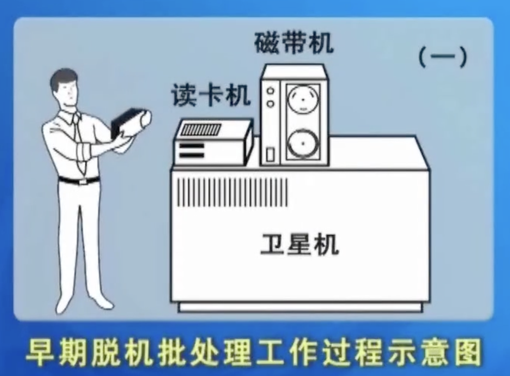

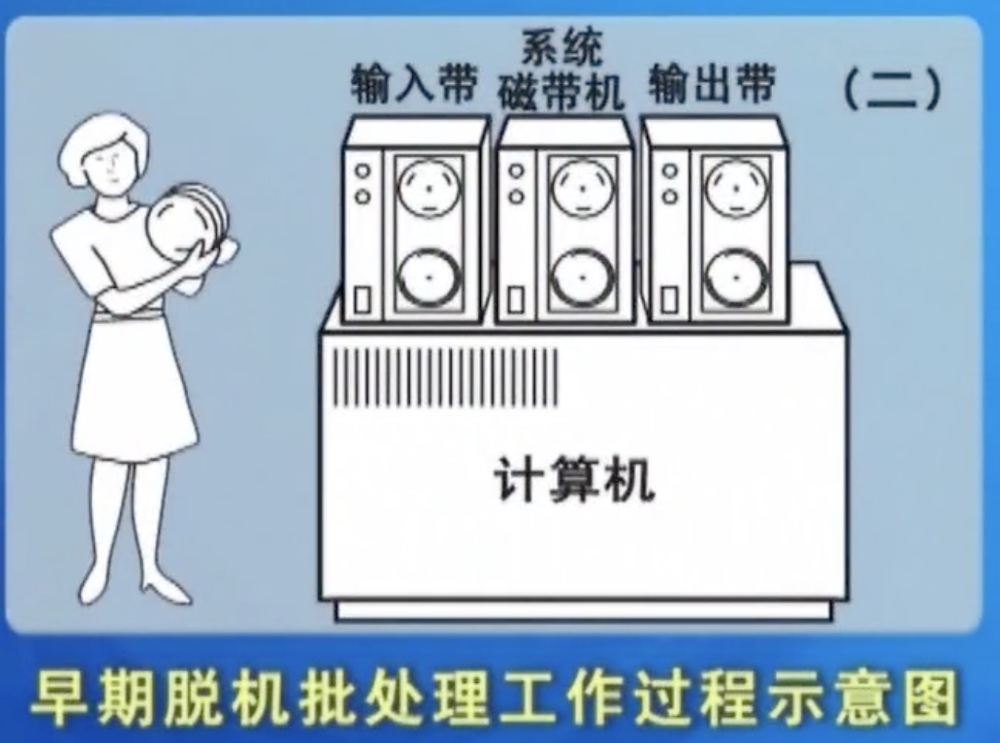

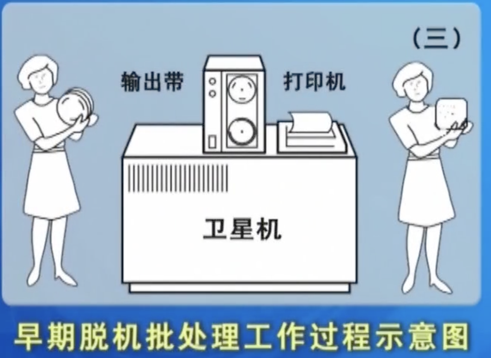

虽然早期的脱机批处理在一定程度上提升了计算机的执行速度，但是它仍属于单道批处理。

3. 多道批处理阶段

多道批处理系统，其基本思想是：在内存中同时存放多道程序，在管理程序的控制下交替执行。这些作业共享CPU和系统中的其他资源。

基本特征：系统资源利用率提高，系统吞吐量增加。但是系统管理变的复杂了

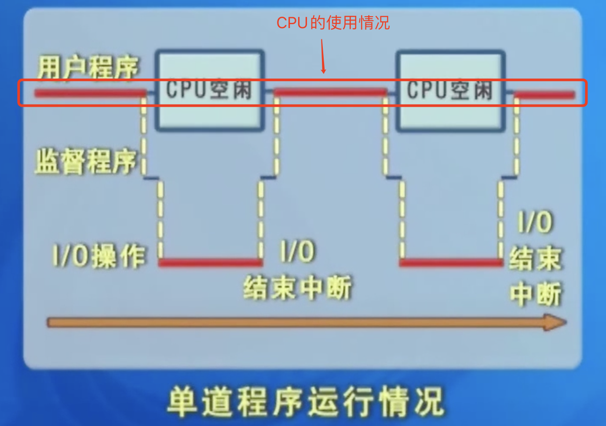

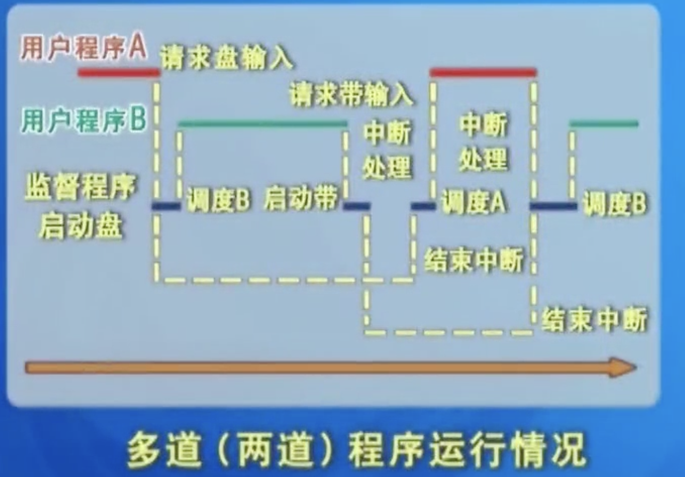

##### 1.2.2 操作系统的发展

1. 分时系统

2. 实时系统

3. 个人机操作系统

4. 网络操作系统

5. 多处理器操作系统

6. 嵌入式操作系统

7. 分布式操作系统

#### 1.3 操作系统的主要功能

首先回顾下计算机系统的组成：由硬件和软件两部分组成，参考下图：

| 部件         | 主要功能               |
| ------------ | ---------------------- |
| 存储管理     | 管理存储器             |
| 进程管理     | 管理CPU：运算器+控制器 |
| 设备管理     | 管理输入/输出设备      |
| 文件管理     | 管理软件               |
| 用户接口管理 | 管理各类接口           |

**存储管理**

1. 内存分配与回收

   1. 内存的任务
      1. 为每道程序分配一定的内存空间
         1. 内存的分配，是根据当时的内存使用情况进行分配的
      2. 记录整个内存使用情况
      3. 处理用户提出的深情
      4. 按照某种策略实施分配
      5. 接收系统或用户释放的内存空间
   2. 目的
      1. 提高内存的利用率，减少内存的浪费

2. 地址映射

   程序在计算机中都是以文件的形式保存的

   程序在编译后的起始地址都是0，并不是实际内存使用的地址，必须将程序中的相对地址(逻辑地址)转换成装入内存后的实际的绝对地址(也叫物理地址)，称为地址映射。

   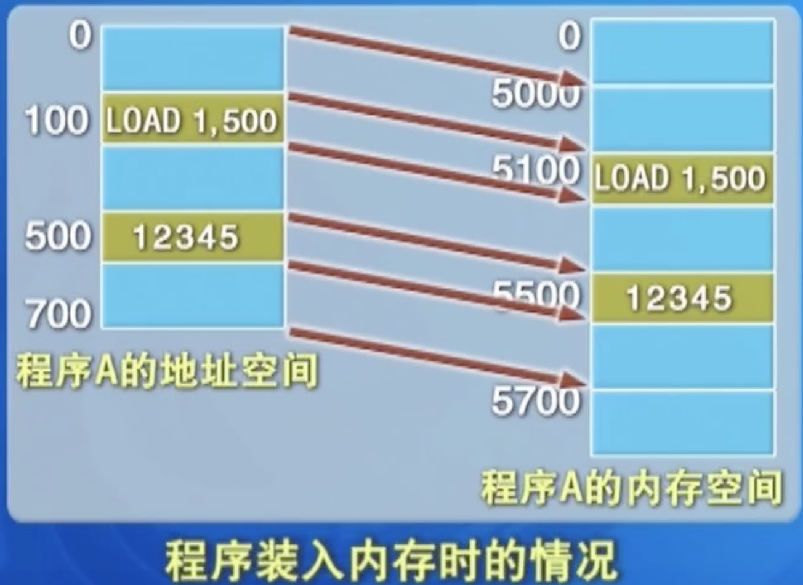

3. 内存保护

4. 内存扩充

   早期的计算机内存都非常小，有的仅仅是512k，大点的1M等，内存非常小。

   内存扩充技术，有时也被称为虚拟存储技术，其原理是：只把当前需要使用到的数据和指令放入到内存中，而不是当前要用的数据和指令放入磁盘，当需要用到这些数据和指令的时候再通过内存调度等方式将这些数据、指令放入内存。

**进程(和处理机)管理**

进程和处理机管理，主要有3个方面的管理：作业和进程调度、进程控制、进程通信

1. 作业和进程调度

   作业：用户提交给计算机的任务被称为作业(job)

   进程：程序的执行过程称为进程(Process),进程是分配和运行处理机的基本单位

   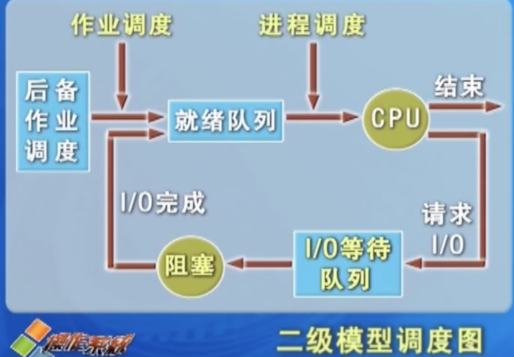

2. 进程控制

   进程控制包括进程的创建、撤销、封锁和唤醒等

   进程有3个状态：运行状态、阻塞状态、就绪状态

   不同的进程状态之间是可以相互转换的

   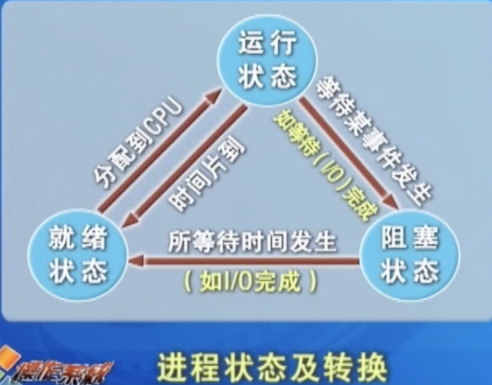

3. 进程通信

   进程与进程之间可能会有依赖、等待、互斥等一些关系，所以在一些进程执行的时候就需要进行一些通信。

**文件管理**

主要是管理计算机系统中的软件，软件主要包括程序、数据和文档，所以这里说的文件管理，也可以简单的理解为管理计算机中的程序、数据和文档。

文件管理，主要涉及到4个方面内容的管理：

1. 文件存储空间的管理

   文件系统对所有文件及文件的存储空间进行统一管理：为新文件分配必要的外存空间，回收释放的文件空间，提高外存的利用效率

2. 文件操作的一般管理

   文件操作的一般管理，主要指对文件的创建、删除、打开、关闭等基本操作的一些管理

   打开：需要进行编辑等进行的操作

   关闭：可以释放占用的内存、临时空间等

3. 目录的管理

   通过目录文件的组织，实现用户对文件“按名存取”，以及目录的快速查询和文件共享等

   通过目录管理，可以解决文件的分类、快速查询和共享等常见问题

4. 文件的读写管理及存取控制

   r：read，读

   w：write，写

   x：执行

   对文件的管理，一般情况下分为文件主、同组用户和其他用户3种类型的用户进行控制

**设备管理**

设备管理从4个方面去分析：

1. 缓冲区管理

   缓冲区的设置，主要是为了解决CPU和外设速度不匹配的矛盾。

   缓冲区可能会有多级，不同的设备都可能会设有缓冲区

   如磁盘有磁盘缓冲区、内存有内存缓冲区、键盘也有缓冲区

2. 设备分配

3. 设备驱动

4. 设备无关性

**用户接口管理**

用户接口可以分为三类：

1. 图形用户接口

2. 命令行接口

3. 程序接口

   程序接口，即系统调用接口。系统调用只能在用户程序中使用，获取系统的基层服务。

#### 1.4 操作系统的特征

操作系统的特征：并发、共享、异步性(不确定性)和抽象性。

**并发：**两个或多个活动在同一个给定的时间间隔中进行

**共享：**计算机系统中的资源被多个任务所共用

​	这些系统资源包括：CPU、内存、磁盘空间、程序或数据

**异步性:**在多道程序环境下，各程序的执行过程有着“走走停停”的性质

​	程序的执行情况不可预知，是由程序执行时的现场所决定的

​	程序在相同的初始数据下，都应得到相同的运行结果

#### 1.5 UNIX和Linux系统简介

Unix适当代最著名的多用户、多进程、多任务分时操作系统

**Unix的主要特点**

可移植性好

有良好的用户界面

树形分级结构的文件系统

字符流式文件

丰富的核外系统程序

设计思想想尽

提供了管道机制

提供电子邮件和对网络通信的有力支持

系统安全，可靠性高

**Linux**

特点：

与Unix系统兼容

自由软件、源码开源

性能高、安全性强

便于定制和再开发

互操作性高

全面的多任务和真正的64位操作系统

常见的Linux发行版本：Red Hat、Debian、Ubuntu、中标麒麟Linux、中标普华Linux、Slackware、OpenSuSE Linux等

### 2. 进程管理

#### 2.1 进程概述

##### 2.1.1程序的顺序执行和并发执行

**程序的顺序执行**

1. 单道顺序程序执行的特点

   顺序性：程序所规定的每个动作都在上个动作结束后才开始

   封闭性：只有所规定的每个动作才能改变程序的运行环境，即程序在运行时独占全部资源，除程序本身的动作外，只有程序规定的动作才能改变这些资源的状态

   可再现性：程序的执行结果与程序运行的速度无关

   单道程序系统存在资源浪费、效率低等明显的缺点，所以在现代计算机系统中，几乎不再使用这种技术，而是广泛的采用多道程序设计技术。

2. 多道程序执行特点

   多道程序设计是指在内存中同时存放多道程序，它们在管理程序的控制下交替的在CPU上运行

**程序的并发执行**

##### 2.1.2进程的概念

**进程的定义**

#### 2.2 线程的引入和实现

#### 2.3 进程之间的关系和通信

#### 2.4 信号量和P、V操作的一般应用

#### 2.5 死锁

#### 案例 Linux进程管理

### 3. 处理机调度

#### 3.1 调度级别

#### 3.2 作业调度和进程调度

#### 3.3 调度策略和调度性能评价

#### 3.4 常用调度算法

#### 3.5 中断处理

#### 案例 Linux系统的进程调度

### 4. 存储管理

#### 4.1 地址空间与重定位

#### 4.2 分区管理技术

#### 4.3 分页管理技术

#### 4.4 虚拟存储管理

#### 4.5 请求分页技术

#### 4.6 段页式系统

#### 4.7 常用的页面置换算法

#### 案例:Linux存储管理

### 5. 文件系统

#### 5.1 文件系统概述

#### 5.2 文件系统的逻辑和物理组织

#### 5.3 目录文件

#### 5.4 文件存储空间的管理

#### 5.5 文件的共享和文件系统的安全性

#### 案例:Linux文件系统

### 6. 设备管理

#### 6.1 设备管理概述

#### 6.2 设备分配技术

#### 6.3 I/O软件层次和管理

#### 6.4 设备驱动程序

#### 6.5 与设备无关的操作系统I/O软件

#### 6.6 用户级I/O软件

#### 6.7 磁盘调度和管理

#### 案例:Linux设备管理

### 7. 现代操作系统发展

#### 7.1 现代操作系统的发展

#### 7.2 嵌入式操作系统

#### 7.3 分布式操作系统

#### 7.4 云计算系统