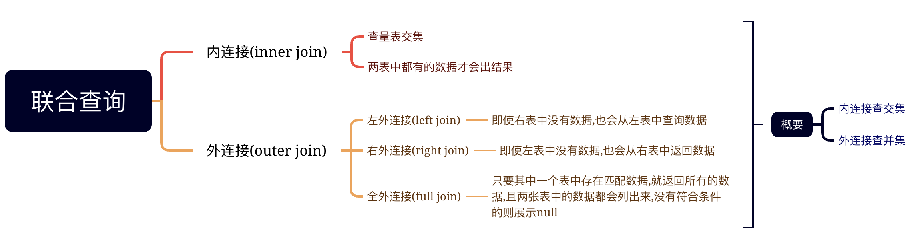
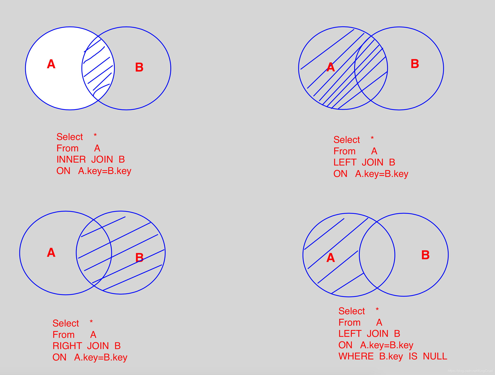
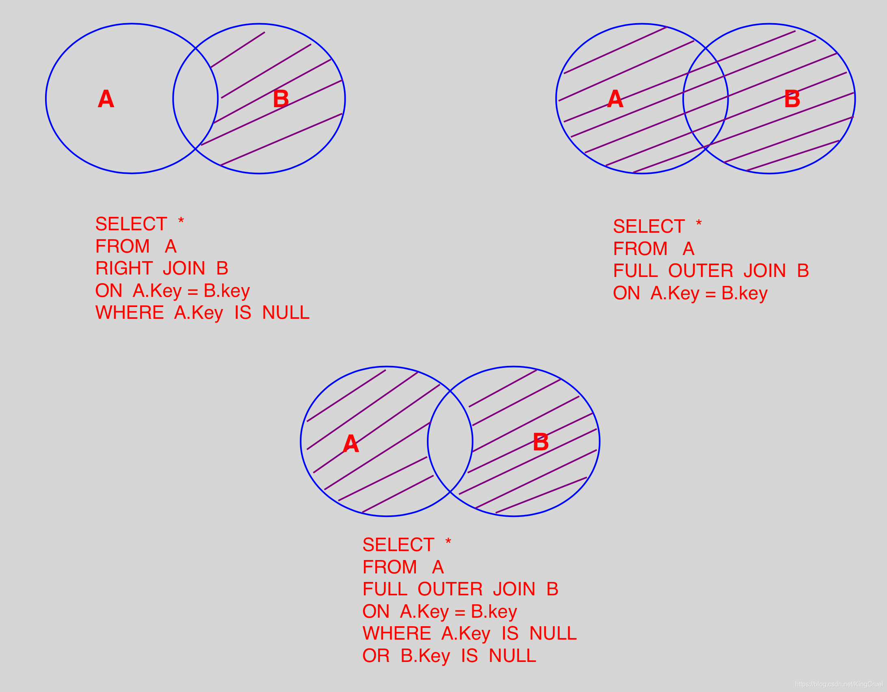

### 使用聚合函数汇总数据

聚合函数也称为集合函数或统计函数,其作用是对一组值进行计算并返回一个单值.SQL提供的聚合函数主要有:

* count(*)统计数据的行数

* count(distinct <列名>):统计列中除空值外的值的个数,distinct选项表示去掉列的重复值后再统计

* sum(<列名>): 计算列值总和

* AVG(<列名>): 求列值的平均值

* MAX(<列名>):求列值的最大值

* MIN(<列名>):求列值的最小值

### 多表查询

多表查询,是指一个查询同时涉及到两个或两个以上的表的查询.

多表查询,分为内连接、外连接以及自连接.自连接是一种特殊的内连接.

#### 内连接

内连接是一种最常用的连接类型,使用内连接时,如果两个表的相关字段满足连接条件,则从这两个表中提取相关数据并组合成新的记录.

#### 外连接

#### 自连接

> 对视图的操作最终都转换为对基本表的操作.

### 联合查询

联合查询,就是上面已经列到的多表查询,联合查询的精髓可参考下图:

还有2个直观的图形可以参考:

### 视图的作用

- 简化数据查询语句

- 使用户能够从多角度看待同一数据

- 提高了数据的安全性

- 提供了一定程度的逻辑独立性