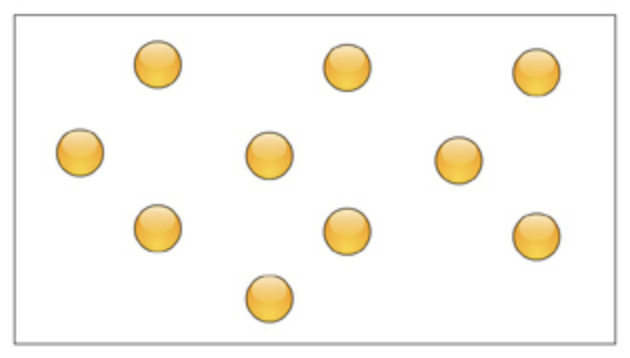
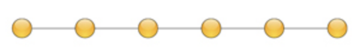
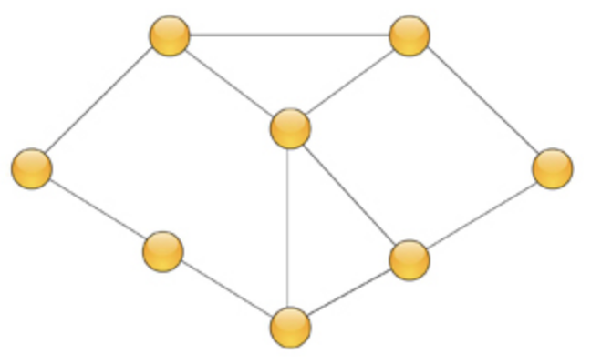
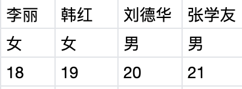

<!-- START doctoc generated TOC please keep comment here to allow auto update -->
<!-- DON'T EDIT THIS SECTION, INSTEAD RE-RUN doctoc TO UPDATE -->
**Table of Contents**  *generated with [DocToc](https://github.com/thlorenz/doctoc)*

- [1. 绪论](#1-%E7%BB%AA%E8%AE%BA)
  - [1.1 数据结构简介](#11-%E6%95%B0%E6%8D%AE%E7%BB%93%E6%9E%84%E7%AE%80%E4%BB%8B)
  - [1.2 数据结构的基本术语和概念](#12-%E6%95%B0%E6%8D%AE%E7%BB%93%E6%9E%84%E7%9A%84%E5%9F%BA%E6%9C%AC%E6%9C%AF%E8%AF%AD%E5%92%8C%E6%A6%82%E5%BF%B5)
  - [1.3 算法和算法分析简介](#13-%E7%AE%97%E6%B3%95%E5%92%8C%E7%AE%97%E6%B3%95%E5%88%86%E6%9E%90%E7%AE%80%E4%BB%8B)
    - [1.3.1 算法](#131-%E7%AE%97%E6%B3%95)
    - [1.3.2 时间复杂度](#132-%E6%97%B6%E9%97%B4%E5%A4%8D%E6%9D%82%E5%BA%A6)
- [2. 线性表](#2-%E7%BA%BF%E6%80%A7%E8%A1%A8)
- [3. 栈和队列](#3-%E6%A0%88%E5%92%8C%E9%98%9F%E5%88%97)
- [4. 串](#4-%E4%B8%B2)
- [5. 数组和广义表](#5-%E6%95%B0%E7%BB%84%E5%92%8C%E5%B9%BF%E4%B9%89%E8%A1%A8)
- [6. 树和二叉树](#6-%E6%A0%91%E5%92%8C%E4%BA%8C%E5%8F%89%E6%A0%91)
- [7. 图](#7-%E5%9B%BE)
- [8. 查找](#8-%E6%9F%A5%E6%89%BE)
- [9. 排序](#9-%E6%8E%92%E5%BA%8F)

<!-- END doctoc generated TOC please keep comment here to allow auto update -->

### 1. 绪论

学习数据结构，首先要学习明白数据结构的4种逻辑结构和存储结构之间的关系；算法在算法分析过程中的时间复杂度和空间复杂度。

#### 1.1 数据结构简介

数据的有效、合理的存储，是学习数据结构的意义。

#### 1.2 数据结构的基本术语和概念

1. 数据

2. 数据元素

是数据的基本单位，在计算机中通常被作为一个整体来存储和处理。

数据元素可以是单个数据项，也可以由多个数据项组合而成。

数据元素，在很多应用中，也被称为记录.

例如学生的年龄就是一个数据元素，也可以根据需要把学生的相关信息如姓名、年龄、性别、班级等信息组合到一起组成一个数据元素。简单来看，我们可以把数据表中的一行称为一个数据元素，或者我们常看到的后台业务系统，一行就是一个数据元素。


3. 数据项

数据项是数据元素中不可分割的最小单位。如学生的一个数据元素姓名、年龄、性别、班级等，其中年龄为一个数据项、年龄为一个数据项，性别也为一个数据项。这些数据项是组成数据元素的基本单位，不可再继续分割了。

4. 数据对象

是数据的一个子集，是性质相同的数据的集合。

5. 数据结构

数据结构是相互之间存在一种或多种特定关系的数据元素的集合。数据元素之间的关系称为结构。

客观事务之间存在着各种不同的联系，但抽象为数据以后再来研究它们具有的共性关系就单纯的多。数据结构研究这种关系的目的是要把数据合理、有效的存储到计算机上进行处理，所以我们的着眼点应该诸如数据之间的位置关系、数据之间是否存在直接或间接间的联系等方面。

<font color="#f20">数据结构一般包括三个方面的内容：数据的逻辑结构、数据的存储结构、数据的运算。</font>

6. 数据的逻辑结构

数据的逻辑结构是指数据之间的逻辑关系，也就是数据元素之间抽象关系的描述。它与数据在计算机的存储器存储的方式无关，独立于计算机存在，通常有4种类型的基本结构：

- 集合：结构中的数据除了“属于同一集合”的关系外，不存在其他关系；

- 线性结构：结构中的数据元素的位置之间存在一对一的关系；

- 树形结构：结构中的数据元素之间存在一对多的关系；

- 图状结构：结构中的数据元素存在多对多的关系，图状结构又被称为网状结构

集合的数据结构：



线性结构的数据结构：



树形结构的数据结构：


图状结构的数据结构：



7. 数据的存储结构

数据的存储结构是指数据的逻辑结构在计算机中的表示。它主要包含两个方面的含义：

- 如何在计算机中存储数据元素；

- 如何体现数据元素之间的逻辑关系；

数据的存储结构包括数据的表示和关系的表示。

数据的存储结构一般情况下可以分为以下4种：

- 顺序存储

- 链式存储

- 索引存储

- 散列存储

8. 数据的运算

数据的运算是对数据进行的操作。它定义在逻辑结构上，也就是说，一旦数据的逻辑结构确定了，就可以定义在这种逻辑结构上可以进行哪种运算了。但是数据运算的具体实现要依赖于数据的存储结构。同样的逻辑结构可能会有不同的存储结构，在不同的存储结构上实现同一个数据运算的方法也不一样，所以，具体数据运算的实现，还要根据数据的存储结构来定。

**数据的逻辑结构和数据的存储结构之间的关系是什么？**

数据的逻辑结构就是从逻辑关系上描述数据，它与数据在计算机存储器中的存储方式无关，独立于计算机存在。数据的存储结构就是数据元素及其关系在计算机存储器内的表示。

数据的逻辑结构是数据之间固有的逻辑关系，是由数据所描述的客观存在决定的，数据的存储结构(物理结构)是数据在计算机存储器中的表示方法，是可选择的，同样的逻辑结构可以用不同的存储结构来表示。

**数据结构是怎么分类的？**

- 从逻辑结构上看：分为线性结构和非线性结构。

线性结构的逻辑特征就是每个数据元素最多只有一个直接前驱，也最多只有一个直接后驱；非线性结构的逻辑特征是每个数据元素可能有多个直接前驱或直接后驱；

- 从存储结构上看：可分为顺序存储、链接存储、索引存储和散列存储，用的最多的是前两种。

顺序存储就是把逻辑上相邻的节点存储在物理位置上相邻的存储单元中，节点的逻辑关系由存储单元的物理位置上的邻接关系来体现；

链接存储就是指逻辑上相邻的节点可以存储在物理位置上不相邻的存储单元中，在存储节点的值的同时存储下一个节点的地址，即“指针”。节点之间的逻辑关系可以通过“指针”来体现。

#### 1.3 算法和算法分析简介

计算机科学中所说的算法是指满足一定条件的问题求解步骤。

学习算法，要了解算法的概念和算法的5个特性，理解时间复杂度的概念。

##### 1.3.1 算法

**程序设计的要素**

算法语言、算法、数据结构和程序设计技术。

**算法**

解决特定问题的方法。

**算法的5个特性**

- 有穷性

在合法的输入下，一个算法必须在执行有穷个步骤之后结束，而其中每一个步骤都能在有限时间内完成。

- 确定性

算法中每一个步骤、每一条指令都有确切的含义，对符合算法要求的任何输入数据都能正确执行，而对于相同的输入只能得到相同的输出。

- 可行性

算法中描述的操作都可以通过已经实现的基本操作执行有限次来实现。

- 算法有0个或多个输入

算法要有处理的对象，也就是数据。根据需要某些数据需要在执行时输入，并通过变量接受它们。有些数据可能已经被嵌入到算法中，或通过赋值方法使变量获得数据。

- 算法有1个或多个输出

输出是一组与输入量有某种特定关系的量，是算法执行后的结果。

##### 1.3.2 时间复杂度

算法的时间复杂度是评估算法的重要标准之一，它能较好的体现算法本身的时间效率，而与具体实现算法的计算机软件、硬件无关。时间复杂度在算法的设计与分析中占有重要地位。

分析一个算法的时间复杂度首先要从中选取一种能在很大程度上体现该算法执行时间的基本操作，以该基本操作重复执行的次数作为度量。例如在矩阵相乘的算法中，乘法就是基本操作。在从一批整数中求最大数的算法中，对两个数据的比较就是基本操作，一批整数中数据的个数称为问题的规模。

一般情况下，算法基本操作重复执行的次数是问题规模n的某个函数f(n)，而算法的时间复杂度简单来说是指算法中某种基本操作执行次数的数量级，通常用T(n)=O(f(n))表示，其中O表示f(n)的数量级。

常见的时间复杂度:https://blog.csdn.net/shu19880720/article/details/87929143

### 2. 线性表

#### 2.1 线性表的定义和逻辑结构

**线性表的定义**

线性表是属于同一个数据对象的数据元素的有限序列。

线性表中数据元素的个数称为线性表的长度，长度为0的线性表称为空表。

线性表中的数据元素可以是只有一个数据项的简单数据，也可以是由多个数据项组成，称这样的数据元素为记录。

由于同一个线性表的数据元素属于同一个数据对象，所以它们有相同的特性。从程序设计的角度来说，这些数据元素属于同一种数据类型。

如(3,4,23,89,0)是一个线性表，它们的数据元素是整数，长度为5.

再如(a,b,c……z)也是一个线性表，它们的数据元素是英文小写字母，其长度为26。

又如

图中表示的也是一个线性表，其中数据元素是相同类型的记录，每个记录由3个数据项组成，分别是姓名、性别和年龄。线性表的长度为4.

由定义和案例，我们可以看出来，线性表的几个重要特征是有限序列、同一类型。

**线性表的逻辑结构**

线性表的逻辑结构是指线性表中数据元素之间的逻辑(抽象)关系。若将线性表记为(a<sub>1</sub>、a<sub>2</sub>、a<sub>3</sub>……a<sub>i-1</sub>、a<sub>i</sub>……a<sub>n-1</sub>、a<sub>n</sub>)，其中(i=1,2,3,……n)是属于表中的某个数据对象的元素，则根据线性表的定义，如果线性表中至少包含两个元素，则线性表中的数据元素之间存在以下关系：

1. 表中存在称作“第一个”的元素，如表中的a<sub>1</sub>,也存在称作"最后一个"的数据元素，如上表中的a<sub>n</sub>.

2. 线性表中第一个元素a<sub>1</sub>前面没有元素和它相邻，称它没有直接前驱；它后面也只有一个数据元素a<sub>2</sub>与它相邻，称它有且只有一个后继；同理，上述线性表中最后一个元素a<sub>n</sub>有且只有一个直接前驱，没有直接后继。

3. 除“第一个”和“最后一个”元素之外，其他每个元素均有且只有一个直接前驱和一个直接后继。

**线性表的基本操作**

1. 存取：存取表中第i个数据元素a<sub>i</sub>(1 <= i <= n)

2. 插入：在表中第i个数据元素之前插入一个新的数据元素，也就是使新插入的数据元素成为新表中的第i个数据元素(1 <= i <= n+1)

3. 删除：删除表中第i个元素(1 <= i <= n)

4. 查找：在线性表中查找满足某种条件的数据元素

5. 求表长：求线性表中的元素个数

6. 合并：将两个线性表按照某种要求合并

7. 排序：将线性表按照某种条件排序

**线性表的存储方式**

线性表主要有顺序存储和链式存储结构。

#### 2.2 线性表的顺序存储结构

**1.顺序存储结构的概念**

顺序表：线性表的顺序存储是指用一组地址连续的存储单元依次存放线性表的数据元素，这种存储形式的线性表程序顺序表。在顺序表中用内存中地址的线性关系表示线性表中数据元素之间的关系。

顺序表的特点：逻辑结构中相邻的节点在存储结构中也相邻，可以相互访问。

在程序设计语言中，一维数组在内存中占用的存储空间就是一组连续的存储区域，因此可以利用一维数组来存储线性表，其存储结构和线性表的逻辑结构完全一致。

**2.利用数组存储处理线性表**

数组是计算机内存中一组类型相同、连续存储的变量，每一个变量称为数组元素，按地址由小到大的顺序每个数组元素都有一个确定的下标。C语言中，在说明数组的同时就为数组开辟了相应的存储空间。

看C语言中数组存储相关的语句：

```c
int a[10,],i;
for(i = 0; i < 5; i++){
    scanf("%d", a[i]);
}
a[0] = 5;
```
可见在数组中存储线性表，它的存储结构和线性表的逻辑结构完全一致。

**3.利用指针处理线性表**

指针：任意一个内存变量，都有唯一确定的内存地址，称这个地址为该变量的指针，它是一个常量。

指针变量：是一种特殊的变量，它和普通变量一样占用一定的内存空间，它与普通变量的不同之处在于，指针变量中存放的不是普通数据，而是另外一个变量的指针(地址)。

指针变量在声明时要指明它的数据类型，其类型就是它将要指向的变量的类型。就C语言而言，只要把数组的首地址赋给具有相同数据类型的指针变量，就可以利用该指针访问到数组中任意一个数组元素，因而也就可以利用指针处理线性表。由于数组名是地址常量，不能对它进行赋值，而指针变量则可以进行一些列运算并能被赋值，另外利用指针变量结合C语言的相关函数可以动态分配存储空间，所以，采用指针处理线性表比数组更方便、更灵活。

看demo：

```c
int a[10];
int *p;
p = a;(或者是p = &a[0];)
```
demo声明了一个整型的数组a，数组a中具有10个元素；然后又声明了一个指针p，并把数组a的首地址赋给了指针p，之后就可以利用p来访问数组中的任何一个元素了,如*(p+i)就等价于a[i],(i等于0，1，2，3，4，5，6，7，8，9)

**顺序表是如何表示线性表中元素之间的逻辑关系的？**

顺序表是利用顺序结构存储的线性表，即将线性表的所有元素按其逻辑顺序依次存放在计算机内存中一组连续的存储单元中。

顺序表的特点是，其逻辑关系相邻的两个节点在物理位置上也相邻，节点的逻辑次序与物理次序完全一致。

#### 2.3 顺序表的操作

链表第一个位置存储的是表长。

#### 2.4 线性表的链式存储结构

#### 2.5 单向链表的存储结构和操作

#### 2.6 单向循环链表的存储结构和操作

#### 2.7 双向循环链表的存储结构和操作

### 3. 栈和队列

### 4. 串

### 5. 数组和广义表

### 6. 树和二叉树

### 7. 图

### 8. 查找

### 9. 排序