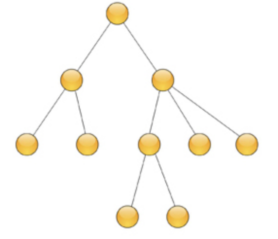

### 1. 绪论

学习数据结构，首先要学习明白数据结构的4种逻辑结构和存储结构之间的关系；算法在算法分析过程中的时间复杂度和空间复杂度。

#### 1.1 数据结构简介

数据的有效、合理的存储，是学习数据结构的意义。

#### 1.2 数据结构的基本术语和概念

1. 数据

2. 数据元素

是数据的基本单位，在计算机中通常被作为一个整体来存储和处理。

数据元素可以是单个数据项，也可以由多个数据项组合而成。

数据元素，在很多应用中，也被称为记录.

例如学生的年龄就是一个数据元素，也可以根据需要把学生的相关信息如姓名、年龄、性别、班级等信息组合到一起组成一个数据元素。简单来看，我们可以把数据表中的一行称为一个数据元素，或者我们常看到的后台业务系统，一行就是一个数据元素。

3. 数据项

数据项是数据元素中不可分割的最小单位。如学生的一个数据元素姓名、年龄、性别、班级等，其中年龄为一个数据项、年龄为一个数据项，性别也为一个数据项。这些数据项是组成数据元素的基本单位，不可再继续分割了。

4. 数据对象

是数据的一个子集，是性质相同的数据的集合。

5. 数据结构

数据结构是相互之间存在一种或多种特定关系的数据元素的集合。数据元素之间的关系称为结构。

客观事务之间存在着各种不同的联系，但抽象为数据以后再来研究它们具有的共性关系就单纯的多。数据结构研究这种关系的目的是要把数据合理、有效的存储到计算机上进行处理，所以我们的着眼点应该诸如数据之间的位置关系、数据之间是否存在直接或间接间的联系等方面。

数据结构一般包括三个方面的内容：数据的逻辑结构、数据的存储结构、数据的运算。

6. 数据的逻辑结构

数据的逻辑结构是指数据之间的逻辑关系，也就是数据元素之间抽象关系的描述。它与数据在计算机的存储器存储的方式无关，独立于计算机存在，通常有4种类型的基本结构：

- 集合：结构中的数据除了“属于同一集合”的关系外，不存在其他关系；

- 线性结构：结构中的数据元素的位置之间存在一对一的关系；

- 树形结构：结构中的数据元素之间存在一对多的关系；

- 图状结构：结构中的数据元素存在多对多的关系，图状结构又被称为网状结构

集合的数据结构：

线性结构的数据结构：

树形结构的数据结构：

图状结构的数据结构：

7. 数据的存储结构

数据的存储结构是指数据的逻辑结构在计算机中的表示。它主要包含两个方面的含义：

- 如何在计算机中存储数据元素；

- 如何体现数据元素之间的逻辑关系；

数据的存储结构包括数据的表示和关系的表示。

数据的存储结构一般情况下可以分为以下4种：

- 顺序存储

- 链式存储

- 索引存储

- 散列存储

8. 数据的运算

数据的运算是对数据进行的操作。它定义在逻辑结构上，也就是说，一旦数据的逻辑结构确定了，就可以定义在这种逻辑结构上可以进行哪种运算了。但是数据运算的具体实现要依赖于数据的存储结构。同样的逻辑结构可能会有不同的存储结构，在不同的存储结构上实现同一个数据运算的方法也不一样，所以，具体数据运算的实现，还要根据数据的存储结构来定。

**数据的逻辑结构和数据的存储结构之间的关系是什么？**

数据的逻辑结构就是从逻辑关系上描述数据，它与数据在计算机存储器中的存储方式无关，独立于计算机存在。数据的存储结构就是数据元素及其关系在计算机存储器内的表示。

数据的逻辑结构是数据之间固有的逻辑关系，是由数据所描述的客观存在决定的，数据的存储结构(物理结构)是数据在计算机存储器中的表示方法，是可选择的，同样的逻辑结构可以用不同的存储结构来表示。

#### 1.3 算法和算法分析简介

### 2. 线性表

### 3. 栈和队列

### 4. 串

### 5. 数组和广义表

### 6. 树和二叉树

### 7. 图

### 8. 查找

### 9. 排序