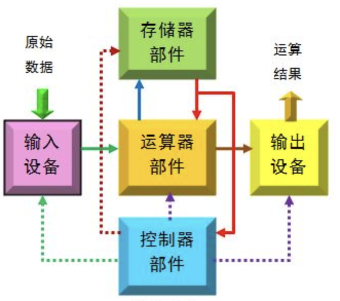
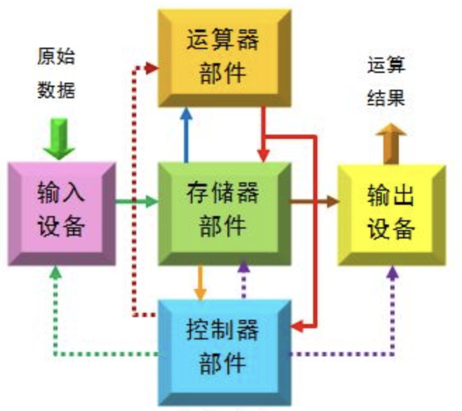
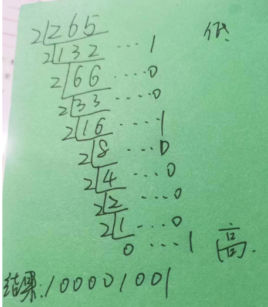
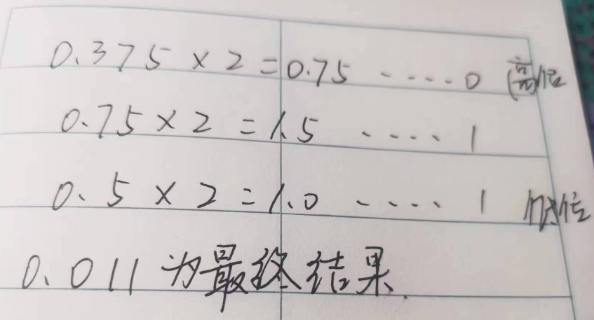
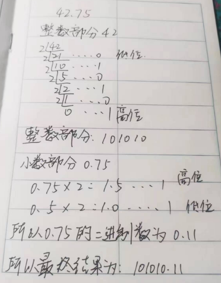
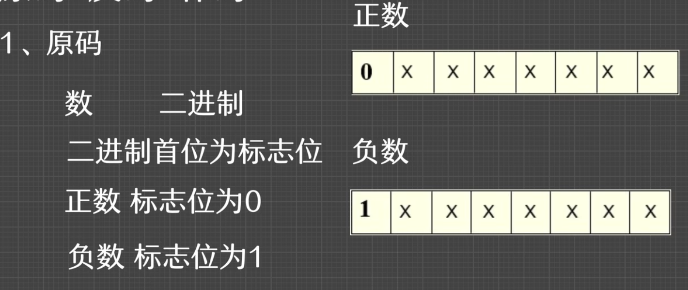

<!-- START doctoc generated TOC please keep comment here to allow auto update -->
<!-- DON'T EDIT THIS SECTION, INSTEAD RE-RUN doctoc TO UPDATE -->
**Table of Contents**  *generated with [DocToc](https://github.com/thlorenz/doctoc)*

- [1. 计算机系统概述](#1-%E8%AE%A1%E7%AE%97%E6%9C%BA%E7%B3%BB%E7%BB%9F%E6%A6%82%E8%BF%B0)
  - [1.1 计算机系统的基本组成和它的层次结构](#11-%E8%AE%A1%E7%AE%97%E6%9C%BA%E7%B3%BB%E7%BB%9F%E7%9A%84%E5%9F%BA%E6%9C%AC%E7%BB%84%E6%88%90%E5%92%8C%E5%AE%83%E7%9A%84%E5%B1%82%E6%AC%A1%E7%BB%93%E6%9E%84)
  - [1.2 计算机硬件系统的5个功能部件及其功能](#12-%E8%AE%A1%E7%AE%97%E6%9C%BA%E7%A1%AC%E4%BB%B6%E7%B3%BB%E7%BB%9F%E7%9A%845%E4%B8%AA%E5%8A%9F%E8%83%BD%E9%83%A8%E4%BB%B6%E5%8F%8A%E5%85%B6%E5%8A%9F%E8%83%BD)
  - [1.3 计算机主要的技术和性能指标](#13-%E8%AE%A1%E7%AE%97%E6%9C%BA%E4%B8%BB%E8%A6%81%E7%9A%84%E6%8A%80%E6%9C%AF%E5%92%8C%E6%80%A7%E8%83%BD%E6%8C%87%E6%A0%87)
  - [1.4 计算机系统的体系结构、组成和实现](#14-%E8%AE%A1%E7%AE%97%E6%9C%BA%E7%B3%BB%E7%BB%9F%E7%9A%84%E4%BD%93%E7%B3%BB%E7%BB%93%E6%9E%84%E7%BB%84%E6%88%90%E5%92%8C%E5%AE%9E%E7%8E%B0)
  - [1.5 计算机系统的发展、应用与分类](#15-%E8%AE%A1%E7%AE%97%E6%9C%BA%E7%B3%BB%E7%BB%9F%E7%9A%84%E5%8F%91%E5%B1%95%E5%BA%94%E7%94%A8%E4%B8%8E%E5%88%86%E7%B1%BB)
- [2. 数据表示和运算方法](#2-%E6%95%B0%E6%8D%AE%E8%A1%A8%E7%A4%BA%E5%92%8C%E8%BF%90%E7%AE%97%E6%96%B9%E6%B3%95)
  - [2.1 二进制码和不同进制数之间的转换](#21-%E4%BA%8C%E8%BF%9B%E5%88%B6%E7%A0%81%E5%92%8C%E4%B8%8D%E5%90%8C%E8%BF%9B%E5%88%B6%E6%95%B0%E4%B9%8B%E9%97%B4%E7%9A%84%E8%BD%AC%E6%8D%A2)
  - [2.2 定点数在计算机内的表示与编码](#22-%E5%AE%9A%E7%82%B9%E6%95%B0%E5%9C%A8%E8%AE%A1%E7%AE%97%E6%9C%BA%E5%86%85%E7%9A%84%E8%A1%A8%E7%A4%BA%E4%B8%8E%E7%BC%96%E7%A0%81)
  - [2.3 浮点数在计算机内的表示](#23-%E6%B5%AE%E7%82%B9%E6%95%B0%E5%9C%A8%E8%AE%A1%E7%AE%97%E6%9C%BA%E5%86%85%E7%9A%84%E8%A1%A8%E7%A4%BA)
  - [2.4 文字和多媒体信息的表示与编码](#24-%E6%96%87%E5%AD%97%E5%92%8C%E5%A4%9A%E5%AA%92%E4%BD%93%E4%BF%A1%E6%81%AF%E7%9A%84%E8%A1%A8%E7%A4%BA%E4%B8%8E%E7%BC%96%E7%A0%81)
  - [2.5 数据校验码](#25-%E6%95%B0%E6%8D%AE%E6%A0%A1%E9%AA%8C%E7%A0%81)
  - [2.6 二进制数值数据的运算算法](#26-%E4%BA%8C%E8%BF%9B%E5%88%B6%E6%95%B0%E5%80%BC%E6%95%B0%E6%8D%AE%E7%9A%84%E8%BF%90%E7%AE%97%E7%AE%97%E6%B3%95)
- [3. 运算器部件](#3-%E8%BF%90%E7%AE%97%E5%99%A8%E9%83%A8%E4%BB%B6)
  - [3.1 算数逻辑运算部件的功能设计与线路实现](#31-%E7%AE%97%E6%95%B0%E9%80%BB%E8%BE%91%E8%BF%90%E7%AE%97%E9%83%A8%E4%BB%B6%E7%9A%84%E5%8A%9F%E8%83%BD%E8%AE%BE%E8%AE%A1%E4%B8%8E%E7%BA%BF%E8%B7%AF%E5%AE%9E%E7%8E%B0)
  - [3.2 计算机的定点运算器](#32-%E8%AE%A1%E7%AE%97%E6%9C%BA%E7%9A%84%E5%AE%9A%E7%82%B9%E8%BF%90%E7%AE%97%E5%99%A8)
  - [3.3 浮点运算和浮点运算器](#33-%E6%B5%AE%E7%82%B9%E8%BF%90%E7%AE%97%E5%92%8C%E6%B5%AE%E7%82%B9%E8%BF%90%E7%AE%97%E5%99%A8)
- [4. 指令系统和汇编程序设计](#4-%E6%8C%87%E4%BB%A4%E7%B3%BB%E7%BB%9F%E5%92%8C%E6%B1%87%E7%BC%96%E7%A8%8B%E5%BA%8F%E8%AE%BE%E8%AE%A1)
  - [4.1 指令格式和指令系统概述](#41-%E6%8C%87%E4%BB%A4%E6%A0%BC%E5%BC%8F%E5%92%8C%E6%8C%87%E4%BB%A4%E7%B3%BB%E7%BB%9F%E6%A6%82%E8%BF%B0)
  - [4.2 寻址方式概述](#42-%E5%AF%BB%E5%9D%80%E6%96%B9%E5%BC%8F%E6%A6%82%E8%BF%B0)
  - [4.3 指令系统举例](#43-%E6%8C%87%E4%BB%A4%E7%B3%BB%E7%BB%9F%E4%B8%BE%E4%BE%8B)
  - [4.4 计算机的汇编程序设计简介](#44-%E8%AE%A1%E7%AE%97%E6%9C%BA%E7%9A%84%E6%B1%87%E7%BC%96%E7%A8%8B%E5%BA%8F%E8%AE%BE%E8%AE%A1%E7%AE%80%E4%BB%8B)
- [5. 控制器部件](#5-%E6%8E%A7%E5%88%B6%E5%99%A8%E9%83%A8%E4%BB%B6)
  - [5.1 控制器的功能与组成概述](#51-%E6%8E%A7%E5%88%B6%E5%99%A8%E7%9A%84%E5%8A%9F%E8%83%BD%E4%B8%8E%E7%BB%84%E6%88%90%E6%A6%82%E8%BF%B0)
  - [5.2 硬连线控制器部件](#52-%E7%A1%AC%E8%BF%9E%E7%BA%BF%E6%8E%A7%E5%88%B6%E5%99%A8%E9%83%A8%E4%BB%B6)
  - [5.3 微程序控制器部件](#53-%E5%BE%AE%E7%A8%8B%E5%BA%8F%E6%8E%A7%E5%88%B6%E5%99%A8%E9%83%A8%E4%BB%B6)
  - [5.4 指令流水线的概念与实现技术](#54-%E6%8C%87%E4%BB%A4%E6%B5%81%E6%B0%B4%E7%BA%BF%E7%9A%84%E6%A6%82%E5%BF%B5%E4%B8%8E%E5%AE%9E%E7%8E%B0%E6%8A%80%E6%9C%AF)
- [6. 存储器系统](#6-%E5%AD%98%E5%82%A8%E5%99%A8%E7%B3%BB%E7%BB%9F)
  - [6.1 存储器综述](#61-%E5%AD%98%E5%82%A8%E5%99%A8%E7%BB%BC%E8%BF%B0)
  - [6.2 半导体存储器](#62-%E5%8D%8A%E5%AF%BC%E4%BD%93%E5%AD%98%E5%82%A8%E5%99%A8)
  - [6.3 主存储器](#63-%E4%B8%BB%E5%AD%98%E5%82%A8%E5%99%A8)
  - [6.4 辅助存储器](#64-%E8%BE%85%E5%8A%A9%E5%AD%98%E5%82%A8%E5%99%A8)
  - [6.5 高速缓冲存储器](#65-%E9%AB%98%E9%80%9F%E7%BC%93%E5%86%B2%E5%AD%98%E5%82%A8%E5%99%A8)
  - [6.6 虚拟存储器](#66-%E8%99%9A%E6%8B%9F%E5%AD%98%E5%82%A8%E5%99%A8)
- [7. 计算机输入/输出设备与系统](#7-%E8%AE%A1%E7%AE%97%E6%9C%BA%E8%BE%93%E5%85%A5%E8%BE%93%E5%87%BA%E8%AE%BE%E5%A4%87%E4%B8%8E%E7%B3%BB%E7%BB%9F)
  - [7.1 输入/输出设备](#71-%E8%BE%93%E5%85%A5%E8%BE%93%E5%87%BA%E8%AE%BE%E5%A4%87)
  - [7.2 输入输出接口](#72-%E8%BE%93%E5%85%A5%E8%BE%93%E5%87%BA%E6%8E%A5%E5%8F%A3)
  - [7.3 输入/输出方式](#73-%E8%BE%93%E5%85%A5%E8%BE%93%E5%87%BA%E6%96%B9%E5%BC%8F)
  - [7.4 总线技术](#74-%E6%80%BB%E7%BA%BF%E6%8A%80%E6%9C%AF)
- [8. 各章重点复习](#8-%E5%90%84%E7%AB%A0%E9%87%8D%E7%82%B9%E5%A4%8D%E4%B9%A0)

<!-- END doctoc generated TOC please keep comment here to allow auto update -->

### 1. 计算机系统概述

#### 1.1 计算机系统的基本组成和它的层次结构

**计算机系统的基本组成**

完整的计算机系统由硬件和软件两部分组成。

计算机的硬件系统是计算机系统中的物理设备，是一种高度复杂的、由多种电子线路、精密机械装置构成的、能自动并且高速地完成数据计算的装置或者工具。

计算机的软件系统是计算机系统中的程序和相关数据，包括完成计算机管理、方便用户使用的系统软件(厂商提供)，和完成用户对数据的预期处理功能的用户软件(用户设计并自己使用)这样量大部分。

计算机硬件系统和软件系统的关系？

计算机软硬件，二者相互依存，分工互动，缺一不可。硬件是计算机系统中保存与运行软件程序的物质基础，软件则是指挥硬件完成预期功能的智力部分。但是计算机的硬件和软件在逻辑功能上是等效的。这就是说，由软件完成的操作，在原理上也可以由硬件来完成。同样，由硬件完成的操作也可以由软件来模拟实现。

**计算机系统的层次结构**

计算机系统层次如上图，共分为6个层次。

其中，0-1层为硬件系统，3-5为软件系统，特殊的是第2层，处于硬件系统和软件系统之间，是软硬件之间的接口部分，对两部分都有重要影响。

第0层:数字逻辑层。这说明实现计算机硬件的最重要的物质材料是电子线路，是能够直接处理离散的数字信号数字逻辑电路。涉及到的计算机硬件的基础知识就是数字逻辑和数字门电路，使用何种电路实现信息存储、信息传递以及信息运算与加工，是这一层要解决的基本问题。

第1层:微体系结构层，也可以称为计算机裸机。计算机的核心功能是执行程序，程序是按一定规则和顺序组织起来的指令序列。这一层体现的是，为了执行指令，需要在计算机中设置哪些功能部件(如存储、运算、输入和输出、接口和总线等部件，以及控制器部件)，每个部件又如何具体组成和怎样运行，这些部件如何实现相互连接并协同工作等方面的知识和技术。

> 计算机硬件系统，由运算器部件(数据通路)、控制器部件、存储器部件、输入设备和输出设备5大部分组成。

第2层:指令系统层，介于软件系统和硬件系统之间，是计算机系统中软件和硬件之间的桥梁。

第3层:操作系统层。它主要分担计算机系统中的资源管理与分配，也向使用者和程序设计人员提供简单、方便、高效的服务。

第4层:汇编语言层。计算机硬件可以直接识别和理解的、电子线路容易理解的，就是计算机的机器语言，又称为二进制代码语言，也就是计算机的指令。

一台计算机的全部指令构成计算机的指令系统，由此可以看出，计算机的基础硬件是在机器语言的层次上被设计与实现的，并且可以直接执行和识别的只能是机器语言构成的程序。

汇编语言是对计算机机器语言的符号化处理的结果，再增加一些为方便程序设计而实现的扩展功能。与机器语言相比，汇编语言至少有2大优点：首先是用英文单词或者缩写的形式代替了二进制的指令代码，易于理解和阅读；再就是语义明确，减少代码的理解和记忆成本。

采用汇编语言设计的程序必须经过汇编程序的翻译，将其翻译为机器语言后，才能在计算机的硬件上执行。

第5层:高级语言层。高级语言层设计的程序不用过多的考虑计算机的硬件指令系统，而是重点面向问题。目前常用的高级语言有C、C++、Java、Javascript、Python等。

#### 1.2 计算机硬件系统的5个功能部件及其功能

**运算器**

运算器是对数字信息进行加工处理的部件，它用来对二进制的数据进行算术运算与逻辑运算，所以又被称为“算术逻辑运算部件(ALU)”。

运算器主要由寄存器和算术逻辑线路构成。

寄存器用来存放数据，算术逻辑线路主要是完成各种运算功能。

算术运算是指加、减、乘、除四则运算，各种运算都可以归结为加法和位移两个基本操作，所以算术逻辑线路核心部分是加法器。

**存储器**

存储器是用来存放程序和数据的部件。计算机存储系统一般分为主存储器和外存储器。

主存储器由半导体存储元件构成，它存取速度快，但容量小。

外存储器通常由磁盘组成，它的存取速度慢，但容量大。

在运算过程中主存储器可以直接与CPU交换信息，而外存储器需要将它的信息传递到主存储器后才能交与CPU处理。也就是说，外存储器中的数据不能直接被CPU处理。

存储器的基本构成单元是存储元件，存取信息是以一个单元来进行的，每个存取单元可以存放一串二进制信息，各单元的位数相同。为了区分存储体内的不同单元，通常将每个存储单元统一编号，这个号码称为存储单元的地址。

整个存储器由存储体、选址系统、读写系统、数据缓冲寄存器，以及有关控制线路组成。存储器的工作过程分为读出过程与写入过程。读出时，将被选址存储单元的内容读到数据缓冲寄存器，提供给CPU使用。写入时，将要写入的信息传送到数据缓冲寄存器，然后写入到被指定的存储单元内。

**控制器**

控制器的主要功能是根据预先编好的程序，不断的从主存中取出指令，分析指令产生各种信号，从而指挥协调计算机各部件自动工作(执行指令)。

控制器最基本的组成部分：指示指令执行顺序的程序计数器(PC)、积存现行指令的指令寄存器(IR)、分析指令的指令译码器(ID)、产生控制命令序列的控制信号形成部件。

**输入/输出设备**

输入/输出设备是实现人与计算机之间互相联系的部件，主要功能是实现人机交互。

输入设备的主要功能是向计算机输入人们提供的各种程序和原始数据，并将其转换成计算机能识别的信号，并存入到存储器中。输入设备的种类很多，如键盘、鼠标、触摸屏、扫描仪等。

输出设备是将计算机加工处理过的二进制信息转换为用户所需要的数据形式的设备。它将计算机的信息以字符、图形、表格等形式显示打印出来，常见的输出设备有打印机、显示器等，也有些设备同时具有输入与输出的功能，如磁盘、光盘、U盘、网络设备等。

**总线**

计算机总线是构成计算机的骨架，是上面多个系统部件之间进行数据传送的公共通路。

系统总线分为：数据总线、地址总线、控制总线三类。

数据总线用于系统部件或者设备之间传送数据信息(指令和数据)的电气信号

地址总线用于在系统部件或者设备之间传送属于地址信息的电气信号，以选择存储部件中的一个存储单元，或外外围设备中的一个设备

控制总线用于向存储部件和外围设备传送起控制作用的信号，也就是指定在CPU和这些部件或者设备之间数据传送的方向以及操作的性质(读操作还是写操作)等

计算机的5个功能部件正是通过这些总线被有机的连接在一起，从而构成一台完整的、可以协调运行的计算机硬件系统。

**冯·诺依曼计算机体系结构**

在计算机中，普遍的体系结构是由冯·诺依曼提出来的被称之为存储程序的计算机体系结构。早期计算机的几个部件围绕运算器部件来组织，其特点是存储器和输入/输出设备之间的数据传送都是经过运算器来完成的，如下图:

在现在的计算机中，更加流行的方案是计算机部件围绕着存储器部件来组织，如下图所示:

两种体系结构并没有本质上的区别，只是使输入输出操作尽可能的绕过CPU，直接在输入输出设备和存储器之间完成，以提高系统的整体运行性能。

#### 1.3 计算机主要的技术和性能指标

**计算机字长**

字长是指参与运算的数的基本位数。

字长决定着寄存器、加法器、数据总线等部件的位数。因为指令和数据都存放在存储器中，字长与指令有着密切的对应关系。在一个32为的计算机系统中，一个整数、一条指令通常都是用32位的二进制数表示，叫作一个字，运算器、存储器、数据和地址总线等通常都被设计为32位。

字长对计算机的处理能力和性能有明显影响，字长长一点有利于提高计算机性能，但是需要使用更多的硬件，计算机的价格也会更高。

**CPU速度**

CPU速度从两个指标去查看。

1. CPU主频：即CPU系统使用的时钟脉冲的频率(每一秒钟提供的时钟脉冲的个数称为赫兹Hz)来表示，如5000MHz。

对同一个型号的计算机，主频越高，完成指令的一个执行步骤所用的时间就越短，执行指令的速度就越快。但是对于不同厂家、不同系列的计算机系统，只用CPU主频来衡量其运行速度不一定会准确。

2. CPU每一秒钟时间能处理的指令条数：由于在计算机中用于计算整数的指令和计算浮点数的指令执行速度差异较大，不同程序中这两类指令所占的比例也有很大不同，为此人们分别用MIPS(每秒百万次整数运算)、MFLOPS(每秒百万次浮点数运算)描述整数指令和浮点数指令的执行速度，以便对比不同计算机系统的CPU性能水平。

**存储容量**

存储器的容量，通常使用字节(Byte，8个二进制位为1个字节)表示，32位的字由4个字节组成。存储器的容量大，就可以保存更多的信息，计算机的运行速度也可以更快，相应的硬件成本也更高。

**内存储器的存取周期**

内存储器的读写周期是指连续的两次读写操作所必需的时间间隔，当前的内存储器读写周期为几十个纳秒到一、二百个纳秒(ns)，读写速度快的存储器价格要高一些，要合理选用。

**外存储器的数据传送速率**

通常把单位时间内可以对磁盘设备读写的数据量称为设备的传输速率(MB/S,找字节/秒)，外存设备的传输速率是影响计算机系统性能的一个重要因素，特别是被用作为服务器的计算机更是如此。

目前磁盘的传输速率可以达到33MB/S-200MB/S。这个速率不仅与设备本身的性能有关，与设备的接口性能和计算机总线设计也有关系。在选用磁盘阵列技术之后，其传输速率得到大幅度提升。

**输入/输出设备的入出速度**

输入/输出设备是计算机系统中比较复杂的部分，其组成和运行原理各不相同，与计算机主机的连接与控制方式也有很多差异，在电子线路之外还涉及到精密机械、光学、激光、电磁转换等许多技术。

不同的输入/输出设备的运行速度各不相同，例如针式打印机每秒只能打印几个字符，而激光打印机则可以打印多行甚至几页打印纸的信息。

#### 1.4 计算机系统的体系结构、组成和实现

**计算机的体系结构**

计算机体系结构，通常是指涉及机器语言或者汇编语言的程序设计人员所见到的计算机系统的属性，更多的说的是计算机的外特性，是硬件子系统的结构概念及其功能特性。

计算机体系结构主要是研究硬件和软件的功能划分，确定硬件和软件的界面，即哪些功能应该划分给硬件子系统完成，哪些功能应划分到软件子系统中完成。

对于目前的通用型机器，计算机体系结构一般包括：

- 数据表示：计算机硬件能够直接识别和处理的数据类型及其表示、存储和读写方式

- 寻址方式：最小寻址单位、支持的寻址方式、表示和地址计算等

- 寄存器组织：指令中使用的寄存器数量和表示方法

- 指令系统：计算机的字长，指令系统的组成，指令类别、格式和功能

- 存储系统：存储器寻址方式、存储容量、最大寻址空间等

- 中断机构：中断的类型和处理流程

- 机器工作状态：计算机运行状态的定义和切换

- 机器级的输入输出结构：输入输出设备和CPU之间数据传送的方式和控制

- 信息保护：系统中对各类信息的保护，对各种运行异常或者出错的检测和处理方案等

**计算机组成**

依据计算机体系结构确定并且分配了硬件子系统的概念结构和功能特性的基础上，设计计算机各部件的具体组成，它们之间的连接关系，实现机器指令级的各种功能和特性。从这一点上来说，计算机组成是计算机体系结构的逻辑实现。为了实现相同的计算机体系结构所要求的功能，完全可以有多种不同的计算机组成设计方案。

在计算机组成的领域内，需要重点解决的问题之一是合理的性能价格比，关键的技术措施在于处理好计算机内部的数据流和控制流，合理地匹配各功能部件的性能参数，也就是尽力避免因一个部件形成的“瓶颈”问题而影响计算机的整体性能。

**计算机实现**

计算机组成的物理实现。包括中央处理机、主存储器、输入输出接口和设备的物理结构，所选用的半导体器件的集成度和速度，器件、模块、插件、底板的划分，电源、冷却、装配等技术，生产工艺和系统调试等各种问题，一句话，就是把完成逻辑设计的计算机组成方案转换为真实的计算机，也就是把满足设计和运行、价格等各项要求的计算机系统真正的制作并调试出来。

#### 1.5 计算机系统的发展、应用与分类

**计算机系统的发展**

从制作计算机所使用的元器件的不同，计算机系统的发展，依次经历了：

1. 电子管时代:1946-1958

2. 晶体管时代:1958-1964

3. 小规模集成电路时代:1964-1975

4. 大规模、超大规模集成电路时代： 1975-至今

**计算机系统的分类**

如果依据计算机所提供的的功能和运行性能来划分，可以把计算机划分为：巨型计算机、大型计算机、中小型计算机和微型计算机。但是这种划分标准不是绝对的，把一台计算机划分在哪一类中，和计算机的发展进程密切相关，例如现在的一台微型计算机的功能和性能，可能比40年前的大型计算机的功能还要强大，这是计算机发展进步的重要成果和具体表现。

计算机另外一种分类办法是Flynn分类法，在1966年，M.J.Flynn提出如下定义：

指令流(instruction stream)：机器执行的指令序列

数据流(data stream):由指令流调用的数据序列，包括输入数据和中间色数据

多倍性(multiplicity):在系统中最受限制的元件上同时处于同一执行阶段的指令或数据的最大可能个数

他按照指令流和数据流的不同组织方式，把计算机的系统结构分为以下4类：

1. 单指令流单数据流SISD(Single Instruction stream Single Data stream)

2. 单指令流多数据流SIMD(Single Instruction stream Multiple Data stream)

3. 多指令流单数据流MISD(Multiple Instruction stream Single Data stream)

4. 多指令流多数据流MIMD(Multiple Instruction stream Multiple Data stream)

第一种是传统的指令顺序执行的处理机系统

第二种以阵列处理机或并行处理机为代表

第三种有不同的看法，有的文献中把流水线结构的计算机看作为SIMD结构。

第四种属于多处理机系统

**计算机系统的应用**

计算机发展进步的另一个方面，表现在其应用领域的扩展和社会变革、进步带来的深刻影响：

1. 科学计算：计算机作为计算工具，完成各种复杂的科学计算是它的一个重要的应用方面，在科学研究、工程设计、天气预报、地质与石油勘探等各个领域发挥着不可或缺的作用。

2. 数据处理：计算机作为数据处理工具，在政府办公，企、事业单位的管理等领域发挥重要作用。对政府大量的档案和公文收发、保存和检索，业务信息的处理和办公流程自动化管理，信息分析与科学决策等方面提供支持。对企业单位的人、财、物，购、销、存等信息的保存与管理，市场预测和经营决策等方面提供支持。

3. 自动控制：计算机作为具有高速和灵活的逻辑处理能力的工具，广泛用于工业生产、航天发射等过程的实时控制，包括用于产品的辅助设计(CAD)和辅助制造(CAM).

4. 人工智能：计算机作为具有高速和灵活的逻辑处理和推理能力的工具，在人工智能领域，完成诸如数学定理证明，自然语言理解，知识表示和挖掘，密码处理和破译，智能机器人研制和应用，计算机翻译等需要有一定逻辑推理的领域发挥决定性作用。

5. 网络应用:随着计算机网络的出现和发展，计算机已经成为在宽广的范围内传播信息和实现人员沟通的重要工具，出现了电子政府、电子商务、网络教育、远程诊断、网上信息检索等多种应用，极大的改变了人们的生活环境和交流方式。

### 2. 数据表示和运算方法

#### 2.1 二进制码和不同进制数之间的转换

**二进制码与进位计数制**

1. 二进制码

只使用0、1两个基本符号，在数值数据中选用逢二进一的进位规则。计算机内普遍采用二进制码来表示各种数据，主要是因为：

- 很容易找到表示和区分二进制码的0和1两个符号的物理器件

- 0和1两个符号可以很好的对应逻辑性数据的假和真两个值

- 用二进制码表示的数值型数据的运算规则最简单

各种不同类型的数据，包括数值、逻辑值、文本、图像、声音和视频等多种信息，在计算机系统内部都必须采用二进制代码的0和1来表示。对于数值类型的数据，在日常生活中通常使用带正、负号的十进制数来表示，如123.456，-892等，这就势必遇到和计算机内部选用的二进制数或采用二进制编码的十进制数之间的数值转换问题。

2. 数制与进位计数法

**不同进制数的转换**

1. 十进制转二进制

十进制转二进制分为整数转换和小数转换两个部分

  - 整数的转换

  除2取余，高位在下，直到商为0时为止

  

  - 小数的转换

  采用乘2取整，高位在上的原则，位数达到要求或者小数部分为0结束

  如计算0.375的二进制数,方法和步骤如下图：

  

  案例：将十进制42.75转换为二进制，方法和步骤如下图：

  

2. 二进制转十进制

3. 八进制转二进制

4. 二进制转八进制

5. 十六进制转二进制

6. 二进制转十六进制

**总结**

虽然有多种不同进制的数进行转换，但是整体上可以归结为十进制和其他进制位的转换、其他进制位的转换

1. 十进制转R进制：短除法：除R取余，高位在下

2. R进制转十进制：按权展开法

R位进制数如二进制、八进制、十六进制

R进制的数转换为十进制，将R进制数的每一位都用Rk形式来表示，幂的底数是R，指数是k，k的取值规则：

1. 该位在小数点的左侧，k值是正数，k表示当前数字所在的位数，小数点左侧从0开始

2. 该位在小数点的右侧，k值是负数，k表示当前数字所在的位数，小数点右侧从-1开始

#### 2.2 定点数在计算机内的表示与编码

**什么是定点小数**

定点数表示法：所谓定点格式，即约定机器中所有数据的小数点位置是固定不变的。在计算机中通常采用两种简单的约定：将小数点的位置固定在最高位的前面、将小数点的位置固定在最低位的后面。一般情况下，将小数点位置约定固定在最高位前面的称为定点小数，将小数点位置约定在最低位后面的称为定点整数。

定点小数是纯小数，约定的小数点的位置在符号位之后、有效数值部分的最高位之前。如果数据x的形式位x0.x1x2x3……xn，那么x0称为符号位，x1-xn为数值的有效部分，也称为尾数。尾数决定了精度。

**原码**

原码，是用机器数的最高一位表示符号，其余各位给出数值绝对值的表示方法

**反码**

**补码**

#### 2.3 浮点数在计算机内的表示

#### 2.4 文字和多媒体信息的表示与编码

#### 2.5 数据校验码

#### 2.6 二进制数值数据的运算算法

### 3. 运算器部件

#### 3.1 算数逻辑运算部件的功能设计与线路实现

#### 3.2 计算机的定点运算器

#### 3.3 浮点运算和浮点运算器

### 4. 指令系统和汇编程序设计

#### 4.1 指令格式和指令系统概述

#### 4.2 寻址方式概述

#### 4.3 指令系统举例

#### 4.4 计算机的汇编程序设计简介

### 5. 控制器部件

#### 5.1 控制器的功能与组成概述

#### 5.2 硬连线控制器部件

#### 5.3 微程序控制器部件

#### 5.4 指令流水线的概念与实现技术

### 6. 存储器系统

#### 6.1 存储器综述

#### 6.2 半导体存储器

#### 6.3 主存储器

#### 6.4 辅助存储器

#### 6.5 高速缓冲存储器

#### 6.6 虚拟存储器

### 7. 计算机输入/输出设备与系统

#### 7.1 输入/输出设备

#### 7.2 输入输出接口

#### 7.3 输入/输出方式

#### 7.4 总线技术

### 8. 各章重点复习
