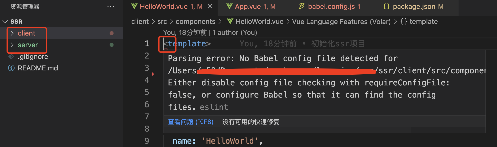

### Parsing error: No Babel config file detected 

今天为了测试一个功能，在一个目录中创建了2个项目，一个vue项目和一个exprss项目，然后我使用vscode同时打开了这2个项目，结果vue项目给我在文件开始的位置标红，显示有异常，我看了下是提示项目的根目录下没有babel的配置文件:

异常的详细信息如下：

Parsing error: No Babel config file detected for /Users/xxx/Documents/workspace/learning/vue/ssr/client/src/components/HelloWorld.vue. Either disable config file checking with requireConfigFile: false, or configure Babel so that it can find the config files.



异常的主要问题就是说项目的根目录缺少了配置文件，那么现在有2种办法可以解决这个标签飘红的问题：

1. 使用vscode直接打开vue项目的根目录

不同时打开2个项目，就可以了。每个项目下的配置文件都是齐全的，那么我单独的打开各个项目就不会报异常了。

2. 在package.json种配置不使用配置文件了

```json
"parserOptions": {
    "parser": "@babel/eslint-parser",
    "requireConfigFile": false
},
"rules": {
    "eslint-disable-next-line": 0
}
```

因为提示的信息是根目录没有配置文件，类似的问题解决方案，应该也就是2个方向：

1. 在根目录添加配置文件，也可以理解为我直接打开当前项目的根目录；

2. 禁用eslint校验；

这个信息只在vscode中暴露了出来，webstorem中并没有类似的信息提示。