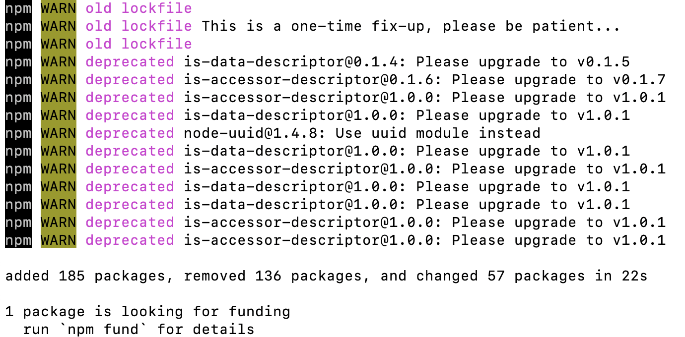

### npm install时报错:request to https://registry.npm.taobao.org/yargs/download/yargs-3.10.0.tgz failed, reason: certificate has expired

在使用npm安装包的时候报错,报错信息如下:

```bash
request to https://registry.npm.taobao.org/yargs/download/yargs-3.10.0.tgz failed, reason: certificate has expired
```

大概的意思就是说证书过期.然后尝试着切换了下npm的镜像源,但是还是解决不了问题.后来尝试了多次,可以顺利安装了.

**解决方案**

1. 清除缓存

```bash
npm cache clean --force
```

2. 设置一个新的镜像源

```bash
npm config set registry https://registry.npmmirror.com
```

这个步骤也可以不做,可以根据自己的实际情况选择.

3. 禁止SSL/TLS安全链接

```bash
npm config set strict-ssl false
```

再次执行npm install成功.

