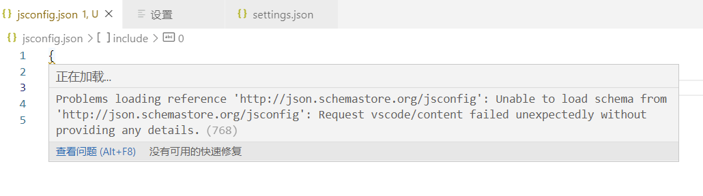
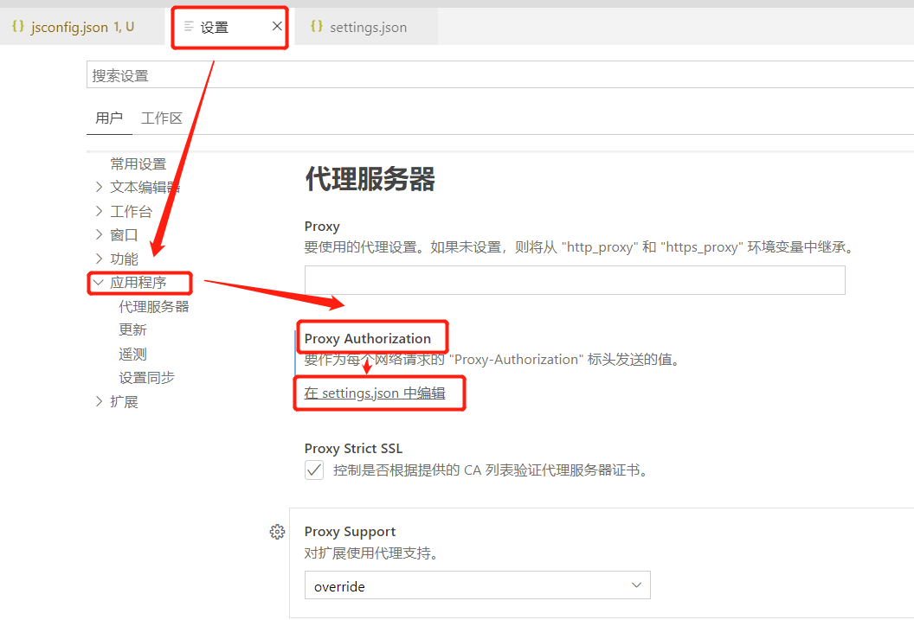

### JSON schema for the JavaScript configuration file

vetur升级后，需要在项目的根目录新建一个jsconfig.json文件，如果是ts语言的化，就是新建一个tsconfig.json文件，在创建好这个文件后，还发出了黄色的警告：

```bash
JSON schema for the JavaScript configuration file

Problems loading reference 'https://json.schemastore.org/jsconfig': Unable to load schema from 'https://json.schemastore.org/jsconfig': Request vscode/content failed unexpectedly without providing any details.(768)
查看问题 (Alt+F8)
没有可用的快速修复
```



具体原因就是无法链接到Schema，解决办法也有：

* 可以切换下网络环境（可能性不大），我们不可能因为这个不太紧要的提示就出国去吧，而且只有部分人纠结这个，很多人是不纠结这个的，毕竟它不影响代码的执行
* 设置成离线模式：这个是可行的，我们链接不上这个Schema，那就索性不连了就可以了吧：我惹不起我躲的起

设置方法：

1. 依次: 文件 -> 首选项 -> 设置 -> 应用程序 -> proxy Authorization,如图所示：



2. 在点击打开的settings.json文件中编辑，将"http.proxyAuthorization": "null" 变更为："http.proxyAuthorization": "false"

```bash
"http.proxyAuthorization": "false"
```