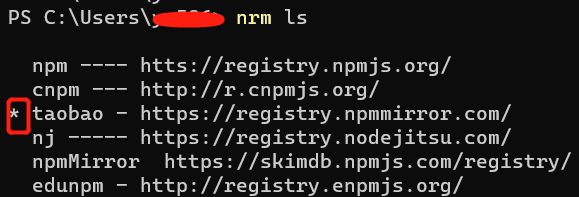

### 正常全局安装了nrm后，通过nrm use选中了nrm内置的源后，选中的源前面不显示*

系统： windows10

nodejs：v14.18.1

npm：6.14.15

nrm：1.2.5

正常的情况下，nrm通过use指令选中一个源后，选中的源前面应该有一个*标识，表示当前的源被选中了。

但是现在不知道什么原因，通过nrm use指令，可以选中nrm内置的源，但是被选中的源前面没有显示*。

通过nrm add指令添加的源，再使用nrm use指令，被选中的源可以显示*。

我更改了下nrm的版本，重新安装了nrm@1.1.0，重新安装后，无论是nrm内置的镜像源，还是后来自定义添加镜像源，被选中后的源前面都可以有*标识被选中。

所以最新版本的nrm，选中的源前面没有*号标识，可能是nrm自己的做的修改吧，至于原因和具体的版本，还没有查清楚。
