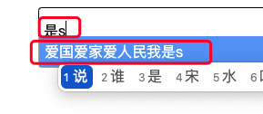

### select2开启tags后，输入中文后样式错乱

查了下问题，发现是select2的对搜索关键字的场景处理问题。

可能由于select2是非中文作者，中文场景使用的比较少，所以可能有些有中文场景的地方处理的不够友好。

前几天我在项目中使用到了select2，且开启了tags，但是这样，我在输入中文的时候，样式错乱了。



但是输入英文就没有任何问题。

我们看下这部分的功能是怎么实现的：

```js
    if (this.$search.attr('placeholder') === '') {
      // 输入关键字的长度
      var minimumWidth = this.$search.val().length + 1;
      // 设置宽度为输入关键字长度的0.75倍的em宽度  这里
      width = (minimumWidth * 0.75) + 'em';
    }
```

其实就是每次输入了信息的时候，输入框就会重置宽度，那么现在呢，宽度的处理，没有考虑到中文场景，所以在输入了中文后，就有点样式错乱了，输入框的宽度设置小了。

那么怎么办呢？

我们已经知道问题的原因是输入框的宽度设置小了，那么加大输入框的宽度就可以了。

```js
if (this.$search.attr('placeholder') === '') {
    // 输入关键字的长度
    var minimumWidth = this.$search.val().length + 1;
    // 设置宽度为输入关键字长度的0.75倍的em宽度  这里
    // width = (minimumWidth * 0.75) + 'em';
    width = minimumWidth + "em";
}
```

把源码中关于宽度的设置，将DOM宽度直接设置为输入内容关键字的宽度，不再对输入内容宽度做比例处理，这样就可以解决问题了。

同时，我也查到了其他的一些解决方案，但是本质上还是处理输入框的宽度。

```js
if (this.$search.attr('placeholder') === '') {
    // 修复开启tags后输入中文显示不全的问题
    var str = this.$search.val();
    var width1 = str.replace(/[^\u4e00-\u9fa5]/gi, "").length * 2;
    var width2 = str.replace(/[\u4e00-\u9fa5]/gi, "").length * .75;
    width = (width1 + width2 + 1) + "em";
}
```

对输入内容做一些处理，然后根据输入内容设置输入框的宽度。

只要宽度给的够了，就不会出现中文输入时样式显示错乱的问题了。