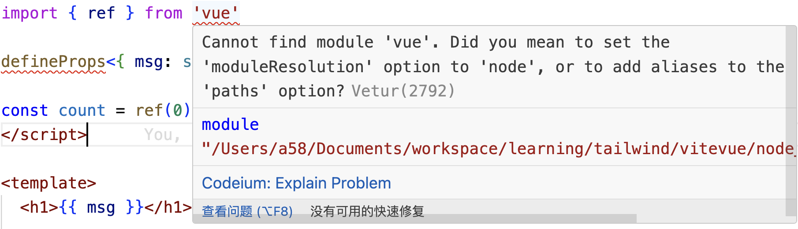
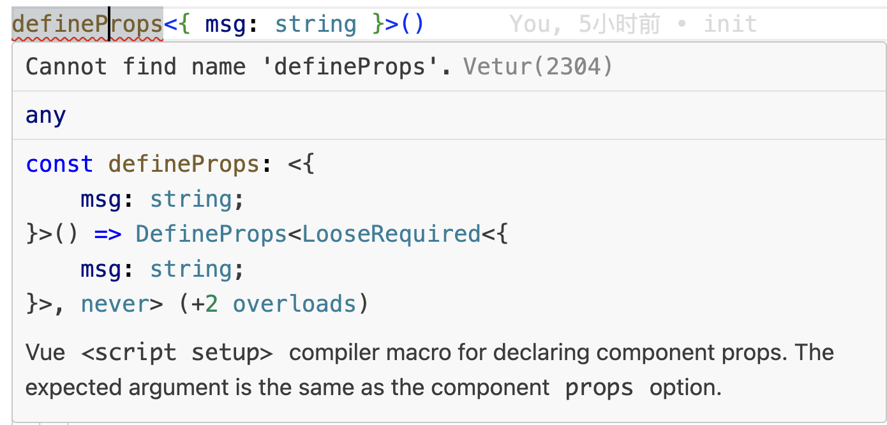

### Cannot find module 'vue'. Did you mean to set the 'moduleResolution' option to 'node', or to add aliases to the 'paths' option?

### Cannot find name 'defineProps'

刚通过vite创建的vue项目,还没有添加任何的代码,在项目提供的模板中就提示上面的2个异常信息:

问题原因:

模块化标准的原因,导致提示找不到模块.

解决方式:

1. 关闭异常信息提示

反正这些语法提示不影响到代码逻辑的执行.虽然可以,但不是最优方案

2. 修改