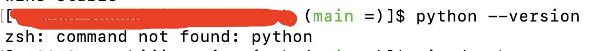
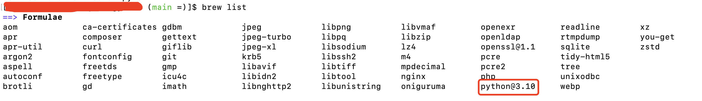
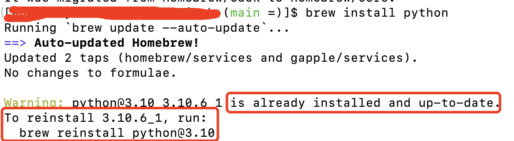

### zsh: command not found: python

记得以前mac上是直接安装了python的，今天想折腾点python，突然在执行python指令的时候，提示找不到python指令:zsh: command not found: python.



我确认我电脑上确实是使用过python的，于是我又确认了一下：

```bash
brew list
```



既然系统已经有了，但是又找不到指令。那可能是我总是瞎折腾，可能是把系统给折腾坏了吧，直接重新安装下吧

```bash
brew install python # 安装最新版本的python
brew install python@2 # 安装2.x版本的python
```



确认系统中已经安装过了，但是在终端命令找不到，那应该就是环境变量的问题了，将python的可执行文件写入到zsh的配置文件.

```bash
echo "alias python=/usr/bin/python3" >> ~/.zshrc
```

python的可执行文件在/usr/bin/目录下，然后重启下配置文件

```bash
source ~/.zshrc
```

再次执行python指令，一切正常了。

### 解决问题思路

找不到指令，一般就2个原因：

1. 系统中没有安装

2. 安装了终端找不到：环境变量配置的不对

所以遇到问题后根据原因去解就可以了。最简单的就是重新安装下，然后就是重新配置下环境变量

> mac下配置环境变量有点麻烦，不同的终端都需要配置环境变量，所以使用mac的尽量选择一个自己喜欢的终端就一直用。但是出了问题也不用担心，重新配置下就可以了。
