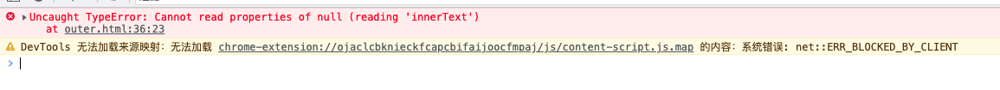
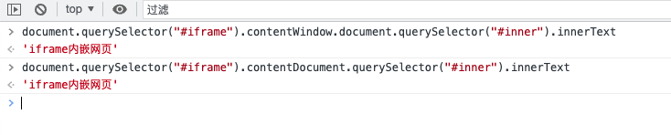

### 开发者工具控制台和js文件中执行效果不同

今天在调试一个iframe效果，尝试iframe的外部页面访问iframe页面的DOM。

我是在同域的情况下测试的，不同源的情况暂且不考虑。

看代码：

```html
<!--outer.html 外壳页面-->
<div class="wrapper">
    <h3 class="outer">外部的DOM</h3>
    <iframe src="./iframe_dom.html" id="iframe" frameborder="0"></iframe>
</div>
<script>
    var a = document.querySelector("#iframe");
    var b = a.contentWindow.document;
    var c = b.getElementById("inner");
    console.log(c.innerText);
</script>
```

iframe页面：

```html
<!--iframe_dom.html-->
<div class="inner">
    <h3 id="inner">iframe内嵌网页</h3>
</div>
```

通过web服务，访问outer页面的时候，我期望能够在outer页面中访问到iframe_dom.html页面中的DOM元素。我的代码实现：

```js
var a = document.querySelector("#iframe");
var b = a.contentWindow.document;
var c = b.getElementById("inner");
console.log(c.innerText);
```
依次获取到iframe、iframe的document，然后再通过document获取当前页面中id为inner的元素。

我觉着是没有问题的，但是结果是报错了:



但是同样的实现，我在控制台，就看可以实现：



在控制台中实现了，且是正常的获取了 ----- 同源页面。

难道是链式读取的效果？我把链式实现的代码放到js文件中去实现一下：

```js
console.log(document.querySelector("#iframe").contentDocument.querySelector("#inner").innerText);
```

结果还是不行。报错了，错误相同。

<font color="#f20">浏览器开发者工具控制台的执行环境和js文件在浏览器中执行环境有不同？为什么同样的代码执行的结果不同呢？</font>