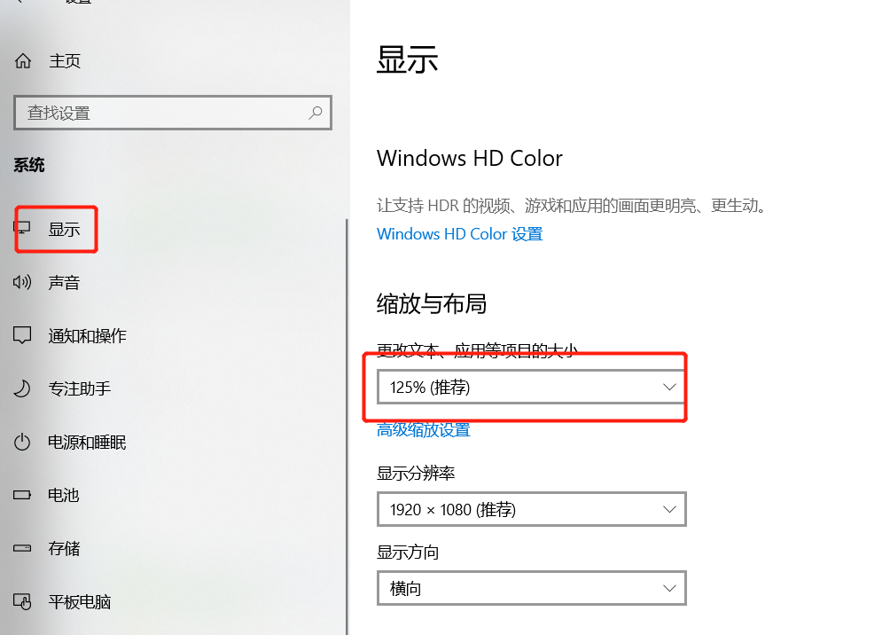

### 网页截图和css设置的元素尺寸不同的问题

最近刚接手了一个新的项目，要用到canvas，就简单了解了下canvas的知识点，做了个小demo，在实现demo的时候，发现了个小问题，就是我给canvas设置了宽高尺寸后，在网页中实际展示的尺寸并不是我设置的宽高的尺寸，无论是直接给canvas设置的width和height属性，还是通过css给canvas设置的尺寸，结果都不对。比如我给我的canvas设置的500x600的尺寸，那么在网页中显示的实际效果是625x750的尺寸，我重新设置了一个新的尺寸为300x200，那么实际的显示尺寸就变成了375x250。观察了2组数据，实际的显示数据是我实际设置数据的1.25倍，我重新设置了其他的几组数据，都呈现出来了这个规律。

> 我的设备为windows11，2020年的设备，chrome浏览器。

后来发现了问题所在，出现类似问题，一般是有两种情况：

1. 浏览器缩放了

职业原因，浏览器一般都是100%比例显示的。很多时候打开一个浏览器时，不自觉的先ctrl+0一下（设置浏览器100%比例显示的快捷键），这个问题在我这是可以排除的。排除方式是(以chrome为例)：

先查看浏览器当前的缩放比例：浏览器右上角3个点，弹出框里面有缩放操作菜单，如图所示：


我们可以根据实际情况点击-或者+实现浏览器显示比例的缩放；

除了这种手动点击的方式，也有快捷的方式实现同样的效果：

```bash
ctrl+"+"  显示比例放大
ctrl+"-"  显示比例缩小
ctrl+0: 100%比例显示
```

2. 系统设置缩放与布局中设置了不是100%的缩放比例

这种场景，主要是由于最近几年出现的新设备，显示器的显示分辨率比较高，在设备100%比例显示的情况下，设别上显示的元素肉眼感觉会比较小，设备为了我们能有一个良好的视觉效果，就根据友好的视觉效果让设备的视觉显示都进行了一定比例的缩放，达到我们在享受高清视觉效果，同时也能保护好我们的眼睛，让我们看起来不那么累，眼睛不疼。

具体的设置方式：

打开设置->进入"系统"选项->选中左侧"显示"菜单（默认就是“显示”菜单，它是第一个菜单）->在右侧“显示”视口找到“缩放与布局”模块，然后我们根据我们的需要选择一个合适的比例就可以了（我的设备推荐的是125%），正好和我之前测试的实际显示效果为设置尺寸的1.25倍是吻合的。



> 我测试的设备是windows设备，没有在Mac上进行验证，如果Mac上也有或者出现了类似的现象，我们可以按照相同的办法去解决一下。