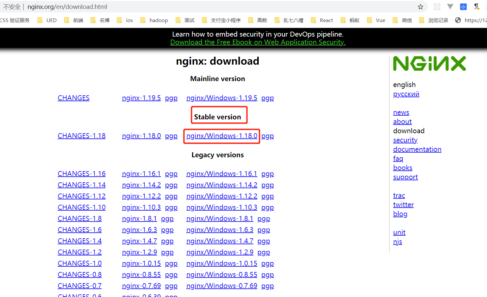
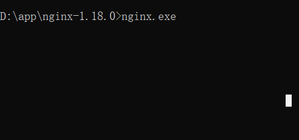
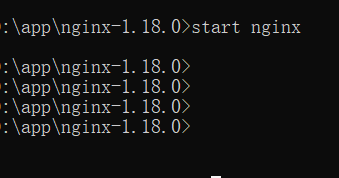
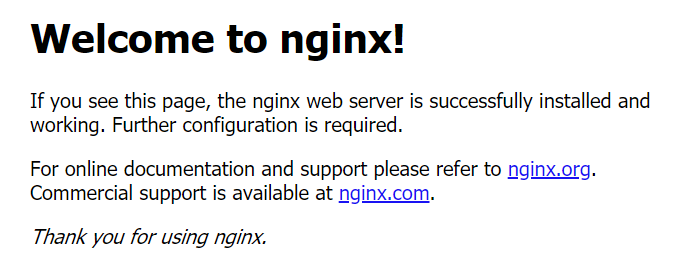
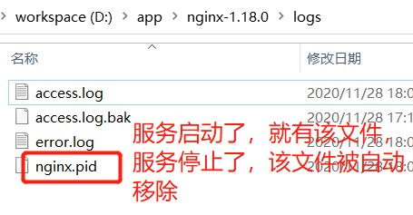
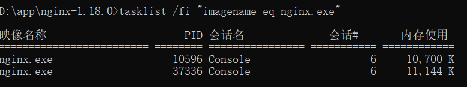

### windows下nginx安装及简单环境搭建

> nginx下载地址：[http://nginx.org/en/download.html](http://nginx.org/en/download.html)

可以选择稳定版本安装

## 安装

### 该版本是免安装的，下载解压后即课运行

###　启动运行：有多种方式

1.　直接双击nginx.exe（双击后会有一个黑色的弹窗飘过）

2. 打开cmd终端，切换到nginx目录下
   1. 输入命令nginx.exe
      1. 不推荐该方式启动服务，因为该方式会直接将当前命令窗口给占用了，不能在当前窗口做任何操作了
    
   2. 输入命令 start nginx
      1. 推荐使用该命令，因为使用该命令启动了服务后，当前窗口还可以继续做其他事情，启动服务后，不影响做其他的事情，推荐
    
   3. 检测是否启动成功
      1. 通过命令行方式启动服务或者直接双击，服务启动后，无论成功或者失败，都没有一个很好的提醒方式，我们只能通过在浏览器中输入localhost:80来检测服务是否启动成功了，如果出现这个界面表示启动成功
    
      2. 看当前nginx的目录中logs目录下的nginx.pid文件，如果有这个文件表示服务启动成功；服务关闭后，该文件自动移除
    
      3. 通过命令 tasklist /fi "imagename eq nginx.exe",如果出现如下结果则表示成功
    
3. 停止/关闭服务
   1. nginx -s stop 快速结束nginx服务
   2. nginx -s quit 有序的技术nginx服务，保证完成了已经接收到的请求
4. nginx可以根据log信息进行一些数据分析和统计，具体可以参考：[https://blog.csdn.net/wudinaniya/article/details/102699360](https://blog.csdn.net/wudinaniya/article/details/102699360)