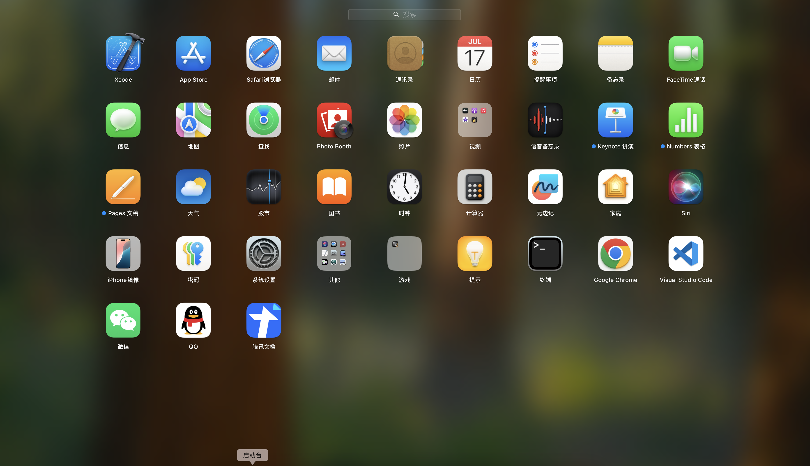

### Mac设置启动台应用的图标数量和大小

启动台中应用的排列数量是默认的，默认是5行7列，在现在的这种屏幕分辨率的情况下，图标很大，这样的图标显示和如此的屏幕分辨率极不协调，那么可以通过下面的方式去设置一下行术和列数。行数和列数设置好了，图标就会根据显示的图标数量去自动调整大小，所以图标的大小是不需要手动调整。

```bash
defaults write com.apple.dock springboard-columns -int 9
defaults write com.apple.dock springboard-rows -int 6
defaults write com.apple.dock ResetLaunchPad -bool TRUE
killall Dock
```

上面指令的意思是将启动台中的应用显示9列、6行，然后重启Dock。效果如下：



现在相对来说，比默认的好看多了。


**恢复为默认显示**

```bash
defaults write com.apple.dock springboard-rows Default
defaults write com.apple.dock springboard-columns Default
defaults write com.apple.dock ResetLaunchPad -bool TRUE
killall Dock
```

恢复默认显示，没有尝试过，不过应该是好用的。