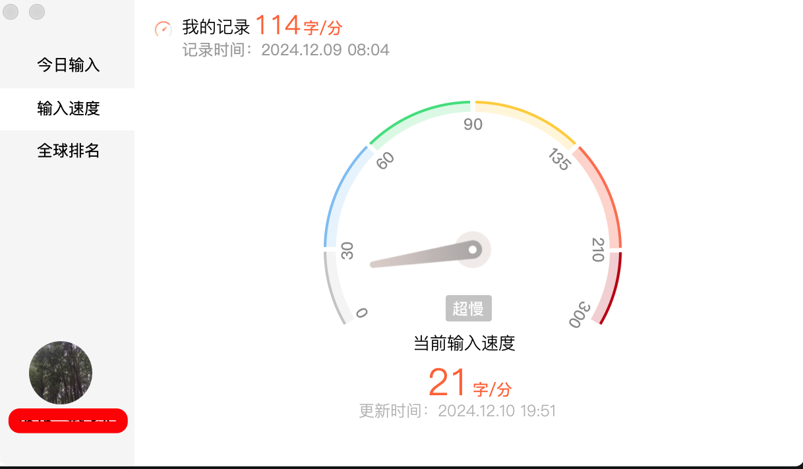
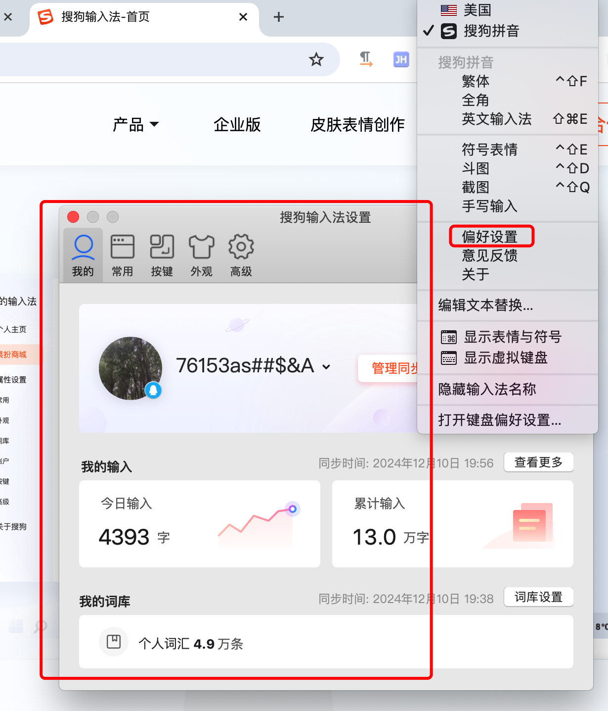
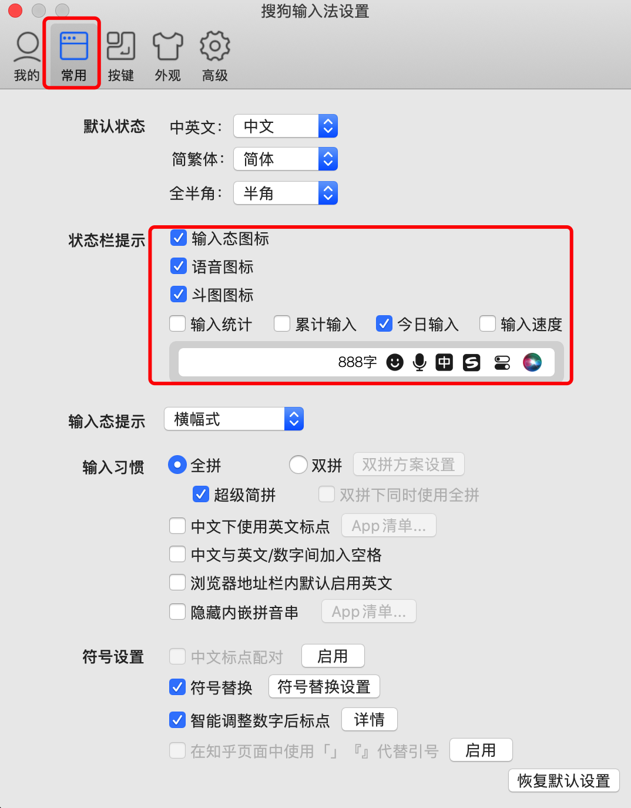

### Mac电脑推荐搜狗输入法

今天打开了家里尘封已久的mac，打开了个编辑器，整理了些材料，在整理材料的过程中，发现输入法挺有意思，可以统计输入文字字数，打字速度、输入字数什么的，挺有意思

打开统计面板后还有一些排名统计，某个时间点的输入字数，挺有意思

在屏幕状态栏显示的输入法的信息，也被称为输入法的状态栏，输入信息的展示可以根据配置来确定是否显示。

配置方式：

点击输入法——偏好设置——常用——状态栏提示，在提示部分，勾选中的都会展示在屏幕的状态栏部分

> 其他输入法如百度是否也有同样的功能，之前没有注意过，今天发现了搜狗输入法的这个能力，觉着挺有意思，分享一下。

搜狗输入法下发链接: [搜狗输入法](https://shurufa.sogou.com/)